# Jarvis Architecture — Data Flow Reference

**Last Updated:** 2026-04-08

This document provides a comprehensive view of all data flows, module interactions, event routing, and persistence in the Jarvis two-device AI system.

> For architecture invariants and open-source guardrails, see [docs/ARCHITECTURE_PILLARS.md](docs/ARCHITECTURE_PILLARS.md). For engineering-level wiring trace and validation evidence, see [docs/ENGINEERING_ARCHITECTURE_TRACE.md](docs/ENGINEERING_ARCHITECTURE_TRACE.md). For AI agent quick-reference, see [AGENTS.md](AGENTS.md). For a high-level visual system map, see [docs/SYSTEM_OVERVIEW.md](docs/SYSTEM_OVERVIEW.md).

## Trace Status Legend

This file is intentionally broad and descriptive. Runtime traceability claims must be read with these labels:

- **VERIFIED**: directly evidenced in code + captured runtime artifacts.
- **PARTIAL**: wired but summarized, derived, maturity-gated, or not yet immutable end-to-end proof.
- **PENDING**: planned but not yet implemented/validated.

Canonical source of truth for current status is:
- `docs/ENGINEERING_ARCHITECTURE_TRACE.md` (wiring matrix + status)
- `docs/TRACE_VALIDATION_EVIDENCE.md` (artifact-backed audit notes)
- `docs/TRACE_FIX_BACKLOG.md` (P0/P1/P2 execution state)

---

## Table of Contents

1. [System Overview](#system-overview)
2. [Hardware Profile & VRAM Tiers](#hardware-profile--vram-tiers)
3. [Data Flow: Voice Interaction](#data-flow-voice-interaction)
4. [Data Flow: Perception Fusion](#data-flow-perception-fusion)
5. [Data Flow: Consciousness Tick](#data-flow-consciousness-tick)
6. [Data Flow: LLM Response](#data-flow-llm-response)
7. [Data Flow: Policy Layer](#data-flow-policy-layer)
8. [Data Flow: Autonomous Research](#data-flow-autonomous-research)
9. [Data Flow: Self-Improvement](#data-flow-self-improvement)
10. [Data Flow: Skill Learning](#data-flow-skill-learning)
11. [Data Flow: Document Library](#data-flow-document-library)
12. [Data Flow: Dashboard](#data-flow-dashboard)
13. [Data Flow: Truth Calibration (Layer 6)](#data-flow-truth-calibration-layer-6)
14. [Data Flow: Hemisphere Neural Networks](#data-flow-hemisphere-neural-networks)
15. [Data Flow: Soul Kernel Systems](#data-flow-soul-kernel-systems)
16. [Data Flow: Unified World Model](#data-flow-unified-world-model)
17. [Data Flow: Eval Sidecar (PVL)](#data-flow-eval-sidecar-pvl)
18. [Data Flow: Blue Diamonds Archive](#data-flow-blue-diamonds-archive)
19. [Data Flow: Fractal Recall](#data-flow-fractal-recall)
20. [Event Catalog](#event-catalog)
21. [Module Dependency Map](#module-dependency-map)
22. [Persistence Map](#persistence-map)

---

## System Overview

Jarvis runs across two physical devices on a local network:

```mermaid
graph TB
    subgraph "Raspberry Pi 5 + Hailo-10H — Thin Sensor Node"
        MIC[Microphone<br/>44.1kHz capture]
        CAM[Picamera2]
        SPK[Speaker]
        DISP[7" Touchscreen]

        MIC --> AM[AudioManager<br/>44.1kHz → np.interp<br/>→ 16kHz int16 PCM]
        AM --> |binary WS frames<br/>~32KB/s continuous| WSC[WebSocket Client<br/>text frames: JSON events<br/>binary frames: raw PCM]

        CAM --> DET[YOLOv8s Detector<br/>Hailo NPU 15fps<br/>person only]
        DET --> TRK[PersonTracker<br/>IOU + pose]
        CAM --> POSE[YOLOv8s-Pose<br/>Hailo NPU]
        POSE --> TRK
        CAM --> EXPR[Expression<br/>Hailo NPU]
        CAM --> SDET[SceneDetector<br/>YOLOv8n ONNX CPU<br/>every 3s ~280ms<br/>chairs/monitors/cups/etc]
        SDET --> SAGG[SceneAggregator<br/>dedup + change scoring]

        TRK --> WSC
        SAGG --> |scene_summary events| WSC

        WSC --> |BrainMessage<br/>with audio_b64| PBW[PlaybackWorker<br/>generation counter]
        PBW --> SPK
        DISP --> PART[particles.js<br/>Chromium kiosk]
    end

    subgraph "Brain PC — NVIDIA GPU (VRAM-tier adaptive)"
        HP[HardwareProfile<br/>auto-detect GPU<br/>→ VRAM tier → models]

        WSS[PerceptionServer<br/>:9100 WebSocket<br/>binary → PERCEPTION_RAW_AUDIO<br/>text → JSON event dispatch]
        WSC <--> |binary: raw PCM<br/>text: PerceptionEvent / BrainMessage| WSS

        WSS --> ASP[AudioStreamProcessor<br/>openWakeWord continuous<br/>Silero VAD endpoint<br/>speech accumulation]
        ASP --> |on_speech_ready| LSTT[LaptopSTT<br/>faster-whisper<br/>model + compute per tier]
        LSTT --> |PERCEPTION_TRANSCRIPTION| PO

        WSS --> PO[PerceptionOrchestrator]
        PO --> BTTS[BrainTTS<br/>Kokoro ONNX<br/>GPU-accelerated]
        PO --> SPKID[SpeakerID<br/>ECAPA-TDNN<br/>on CUDA]
        PO --> EMOT[EmotionClassifier<br/>wav2vec2 on CUDA]
        PO --> AC[AttentionCore<br/>multi-modal fusion]
        PO --> CH[ConversationHandler]

        AC --> MM[ModeManager<br/>8 modes + hysteresis<br/>all 5 profile params wired]
        MM --> KL[KernelLoop<br/>cadence-scaled ticks]

        CH --> TR[ToolRouter<br/>keyword + intent<br/>TIME/SYSTEM/MEMORY/<br/>VISION/INTROSPECTION/<br/>WEB_SEARCH/CODEBASE]
        CH --> RG[ResponseGenerator<br/>cancel-token streaming]
        TR -->|tool data| RG
        TR -->|WEB_SEARCH| WEBSRCH[DuckDuckGo<br/>fenced + cached]
        TR -->|CODEBASE| CBTOOL[CodebaseIndex<br/>AST indexer + symbols<br/>+ import graph]
        WEBSRCH -->|context| RG
        CBTOOL -->|context| RG
        RG --> CB[ContextBuilder<br/>speaker + emotion + length<br/>+ follow-up context]
        RG --> OLL[Ollama LLM<br/>keep_alive per tier]

        KL --> CE[ConsciousnessEngine]
        CE --> CS[ConsciousnessSystem<br/>meta-thoughts, evolution,<br/>mutation + post-monitor,<br/>existential]
        CE --> PI[PolicyInterface<br/>shadow eval → NN → governor]
        CE --> HO[HemisphereOrchestrator<br/>gap detector → NN build<br/>+ prune + evolve]
        CE --> AUTO[AutonomyOrchestrator<br/>metric triggers + scorer<br/>+ delta tracking + levels]

        CE --> MS[MemoryStorage<br/>exponential decay<br/>priority-aware eviction<br/>+ orphan cleanup<br/>+ DeltaEffects]
        CE --> PT[PersonalityTraits<br/>evidence-based]
        CE --> RE[ReflectionEngine<br/>3/hr guard]
        CE --> EP[EpisodicMemory<br/>conversation context]

        SIO[SelfImprovementOrchestrator<br/>multi-turn think-code-validate<br/>atomic apply + health gate]
        SIO --> CODELLM[CPU Coding LLM<br/>Ollama :11435<br/>qwen2.5-coder]
        SIO --> SB[Sandbox<br/>AST + lint + test + sim]

        DASH[Dashboard :9200<br/>snapshot cache<br/>hash-diff push<br/>ML charts + gap map +<br/>improvement history]
        CE --> DASH

        HP -.-> |tier config| LSTT
        HP -.-> |model selection| OLL
        HP -.-> |coding model| CODELLM
        HP -.-> |tts/speaker_id/emotion| PO
    end

    style WSC fill:#3a86ff,stroke:#333,color:#fff
    style WSS fill:#3a86ff,stroke:#333,color:#fff
```

---

## Hardware Profile & VRAM Tiers

The brain auto-detects GPU capabilities at startup and selects appropriate model sizes, compute types, and memory management. This makes the system portable across different hardware — from a laptop with a 4GB GPU to a workstation with a 24GB card.

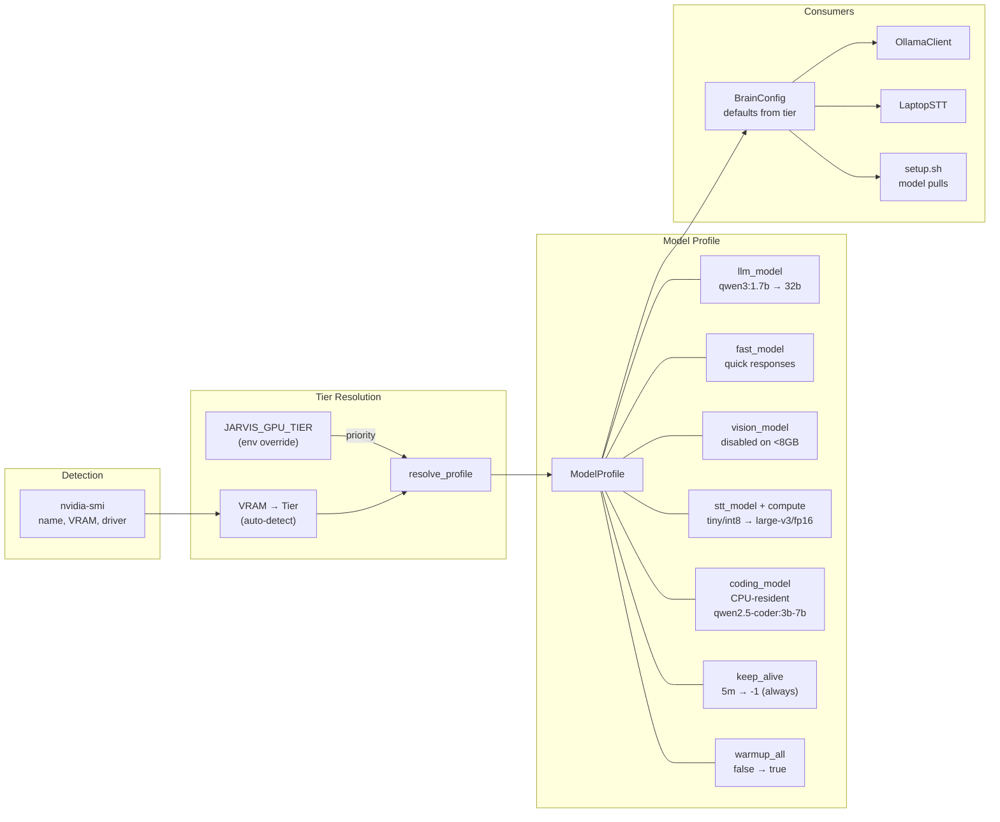

### VRAM Tier Table

| Tier | VRAM | LLM | Fast | Vision | STT Model | STT Compute | TTS | Coding LLM | Keep-alive | Warmup |
|---|---|---|---|---|---|---|---|---|---|---|
| **minimal** | <4 GB | qwen3:1.7b | qwen3:1.7b | disabled | tiny | int8 (CPU) | none | disabled | 5m | no |
| **low** | 4-6 GB | qwen3:4b | qwen3:1.7b | disabled | small | int8 | none | disabled | 5m | no |
| **medium** | 6-8 GB | qwen3:8b | qwen3:4b | disabled | medium | int8_float16 | kokoro_cpu | qwen2.5-coder:3b | 5m | no |
| **high** | 8-12 GB | qwen3:8b | qwen3:4b | qwen2.5vl:7b | large-v3-turbo | int8_float16 | kokoro_cpu | qwen2.5-coder:7b | 10m | no |
| **premium** | 12-16 GB | qwen3:8b | qwen3:8b | qwen2.5vl:7b | large-v3 | float16 | kokoro_gpu | qwen2.5-coder:7b | always | yes |
| **ultra** | 16-24 GB | qwen3:14b | qwen3:8b | qwen2.5vl:7b | large-v3 | float16 | kokoro_gpu | qwen2.5-coder:7b | always | yes |
| **extreme** | 24+ GB | qwen3:32b | qwen3:14b | qwen2.5vl:7b | large-v3 | float16 | kokoro_gpu | qwen2.5-coder:7b | always | yes |

### Always-Online Mode (premium+ tiers)

When `keep_alive=-1` and `warmup_all=True`:
1. **Startup**: all models (LLM + fast + vision) are loaded with a tiny prompt via `warmup_all()`
2. **Runtime**: Ollama keeps all models pinned in VRAM permanently — no cold-start latency
3. **Tradeoff**: uses more VRAM, but eliminates the 5-15s model-swap delay between vision and chat queries

### CPU-Resident Coding LLM

The coding model runs on a **separate CPU-only Ollama instance** (port 11435, launched with `CUDA_VISIBLE_DEVICES=""`) to avoid GPU VRAM contention with the main LLM:

- **Never touches GPU VRAM** — runs entirely on CPU RAM
- Used by the self-improvement pipeline for code generation and iterative fixing
- Configured via `CodingConfig`: `CODING_MODEL`, `CODING_OLLAMA_HOST`, `CODING_BACKEND` env vars
- Disabled on minimal/low tiers (insufficient CPU for useful code generation)
- `OllamaClient.code_chat()` connects to this separate instance

### VRAM Budget (premium tier, 16GB example)

| Component | VRAM | Notes |
|---|---|---|
| qwen3:8b (Ollama, always loaded) | ~5.7 GB | Q4_K_M quantization |
| faster-whisper large-v3 (float16) | ~3.0 GB | Full accuracy STT |
| Kokoro ONNX GPU | ~0.3 GB | GPU-accelerated TTS |
| ECAPA-TDNN speaker ID | ~0.3 GB | SpeechBrain on CUDA |
| wav2vec2 emotion | ~0.5 GB | Transformers on CUDA |
| **Always resident** | **~9.8 GB** | Leaves ~6.2 GB for vision on-demand |
| qwen2.5vl:7b (on-demand) | ~4.5 GB | Ollama auto-swaps when needed |

### Override Priority

```
1. Environment variable (OLLAMA_MODEL, STT_MODEL, etc.) — always wins
2. JARVIS_GPU_TIER env var — forces a tier, tier defaults apply
3. Auto-detected from VRAM — fallback
```

---

## Data Flow: Voice Interaction

End-to-end flow from user utterance to spoken response. The Pi is a thin sensor node — it streams raw audio continuously and the brain handles all audio intelligence.

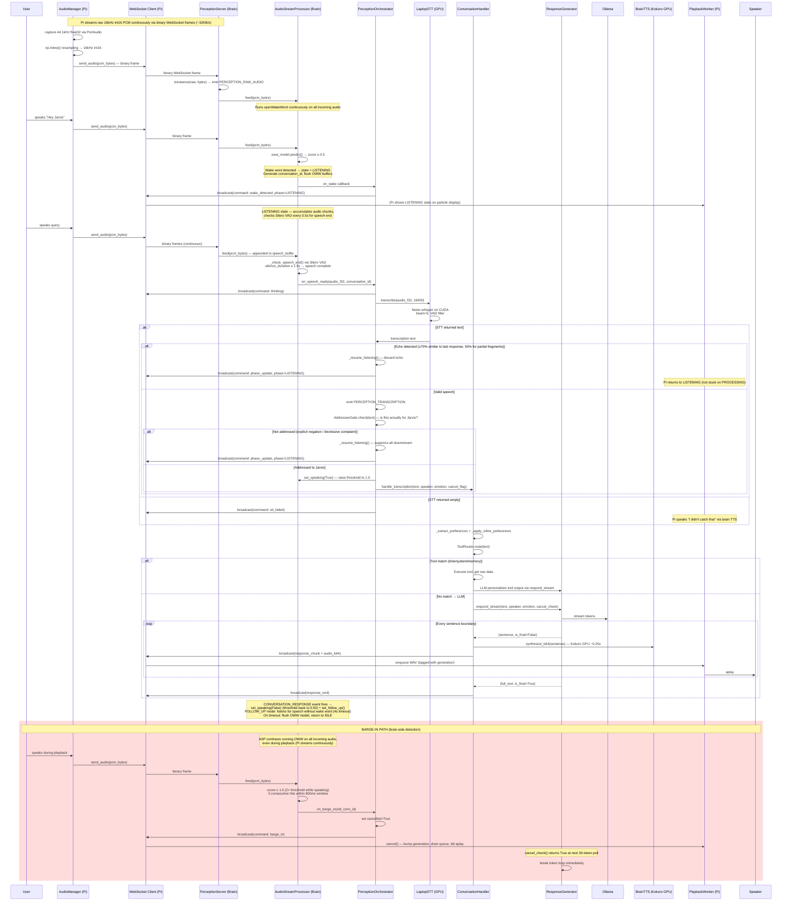

### AudioStreamProcessor (Brain-side Wake + VAD)

All audio intelligence runs on the brain in `AudioStreamProcessor` (`brain/perception/audio_stream.py`). It receives continuous 16kHz int16 PCM from the Pi via `PERCEPTION_RAW_AUDIO` events and runs in a single worker thread with three states:

1. **IDLE** — runs `openWakeWord.predict()` (ONNX backend) on every chunk. On detection (score ≥ 0.5), transitions to LISTENING, generates `conversation_id`, flushes OWW prediction buffers with 32k zeros, and fires the `on_wake` callback. PerceptionOrchestrator broadcasts a `wake_detected` command to the Pi.
2. **LISTENING** — accumulates audio in `_speech_buffer`. Every 0.5s, checks for speech end via Silero VAD (`faster_whisper.vad.get_speech_timestamps`). If silence ≥ 1.5s (or max 15s recording), dispatches the complete utterance to STT via the `on_speech_ready` callback.
3. **FOLLOW_UP** — entered after a response is delivered via `CONVERSATION_RESPONSE` event. Listens for speech without requiring a wake word (4s timeout). If Silero VAD detects speech, transitions to LISTENING with a new `conversation_id`. Also runs OWW so explicit triggers still work. On timeout, clears `_speaking` flag and flushes OWW model before returning to IDLE.

**Speaking flag lifecycle:** `set_speaking(True)` is called in `_on_transcription` when the brain begins processing a response. While speaking, the wake threshold doubles (0.5→1.0) and requires 3 consecutive hits within an 800ms window before triggering barge-in. `set_speaking(False)` is called in `_on_conversation_response` when the response completes, restoring the threshold to 0.5 and entering FOLLOW_UP mode. The flag is also cleared as a safety net when FOLLOW_UP times out.

**Echo detection:** After STT, the orchestrator compares the transcribed text against `_last_response_text` using `SequenceMatcher`. Primary threshold: `_ECHO_SIMILARITY_THRESHOLD = 0.70`. Partial fragment threshold (text < 50% of response length): `_ECHO_PARTIAL_THRESHOLD = 0.50`. Speaker echo guard for unknown speakers: `_SPEAKER_ECHO_SIMILARITY = 0.60`. On discard, `_resume_listening()` sends a `phase_update` command to the Pi so its display returns to LISTENING (not stuck on PROCESSING).

**Pi command: `phase_update`:** Sent when the brain discards speech (echo, stale conv_id) after already telling the Pi "thinking". `data.phase` tells the Pi which display state to show. Without this, the Pi would stay stuck on PROCESSING indefinitely.

**Barge-in during LISTENING:** If the ASP is in LISTENING state and `_speaking` is True (response still playing), it also runs OWW on each chunk. A detection at the elevated threshold immediately cancels the current speech buffer and fires `on_barge_in`.

### Stream Health Monitoring

The Pi's PortAudio stream is monitored for silent death:
- **`_shared_callback`** is wrapped in `try/except` — unhandled exceptions no longer kill the stream silently.
- **`_callback_count`** increments on every callback. **`_overflow_count`** tracks input overflows (no logging inside the callback to avoid cascading overflows).
- **`is_stream_active`** property — checks stream object existence and `.active` flag.
- **`restart_shared_stream()`** — cleanly stops, waits 0.5s, resets counters, retries up to 5 times with exponential backoff. On consecutive stalls, performs a full PortAudio terminate/reinitialize.
- **Main loop stall detection** — every 5s, checks if `_callback_count` has advanced. If stalled or `is_stream_active` is False, auto-restarts the stream.
- **Blocksize**: 4096 samples to give the callback more processing time, reducing input overflows.

Since the Pi is a thin sensor node, the stream callback simply forwards raw audio to the brain — there are no local subscribers for wake word, VAD, or classification.

### Mic Device Pinning

Mic and speaker are pinned by name substring via `MIC_NAME` and `SPEAKER_NAME` env vars (e.g., `MIC_NAME=JOUNIVO`). This prevents device index roulette when USB hardware is re-plugged. If the named device is not found, falls back to default input. On startup, AudioManager retries up to 3 times with 2/4/6s waits if the USB mic hasn't appeared yet.

### PlaybackWorker

Single-threaded audio output owner with deterministic cancellation:
- `enqueue(wav, generation)` — tags items with current generation counter
- `cancel()` — bumps generation, drains queue, kills aplay. Items with old generation are discarded.
- Only the worker thread touches ALSA output and mic muting — no races.

### Timing Constraints

| Segment | Target | Mechanism |
|---|---|---|
| Audio capture → brain delivery | ~30ms | 44.1kHz capture → np.interp resample → binary WS frame (~960 bytes/chunk) |
| Wake word detection latency | ~50-100ms | Brain-side openWakeWord on continuous 16kHz stream |
| Speech end → STT result | ~2-4s | Silero VAD endpoint → faster-whisper GPU (large-v3) |
| STT result → first audio | <2s | Streaming + GPU TTS synthesis |
| STT failure → "Didn't catch that" | <1s | `stt_failed` command from brain → brain TTS |
| Barge-in → cancel | <300ms | Brain detects via OWW + generation counter + 30-token poll |
| OWW model flush | ~instant | 32k zeros through predict() + clear prediction_buffer |
| Max recording duration | 15s | AudioStreamProcessor hard limit |
| Follow-up window | 4s | Post-response listen without wake word |
| Audio playback timeout | 30s | Prevents ALSA hangs on Pi |
| Stream stall detection | 5s | Pi main loop checks `_callback_count` advance |
| Response_end ordering | Immediate | Pi ignores chunks after `response_end` per conversation |

---

## Data Flow: Perception Fusion

How raw sensor events flow through `AttentionCore` into `ModeManager` and ultimately shape the kernel's tick cadence.

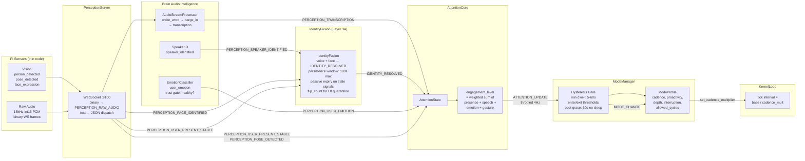

### AttentionState Fields

| Field | Source Event | Decay |
|---|---|---|
| `person_present` | `PERCEPTION_USER_PRESENT` | Binary, presence timeout |
| `speaker_identity` | `PERCEPTION_SPEAKER_IDENTIFIED` | Holds until new ID |
| `user_emotion` | `PERCEPTION_USER_EMOTION` | Decays to "neutral" |
| `gesture` | `PERCEPTION_POSE_DETECTED` | Decays to "neutral" |
| `ambient_state` | `PERCEPTION_AMBIENT_SOUND` | Last-seen |
| `engagement_level` | Computed | Weighted sum, 0.0-1.0 |

### Mode Profiles

All 5 profile parameters are applied on mode change via `_on_mode_change()`:

| Mode | Cadence | Proactivity Cooldown | Response Depth | Memory Reinforcement | Interruption |
|---|---|---|---|---|---|
| `gestation` | 1.5× | 9999s | detailed | 2.0× | 0.0 |
| `passive` | 0.5× | 300s | brief | 0.5× | 0.3 |
| `conversational` | 1.5× | 300s | normal | 1.5× | 1.0 |
| `reflective` | 0.8× | 120s | detailed | 1.2× | 0.6 |
| `focused` | 0.7× | 600s | brief | 0.8× | 0.2 |
| `sleep` | 0.2× | 3600s | brief | 0.3× | 0.1 |
| `dreaming` | 0.5× | 600s | detailed | 2.0× | 0.8 |
| `deep_learning` | 2.0× | 60s | detailed | 1.5× | 0.8 |

**Wiring**: on mode change, the orchestrator updates: kernel cadence multiplier, engine response length hint, memory storage reinforcement multiplier, proactive behavior cooldown override, and attention interruption threshold.

### Hysteresis Rules

- Each mode has a **min dwell time** (5-300s) — cannot switch before it expires (unless `force=True`)
- Sticky modes (`gestation`, `deep_learning`) are never overridden by the attention heuristic
- **Enter threshold** > **Exit threshold** per mode — prevents oscillation at engagement boundaries
- Example: enter `conversational` at engagement >= 0.6, exit only when engagement drops below 0.4

---

## Data Flow: Consciousness Tick

Background cognitive work is split across **three peer-level kernel callbacks** called from `KernelLoop`. `ConsciousnessSystem.on_tick()` handles most cycles, while `on_autonomy_tick()` and `run_shadow_evaluation()` are separate callbacks on `ConsciousnessEngine`.

```mermaid
flowchart TB
    KL[KernelLoop<br/>tick every base/cadence ms]

    KL --> BT[BudgetTracker]
    BT --> RT[REALTIME Queue<br/>phase + tone transitions]
    BT --> INT[INTERACTIVE Queue<br/>thinking + trait modulation]
    BT --> BG[BACKGROUND Queue<br/>evolution + mutation + existential]

    RT --> PT[PhaseTransitions]
    RT --> TS[ToneShifts]

    INT --> TC[on_thinking_cycle<br/>trait eval + self-reflection]
    INT --> TM[on_trait_modulation<br/>trait weight updates]

    BG --> CS[ConsciousnessSystem.on_tick<br/>receives real tick_count]
    BG --> AU["on_autonomy_tick()<br/>(ConsciousnessEngine)<br/>always runs AutonomyOrchestrator<br/>+ GestationManager if active"]
    BG --> SE["run_shadow_evaluation()<br/>(ConsciousnessEngine)<br/>every 10s"]

    CS --> PMC["_check_mutation_health()<br/>every tick"]
    CS --> MT["_run_meta_thoughts()<br/>every 8s"]
    CS --> RA["_run_analysis()<br/>every 30s"]
    CS --> EV["_run_evolution()<br/>every 90s"]
    CS --> MU["_run_mutation_cycle()<br/>every 180s"]
    CS --> HEM["_run_hemisphere_cycle()<br/>every 120s<br/>+ distillation every 300s"]
    CS --> EX["_run_existential()<br/>every 120s<br/>gated: transcendence ≥ 0.5"]
    CS --> PH["_run_dialogue()<br/>every 240s<br/>gated: transcendence ≥ 1.0"]
    CS --> SI["_run_self_improvement()<br/>every 900s<br/>gated: enabled + not paused"]
    CS --> QT["_run_quarantine_tick()<br/>every 60s<br/>Layer 8 scoring + pressure update<br/>all modes incl. sleep"]
    CS --> CD["_run_capability_discovery()<br/>every 300s<br/>gap detection + proposal<br/>interval doubled under pressure"]
    CS --> GL["_run_goals_tick()<br/>Goal Continuity (Phase 2: dispatch + alignment)<br/>mode-gated"]
    CS --> SC["_run_scene_continuity_tick()<br/>every 60s<br/>Layer 3B shadow scene state<br/>mode-gated (not sleep)"]
    CS --> DR["_run_dream_cycle()<br/>every 30s in dreaming mode<br/>memory consolidation + cortex training<br/>+ dream artifact generation (provisional)"]
    CS --> FR["_run_fractal_recall()<br/>every 30s<br/>background associative recall<br/>mode-gated (not sleep/dream/gestation/deep_learning)"]

    PMC --> |"regression?"| RB[Auto-rollback<br/>restore snapshot<br/>record outcome -1.0]
    PMC --> |"healthy"| OK[Record outcome +1.0]

    MT --> MCT[MetaCognitiveThoughts<br/>template-based, no LLM]
    MT --> OBS[Observer<br/>observe_thought<br/>+ observe_pattern]
    MT --> ANA[Analytics<br/>record_thought]

    RA --> ANA2[Analytics<br/>confidence, reasoning, health]
    RA --> |CONSCIOUSNESS_ANALYSIS| EB[EventBus]

    EV --> CEV[ConsciousnessEvolution<br/>stage advancement]
    EV --> OBS2[Observer<br/>observe_emergence]
    EV --> CDE[DrivenEvolution<br/>capability unlock]

    MU --> KMU[KernelMutator<br/>real tick_count]
    MU --> MG[MutationGovernor<br/>risk + cooldown + stability]
    MU --> |MUTATION_APPLIED| EB

    SE --> PI[PolicyInterface.decide<br/>NN shadow decision]
    SE --> PEV[PolicyEvaluator<br/>record_shadow]

    HEM --> HO[HemisphereOrchestrator<br/>train + evolve + prune]

    EX --> ER[ExistentialReasoning<br/>inquiry chains, LLM-gated]
    PH --> PD[PhilosophicalDialogue<br/>framework debates, LLM rare]

    AU --> AO[AutonomyOrchestrator<br/>metric triggers + scorer +<br/>queue + delta tracking +<br/>goal hard gate + alignment]
    AU --> GM[GestationManager<br/>if gestation active:<br/>directives + readiness]

    BG --> DEF[DeferredOp Queue<br/>runs when spare budget]

    style RT fill:#ff6b6b,stroke:#333,color:#fff
    style INT fill:#ffd93d,stroke:#333
    style BG fill:#6bcb77,stroke:#333
```

### Tick Budget System

Budget defaults are sized for Python (not game-loop): `DEFAULT_BUDGET_MS=50`, `IDLE_BUDGET_MS=100`, `LOAD_BUDGET_MS=25`, `SLOW_TICK_THRESHOLD_MS=30`. The adaptive tuner adjusts budget by +5ms/-1ms per tick based on load. The policy reward function uses overrun *rate* (`overruns / tick_count`) rather than absolute count.

| Priority | Examples | Deferral |
|---|---|---|
| REALTIME | Phase transitions, tone shifts | Never deferred |
| INTERACTIVE | Thinking cycle, trait modulation | Deferred if budget exceeded |
| BACKGROUND | Evolution, mutation, existential | Deferred first, run with spare budget |

### Cycle Intervals

Default intervals (can be accelerated in `deep_learning` and `dreaming` modes):

| Cycle | Interval | LLM Cost | What It Does |
|---|---|---|---|
| Mutation health | Every tick | None | Check post-mutation regression, auto-rollback if needed |
| Shadow evaluation | 10s | None | NN shadow decision, compare to kernel, feed evaluator |
| Meta-thoughts | 8s | None (templates) | Generate structured thoughts, observe patterns |
| Analysis | 30s | None (O(1) reads) | Consolidate metrics, emit `CONSCIOUSNESS_ANALYSIS` |
| Evolution | 90s | None | Check stage advancement, detect + observe emergent behaviors |
| Hemisphere | 120s | None | Train/evolve hemisphere NNs per cognitive focus area |
| Distillation | 300s (120s deep_learning) | None | Train Tier-1 specialists from teacher signals (inside hemisphere cycle) |
| Existential | 120s | Rare (token-budgeted) | Inquiry chains, gated at transcendence ≥ 0.5 or capability active |
| Mutation | 180s | None | Propose config changes (real tick count), governor evaluates (p95 < 50ms gate), apply/reject |
| Philosophical | 240s | Rare (token-budgeted) | Framework debates, gated at transcendence ≥ 1.0 or deep_learning mode |
| Autonomy tick | 30s | None (metric reads) | Feed system metrics, evaluate triggers, run queued research (L1+) |
| Dream cycle | 30s (dreaming only) | None | Memory consolidation via `associate()`, cross-association, decay + cortex training + dream artifact generation (provisional, never canonical) |
| Artifact validation | 120s (when NOT dreaming) | None | ReflectiveValidator reviews pending dream artifacts: promote/hold/discard/quarantine |
| Fractal recall | 30s | None | Background associative recall: build cue, probe memory, walk chain, governance recommendation, emit event |
| Self-improvement | 900s | None (CPU LLM) | Attempt code patches when enabled and not paused |

**Accelerated intervals**: In `deep_learning` mode, all intervals are dramatically shortened (e.g. meta_thought=4s, evolution=30s, analysis=15s, existential=60s, dialogue=120s, mutation=60s). In `dreaming` mode, dream-related cycles run faster while others slow down.

### Evolution Stages

```
basic_awareness → self_reflective → philosophical → recursive_self_modeling → integrative
```

Each stage requires sustained metrics over a rolling window. Stages unlock capabilities:
- Transcendence ≥ 0.5: existential reasoning
- Transcendence ≥ 1.0: philosophical dialogue
- Higher thresholds: additional capabilities via `consciousness_driven_evolution`

---

## Data Flow: Dream Observer Architecture

Dream cognition is a metabolically important phase, not idle maintenance. Dream outputs are ontologically distinct from waking experience — they are provisional structure, not canonical truth.

**Governing rule**: *Dreaming may generate structure. Waking validation determines ontology.*

### Observer Stances

The `ConsciousnessObserver` operates in three stances (`ObservationStance`), each controlled by a `StanceProfile`:

| Stance | Mode Mapping | Memory Writes | Association Effects | Delta Scale | Novelty Bias |
|---|---|---|---|---|---|
| WAKING | conversational, focused, passive, gestation | Yes | Yes | 1.0 | 0.0 |
| DREAMING | dreaming, sleep | **No** | **No** | 0.5 | 0.3 |
| REFLECTIVE | reflective, deep_learning | **No** | **No** | 0.0 | 0.0 |

Stances transition via `MODE_CHANGE` events. In DREAMING stance, `_apply_delta_effects()` salience and association_weight paths are blocked. Dream-specific observation types (`dream_tension`, `dream_bridge`, `dream_compression`, `dream_anomaly`, `dream_question`) go into the observer history ring buffer only.

### Dream Artifact Pipeline

```
Dream Cycle Phase 4
    │
    ├── Cluster insights → symbolic_summary artifacts
    ├── Cross-cluster links → bridge_candidate artifacts
    ├── Anomalies → tension_flag artifacts
    ├── Knowledge gaps → waking_question artifacts
    └── High-coherence clusters → consolidation_proposal artifacts
         │
         ▼
    ArtifactBuffer (ring buffer, maxlen 200)
    [pending → pending → pending → ...]
         │
         ▼ (when NOT dreaming, every 120s)
    ReflectiveValidator
    ├── coherence ≥ 0.65 + confidence ≥ 0.5 + no contradiction → PROMOTE
    ├── tension_flag / waking_question → HOLD (informational)
    ├── contradicts active beliefs → QUARANTINE
    ├── low coherence or confidence → DISCARD
    └── borderline → HOLD
         │
         ▼ (promoted only)
    engine.remember() → full quarantine/salience/identity gates
    └── provenance: "dream_observer", weight ≤ 0.4
```

**Hard invariants**: Artifacts are NEVER written to MemoryStorage directly, NEVER emitted as MEMORY_WRITE, NEVER fed to belief extraction, NEVER used as factual self-report.

### Dream Containment

| Mechanism | Location | Effect |
|---|---|---|
| `_DREAM_ORIGIN_TAGS` | `storage.py` | Dream-tagged memories skip reinforcement multiplier |
| `_DREAM_INELIGIBLE_TAGS` | `contradiction_engine.py` | Dream-origin memories excluded from belief extraction |
| `_MAX_ASSOCIATIONS_PER_MEMORY` | `storage.py` | Caps per-memory associations at 30 |
| Stance gating | `observer.py` | DREAMING stance blocks memory writes and association effects |
| Artifact buffer | `dream_artifacts.py` | Dream outputs never enter MemoryStorage directly |

### Phase 4 — Dream Observer NN (Gated)

Not built until 500+ labeled artifact outcomes exist with stable promotion rates. Design: `HemisphereFocus.DREAM_SYNTHESIS` Tier-2 specialist, ~16 input dims, ~6 output dims, MSE loss against validator decisions. The NN proposes and scores; the reflective validator remains the governing layer.

---

## Data Flow: LLM Response

Full context-building pipeline from user message through streaming response with cancel support.

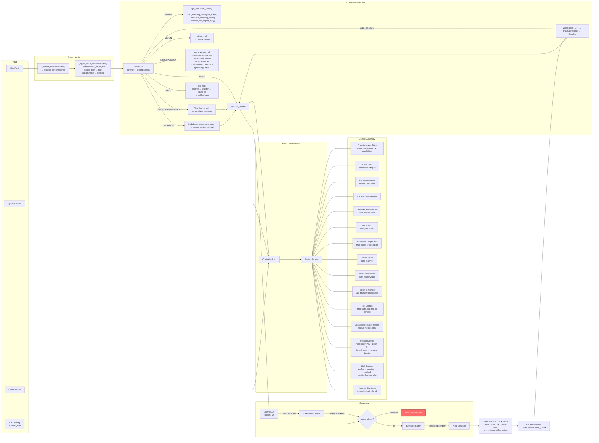

**Routing guardrail (anti verb-hacking):** route behavior must be changed at the intent-class level, not by adding one-off phrase/verb patches for a single utterance. Conversation fixes must preserve lane semantics (strict-native routes, provenance filtering, preference memory path) and be validated with class-level regression tests.

### Context Builder Injections

The system prompt is assembled from multiple sources. All reads are O(1) — no computation at prompt-build time. **Ordering is priority-aware**: for introspection routes, the tool data is promoted to position 1 (ahead of personality), ensuring the LLM sees subsystem facts before any other context.

**Normal conversation ordering:**

1. **Base personality** — from `config/local_soul.md` (frames LLM as "the mouth, not the brain" — articulates subsystem data, does not generate self-knowledge) or `config/cloud_soul.md`
2. **Consciousness state** — stage name, transcendence level, active capabilities
3. **Traits** — top 3-5 active traits with weights
4. **Memories** — 5-10 most relevant (tag-matched + recency-weighted + provenance boost). Research-backed memories (autonomous_research, evidence:peer_reviewed, code_sourced) are presented in a separate "Research-backed knowledge" section with provenance labels
5. **Tone directive** — current tone engine output
6. **Speaker context** — "You are talking to {name}" if known, relationship data from IdentityState
7. **Emotion context** — "The user seems {emotion}" if not neutral
8. **Length directive** — "Keep responses SHORT" or "The user wants DETAIL" based on policy hint or inline preference
9. **Focus** — last mutation summary + 1-3 recent meta-thought titles
10. **User preferences** — stored as tagged memories (e.g., "user prefers technical answers")
11. **Follow-up context** — last 4 turns from the active episode for conversational continuity
12. **Tool context** — when a tool is invoked (TIME/SYSTEM/MEMORY/WEB_SEARCH/CODEBASE), the raw data is injected as context so the LLM can personalize its delivery. Web search results include a "do NOT copy code directly" fence. Codebase results include module/symbol counts and matched symbols. `ToolType.STATUS` is no longer part of this path; it now uses native bounded articulation from structured status data.
13. **Consciousness self-report** — factual self-state from `ConsciousnessCommunicator.get_context_summary()` (verified metrics only: stage, transcendence, awareness, confidence, memory count, mutations — no aspirational content)
14. **System metrics** — ground-truth data from `_inject_system_metrics()`: hemisphere NN status (networks, accuracy, parameters, migration readiness per focus), policy NN status (architecture, mode, win rate, governor counts, training loss), memory density/count, operating mode
15. **Skill registry** — `_inject_skill_registry()` injects verified/learning/blocked skill list + active learning jobs (skill_id, phase, job_id) from `SkillRegistry.get_summary_for_prompt()`. Includes the Learning Job system description and honesty directive: "If a capability is not listed as Verified, you do NOT have it"
16. **Honesty directives** — "CRITICAL — Honesty about yourself" block: never fabricate metrics/capabilities, only reference prompt data, say "I don't have data on that yet" when data is missing. `build_tool_prompt()` also includes a tool-specific honesty directive

**Introspection route ordering** (overrides normal ordering when `perception_context` starts with `[Self-introspection data`):

1. **Grounding preamble** — "You are Jarvis. The following is REAL DATA from your subsystems. Your job is to articulate this data conversationally — you are the mouth, not the brain. Every claim you make must trace back to a metric or fact below."
2. **Voice style** — "speak naturally, short sentences, calm and intelligent. No markdown. No theatrical language. No generic AI descriptions."
3. **Query-aware introspection data** — selected subsystem sections (not a full dump) with fail-closed preamble. If `total_facts == 0`, preamble says "your subsystems returned no concrete data — say that honestly." If facts present, preamble demands specific metric citations.
4. **Operational self-report mode** — suppresses companion/persona prompt pressure (relationship context, memory clusters, self-awareness summaries, reflective framing) so the LLM sees system facts before stylistic context.
5. Remaining normal-order items only apply when the route falls back to LLM articulation. Strict native recent-learning / learning-job answers bypass the LLM entirely.

**Temperature differentiation**: introspection routes use temperature 0.35 (grounding mode) instead of the normal 0.70 (trait-adjusted). This penalizes creative drift and keeps the model conditioned on the provided context rather than its training priors.

### Introspection Pipeline (Query-Aware Extraction)

The introspection tool uses a three-stage pipeline to prevent attention dilution when the LLM articulates self-knowledge:

```
User asks self-query
  │
  ▼
ToolRouter → ToolType.INTROSPECTION
  │
  ▼
get_introspection(engine, query=text)
  │
  ├── Stage 1: Topic Matching
  │   _match_topics(query) matches against 9 topic buckets:
  │   curiosity, memory, learning, consciousness, identity,
  │   health, policy, perception, epistemic
  │   Each bucket has prefix-aware regex patterns (\b...\w*\b)
  │   Multiple buckets can fire for a single query
  │
  ├── Stage 2: Section Selection
  │   _select_sections(topics) maps matched topics to section builders
  │   Core sections (consciousness, analytics) always included
  │   29 section builders cover all subsystems:
  │     consciousness, evolution, observer, thoughts, mutations,
  │     analytics, existential, philosophical, memory, policy,
  │     hemisphere, traits, epistemic, self_improvement, dream_cycle,
  │     performance, autonomy_drives, policy_memory, autonomy_research,
  │     quarantine, identity_fusion, world_model, belief_graph,
  │     truth_calibration, cortex, learning_jobs, scene, attention, emotion
  │   If no topics match → default 6-section set
  │   Section count capped to prevent over-injection
  │
  ├── Stage 3: Build + Count Facts
  │   Each builder returns (title, lines, fact_count)
  │   fact_count = concrete data points (numbers, states, names)
  │   Metadata: matched_topics, selected_sections, total_facts, section_facts
  │
  ▼
Returns (report_text, metadata)
  │
  ▼
ConversationHandler:
  ├── Fail-closed preamble:
  │   facts > 0 → "cite specific numbers from data below"
  │   facts = 0 → "say you don't have data yet"
  │
  ├── context.py promotes data to prompt position 1
  │
  ├── respond_stream(temp=0.35, tool_hint="introspection")
  │
  ▼
Post-response grounding check:
  _log_introspection_grounding(reply, data, metadata)
  → extracts shared numeric values between data and reply
  → logs: topics, facts_extracted, numbers_shared, grounded (bool)
  → warns on grounding misses
  → if grounded=False on a fact-bearing reply, ConversationHandler degrades to bounded fallback text
```

**Design principle**: The LLM is the articulation layer, not the source of truth. Symbolic subsystems produce inspectable facts; neural layers (policy NN, hemisphere NNs, cortex ranker) learn prediction patterns over time; the LLM converts selected facts into natural speech. This three-layer separation preserves auditability, debuggability, and epistemic safety. Query-aware extraction ensures the LLM receives relevant, focused data (~1-2KB) rather than a monolithic dump (~5KB+), reducing the well-known RAG failure mode where models ignore long injected context.

**Debug**: Set `JARVIS_INTROSPECTION_DEBUG=1` to force all 29 sections (full dump) for operator inspection. `get_introspection_raw(engine)` provides the same via code.

### STATUS Pipeline (Native Operational Articulation)

STATUS is now intentionally more constrained than normal conversation. It does **not** route through the LLM for final wording.

```
User asks well-being / status query
  │
  ▼
ToolRouter → ToolType.STATUS
  │
  ▼
get_structured_status(engine)
  │
  ▼
build_meaning_frame(response_class="self_status", grounding_payload=status_text)
  │
  ▼
articulate_meaning_frame()
  │
  ▼
CapabilityGate.sanitize_self_report_reply()
  │
  ▼
Broadcast + language telemetry
```

**Why this exists**: status answers are part of the epistemic truth surface, not companion narration. Deterministic rendering prevents soft self-state language like "I'm doing well" or "I am operational" from re-entering the path through model phrasing.

### Cancel-Token Flow

```
Barge-in event → PerceptionOrchestrator._on_barge_in()
  → sets _active_conversation["cancelled"] = True
    → cancel_check() (lambda) returns True
      → respond_stream breaks at next 30-token checkpoint
        → ConversationHandler broadcasts response_end
          → Engine phase reset to LISTENING
```

---

## Data Flow: Personal Intel & Preference Capture

How user biographical facts, interests, and preferences are extracted from conversation, stored in memory, and corrected.

```
User utterance
  → _extract_personal_intel(text, speaker)
    → _retire_matching_preferences(text)     # "I stopped X" → downweight old prefs
    → _correct_recent_facts(text)            # "that's wrong" → downweight last 5min prefs
    → 4 pattern lists scanned:
      │  _INTEREST_PATTERNS   → "I love X", "I enjoy X"
      │  _DISLIKE_PATTERNS    → "I hate X", "I can't stand X"
      │  _FACT_PATTERNS       → "I am X", "I work at X", "I live in X"
      │  _PREFERENCE_PATTERNS → "I prefer X", "I always X"
    → Content filter: _is_unstable_personal_fact(payload, category)
      │  Blocks: transient states, gerunds ("running"),
      │  self-references (jarvis/ai/bot), name_validator._BLOCKED_WORDS
    → Surviving facts → engine.remember(type="user_preference", tags=["user_preference"])
    → Also stored on Relationship.learned_facts[category]
```

**Correction flow**: When `_CORRECTION_PATTERNS` fires ("that's wrong", "no I'm not X", "forget that"), `_correct_recent_facts()` queries `memory_storage.get_by_tag("user_preference")`, finds memories created within the last 300 seconds, and downweights them (weight × 0.1, tag `corrected` added). This prevents junk facts from persisting when the user immediately corrects them.

**Retirement flow**: When `_RETIREMENT_PATTERNS` fires ("I stopped X", "I don't X anymore"), matching preference memories are downweighted and a historical "User used to X" record replaces them.

**Invariants**:
- `suppress_write=True` (from synthetic exercise or non-user sources) skips all memory writes and corrections
- Content filter blocks are logged but not stored — never silently create junk memories
- CueGate is not checked here because personal intel only fires during active conversation (always waking/conversational mode)

---

## Data Flow: Policy Layer

How the neural policy observes system state, produces behavioral decisions, passes safety gates, and routes knobs to consumers.

```mermaid
flowchart TB
    subgraph "State Observation"
        SE[StateEncoder<br/>consciousness state → 20-dim vector]
        SE --- F1["[0] stage (0-4 normalized)"]
        SE --- F2["[1] transcendence (0-10 / 10)"]
        SE --- F3["[2] awareness_level"]
        SE --- F4["[3] reasoning_depth_avg"]
        SE --- F5["[4] confidence_avg"]
        SE --- F6["[5] mutation_count / max"]
        SE --- F7["[6] observation_count / max"]
        SE --- F8["[7] emergent_behavior_count"]
        SE --- F9["[8] system_health"]
        SE --- F10["[9] capabilities_count"]
        SE --- F11["[10-13] thought_weights (4)"]
        SE --- F12["[14] memory_density"]
        SE --- F13["[15] user_present"]
        SE --- F14["[16-19] Global Broadcast Slots<br/>(top-4 hemisphere signals by score,<br/>Tier-1 distilled + Tier-2 standard compete)"]
    end

    subgraph "Neural Network"
        NN[PolicyNN<br/>MLP2 / MLP3 / GRU]
        SE --> NN
        NN --> PD[PolicyDecision]
    end

    subgraph "PolicyDecision Fields"
        PD --- K1[thought_weights_delta]
        PD --- K2[budget_ms]
        PD --- K3[run_tasks]
        PD --- K4[mutation_rank]
        PD --- K5[confidence]
        PD --- K6[response_length_hint]
        PD --- K7[proactivity_cooldown_s]
        PD --- K8[suggested_mode]
        PD --- K9[interruption_threshold]
        PD --- K10[attention_decay_rate]
        PD --- K11[memory_reinforcement_mult]
    end

    subgraph "Safety Gate"
        GOV[PolicyGovernor]
        PD --> GOV
        GOV -->|blocked| LOG[Telemetry<br/>block reason + count]
        GOV -->|passed| APPLY
    end

    subgraph "Knob Consumers"
        APPLY[engine.apply_policy_decision]
        APPLY --> C1B[ContextBuilder<br/>response_length_hint<br/>→ length directive in prompt]
        APPLY --> C2B[ProactiveGovernor<br/>set_cooldown_override<br/>clamped 10-3600s]
        APPLY --> C3B[ModeManager<br/>set_mode<br/>respects hysteresis]
        APPLY --> C4B[KernelLoop<br/>set_budget<br/>tick budget_ms]
    end

    subgraph "Feature Flags"
        FF[Per-capability toggles]
        FF --- FF1[budget_allocation → NN controls budget]
        FF --- FF2[task_scheduling → NN picks tasks]
        FF --- FF3[thought_weights → NN adjusts priorities]
        FF --- FF4[mutation_ranking → NN ranks proposals]
    end
```

### Governor Block Conditions

| Condition | Action |
|---|---|
| `auto_disabled` (too many regressions) | Block all NN decisions |
| Cooldown active (recent block) | Block, wait for cooldown |
| Confidence < threshold | Block, insufficient certainty |
| Values out of bounds | Block, reject unsafe values |
| System under load (high tick p95) | Block, protect stability |

### Training Pipeline

```
Live decisions → ExperienceBuffer (state, action, reward)
                 ↓ deque(maxlen=5000)
                 ↓ ~/.jarvis/policy_experience.jsonl

PolicyTrainer.train_imitation()
  → Sample from buffer
  → Train NN to mimic kernel decisions
  → Report epochs, best_loss, duration

PolicyEvaluator (shadow A/B with reward-delta scoring)
  → Both NN and kernel decide
  → Only kernel applied
  → Reward-delta scoring: tracks previous health reward
    → NN gets deviation bonus only if health IMPROVED (delta > 0.05)
    → Kernel gets bonus if health degraded (delta < −0.05)
    → Steady state (no change) → tie (prevents false credit)
  → Margin > TIE_MARGIN (0.03) = decisive win/loss
  → Margin ≤ TIE_MARGIN = tie (no winner)
  → No-op detection: NN proposed same as kernel → NOOP_PENALTY (−0.01)
  → Track nn_wins / kernel_wins / ties
  → Decisive win rate = nn_wins / (nn_wins + kernel_wins)
  → Promote requires: decisive_wr > 55%, ≥30% decisions decisive, avg margin > 0.025
  → Feature enablement uses decisive_win_rate (not raw win_rate)
  → Per-feature minimum shadow A/B samples (100-300) before enabling
  → 300s cooldown between consecutive feature enables

ModelRegistry
  → Version management
  → Candidate promotion
  → Rollback if degraded
  → Stored: ~/.jarvis/policy_models/
```

### Reward Signal (`compute_reward`)

| Signal | Weight | Source |
|---|---|---|
| Response latency | Negative if slow | Timer |
| User engagement | Positive | Attention state |
| Barge-in rate | Negative | Event count |
| Emotion change | Positive if improves | Perception |

### Shadow Evaluation (Anti "Default Win" Problem)

The evaluator uses three mechanisms to prevent the NN from appearing to win by doing nothing:

| Mechanism | How It Works |
|---|---|
| **Tie margin** | `TIE_MARGIN = 0.03` — reward differences within ±0.03 are classified as ties, not wins. |
| **No-op penalty** | `NOOP_PENALTY = −0.01` — if the NN proposes the same config as the kernel (budget, mode, weights all match), the NN reward is penalized. Doing nothing cannot dominate. |
| **Decisive win rate** | Promotion eligibility uses `nn_wins / (nn_wins + kernel_wins)`, excluding ties from the denominator. Requires ≥30% of total decisions to be decisive and average win margin > half the tie threshold. |

**Dashboard visibility**: ties count, decisive win rate, win margin EMA, no-op rate — all shown in the Policy panel.

---

## Data Flow: Autonomous Research

The autonomy system lets Jarvis learn from its own internal state without user prompting. It is metric-driven (not thought-driven) — measurable deficits are the primary trigger, with curiosity thoughts as secondary flavor.

```mermaid
flowchart TB
    subgraph "Primary Triggers: Metric Deficits"
        ANA[ConsciousnessAnalytics<br/>confidence, reasoning,<br/>tick p95, health]
        POL[PolicyTelemetry<br/>shadow win rate,<br/>noop rate]
        HC[HealthCounters<br/>barge-in rate,<br/>error count]
        ANA --> MF[MetricTriggers<br/>7 deficit dimensions<br/>sustained ≥ 120s to fire<br/>30 min per-metric cooldown<br/>policy veto + tool rotation]
        POL --> MF
        HC --> MF
        MF -.-> |"consult prior"| PM3[PolicyMemory]
        PM3 -.-> |"veto / rotate tool"| MF
        MF --> |"ResearchIntent<br/>source=metric:X"| QUEUE
    end

    subgraph "Secondary Triggers: Thought-Driven"
        KT[KERNEL_THOUGHT]
        EI[EXISTENTIAL_INQUIRY_COMPLETED]
        EB_E[CONSCIOUSNESS_EMERGENT_BEHAVIOR]
        LP[CONSCIOUSNESS_LEARNING_PROTOCOL]
        KT --> EB[AutonomyEventBridge]
        EI --> EB
        EB_E --> EB
        LP --> EB
        EB --> CD[CuriosityDetector<br/>repetition threshold (3x)<br/>tag-cluster dedup<br/>cooldown 600s]
        CD --> |"ResearchIntent<br/>source=thought:X"| QUEUE
    end

    subgraph "Opportunity Scoring + Anti-Gaming"
        QUEUE[Enqueue]
        QUEUE --> OS[OpportunityScorer]
        OS --- FORMULA["Score = Impact × Evidence × Confidence<br/>     − 0.3×Risk − 0.3×Cost<br/>     + policy_adjustment<br/>     − diminishing_returns<br/>     − action_rate_penalty"]
        OS --> PM[PolicyMemory<br/>historical win_rate per topic<br/>score_adjustment ±0.3]
        PM --> OS
        OS --> |"priority = score.total"| PQ[Priority Queue<br/>max 20 items<br/>sorted by composite score]
    end

    subgraph "Gating"
        PQ --> GOV[ResearchGovernor]
        GOV --- G1["Mode gate: passive/sleep/dreaming/<br/>reflective/deep_learning only"]
        GOV --- G2["Rate: 8/hour, 30/day, 3 web/hour"]
        GOV --- G3["Topic cooldown: 600s"]
        GOV --- G4["Max 1 concurrent"]
        GOV --- G5["Cluster overlap: Jaccard ≥ 0.5<br/>→ 900s cooldown"]
        GOV --> |blocked| BLOCK[Intent blocked<br/>reason logged]
    end

    subgraph "Level Gate"
        GOV --> LVL{"Autonomy Level?"}
        LVL --> |"L0 propose"| PROPOSE[Show in dashboard only]
        LVL --> |"L1+ research"| EXEC
    end

    subgraph "Pre-Research Knowledge Check"
        GOV --> PKC[KnowledgeIntegrator<br/>.check_prior_knowledge]
        PKC -->|"skip: already known<br/>(peer-reviewed, weight≥0.6)"| SKIP["autonomy:research_skipped<br/>0 API calls made"]
        PKC -->|"verify: stale (>168h)"| EXEC
        PKC -->|"research: no coverage"| EXEC
    end

    subgraph "Execution"
        EXEC[InternalQueryInterface]
        EXEC --- T1["academic → S2 bulk search + batch enrich<br/>+ Crossref (scholarly-first)<br/>influentialCitationCount scoring"]
        EXEC --- T2["codebase → CodebaseIndex<br/>(AST + symbols)"]
        EXEC --- T3["memory → semantic search"]
        EXEC --- T4["introspection → engine state"]
        EXEC --> ENRICH
    end

    subgraph "Content Enrichment"
        ENRICH["batch_enrich_results()<br/>POST /paper/batch<br/>backfill abstract/authors/TLDR/PDF"]
        ENRICH --> PREF["Content preference:<br/>abstract > TLDR > title"]
        PREF --> SCORE["confidence_for_result()<br/>provenance + influentialCitations×2<br/>+ recency bonus"]
        SCORE --> TAG["Tag content_depth per finding:<br/>tldr / abstract / title_only"]
        TAG --> RES[ResearchResult<br/>findings + provenance<br/>+ content_depth tags]
    end

    subgraph "Document Fetching"
        RES --> FETCH{"open_access_pdf_url<br/>or doi_url available?"}
        FETCH -->|"Yes"| DL["_try_fetch_full_text()<br/>PDF → pdftotext<br/>HTML → strip + extract"]
        DL -->|"text > 500 chars"| FULL["depth=full_text<br/>replace abstract with<br/>actual paper content"]
        DL -->|"failed/too short"| KEEP["Keep original<br/>TLDR/abstract"]
        FETCH -->|"No"| KEEP
    end

    subgraph "Content Quality Gate + Integration"
        FULL --> QFLOOR
        KEEP --> QFLOOR
        QFLOOR{"content chars<br/>≥ min_content_chars?"}
        QFLOOR -->|"Yes"| CD2["detect_conflicts()<br/>compare findings vs<br/>existing memories"]
        QFLOOR -->|"No: set depth=metadata_only<br/>store Source but skip<br/>chunking + study"| LIBDB_STUB["library.db: Source only<br/>(no chunks, no embeddings)"]
        CD2 -->|"upgrade found<br/>(new > old + 0.1)"| SUP["apply_upgrades()<br/>accelerate old decay<br/>reduce old weight"]
        CD2 --> KI[KnowledgeIntegrator]
        KI --> LIBDB["library.db: Source + Chunks<br/>+ sqlite-vec embeddings"]
        KI --> MEM["library_pointer memories<br/>payload: source_id + claim<br/>provenance tags + venue scoring"]
        KI --> EVID["KERNEL_THOUGHT event<br/>type=research_finding<br/>→ future thoughts use new material"]
        LIBDB --> STUDY["Study Pipeline<br/>(background, 120s cycle)<br/>→ LLM structured extraction<br/>  (problem/methods/results/conclusion)<br/>→ regex fallback if no LLM<br/>→ concept graph<br/>→ claim memories<br/>→ skips title_only/metadata_only"]
    end

    subgraph "Credit Assignment"
        DT[DeltaTracker]
        DT --> |"before job"| BASE["Baseline snapshot<br/>(10 min metric average)"]
        DT --> |"counterfactual"| CF["Trend extrapolation<br/>what would have happened<br/>with no intervention"]
        DT --> |"after job + 10 min"| POST["Post snapshot<br/>per-metric delta"]
        POST --> ATTR["Attribution =<br/>raw_delta − counterfactual<br/>→ true causal credit"]
        ATTR --> PM2[PolicyMemory<br/>record_outcome<br/>worked = net_attr > 0.02 ∧ stable]
        PM2 --> LEARN["Experience loop:<br/>improved → boost future score<br/>regressed → penalize similar topics"]
        ATTR --> RECORD[EpisodeRecorder<br/>JSONL trace per job<br/>for offline replay]
    end

    style MF fill:#3a86ff,stroke:#333,color:#fff
    style CD fill:#ffd93d,stroke:#333
    style OS fill:#6bcb77,stroke:#333
    style BLOCK fill:#ff6b6b,stroke:#333,color:#fff
    style SKIP fill:#6bcb77,stroke:#333
    style SUP fill:#ffd93d,stroke:#333
```

### Autonomy Levels

The system supports 4 levels, configurable via `config.autonomy.level`:

| Level | Name | Behavior | Promotion Criteria |
|---|---|---|---|
| **L0** | `propose` | Generate intents, show in dashboard, never execute. | None (manual) |
| **L1** | `research` | Execute research (web/codebase/memory/introspection). Default. | None (default) |
| **L2** | `safe_apply` | Auto-apply docs/tests/dashboard patches only. | ≥10 positive attributions at ≥40% win rate |
| **L3** | `full` | With escalation approval for new capabilities. | ≥25 positive attributions at ≥50% win rate, 0 regressions in last 10 jobs |

### Opportunity Scorer

Every research intent gets a composite score replacing the raw `priority` float:

```
Score = (Impact × Evidence × Confidence − 0.3×Risk − 0.3×Cost)
        + policy_adjustment
        − diminishing_returns_penalty
        − action_rate_penalty
```

| Component | What It Measures | Range |
|---|---|---|
| **Impact** | Expected improvement to a real metric. Metric-triggered intents = 0.8. Thought-triggered = 0.3-0.5 unless correlated with active deficit. | 0.0-1.0 |
| **Evidence** | Sustained degradation window + repetition count. 5+ repetitions or 300s deficit = high. | 0.0-0.9 |
| **Confidence** | Codebase queries = 0.9 (verifiable). Web = 0.5 (least verifiable). | 0.5-0.9 |
| **Risk** | Touches sensitive subsystems or introduces external capability. | 0.0-0.5 |
| **Cost** | Token budget + timeout as resource estimate. | 0.0-0.3 |
| **Policy Adjustment** | Historical win rate for similar topics (from AutonomyPolicyMemory). Boost if topic historically works, penalize if it historically fails. | -0.3 to +0.3 |
| **Diminishing Returns** | Penalty for repeated actions in the same category within 1 hour. Each repeat adds 0.15 penalty. | 0.0-0.3 |
| **Action Rate Penalty** | Penalty for high overall action rate in the last 30 minutes. Each action adds 0.03 penalty. | 0.0-0.15 |

**Anti-gaming**: the diminishing returns + action rate penalties prevent the system from learning that "very low-cost research produces tiny positive deltas" and then spamming those forever. The minimum meaningful delta threshold (`MIN_MEANINGFUL_DELTA = 0.02`) ensures trivial improvements don't count as "wins" in policy memory.

### Metric Triggers

7 system metrics monitored for sustained degradation:

| Metric | Threshold | Direction | Research Question |
|---|---|---|---|
| `confidence_volatility` | 0.15 | above = bad | Techniques to reduce confidence volatility |
| `tick_p95_ms` | 15.0ms | above = bad | Optimizations for tick processing latency |
| `barge_in_rate` | 0.20 | above = bad | Pacing heuristics to reduce barge-ins |
| `reasoning_coherence` | 0.50 | below = bad | Improving reasoning coherence |
| `processing_health` | 0.50 | below = bad | Processing health in budget-constrained kernels |
| `shadow_default_win_rate` | 0.95 | above = bad | Differentiating true wins from default no-ops |
| `memory_recall_miss_rate` | 0.30 | above = bad | Indexing strategies for semantic recall |

**Governance**: Must sustain deficit for 120s. Per-metric cooldown of 30 minutes. Evaluated every 60s.

**Policy-Memory Veto**: Before firing, MetricTriggers consults `AutonomyPolicyMemory.get_topic_prior()` for the trigger's tag cluster. If ≥3 prior outcomes exist and win rate < 15%, the trigger is vetoed (cooldown consumed, no intent generated). This prevents "try again in 30 minutes" loops for research that consistently fails. Severity override: deficits sustained > 8 minutes always fire regardless of veto — the system is in real trouble.

**Tool Rotation**: When the default tool for a metric has a win rate < 25% (from `get_tool_prior()`), MetricTriggers rotates to an alternative: `web ↔ codebase`, `memory → codebase`, `introspection → codebase`. This lets the system try a different approach when the current one isn't working instead of giving up entirely.

### Credit Assignment (Before/After Deltas + Counterfactual)

Every research job is measured with both a raw delta and a counterfactual baseline to prevent false credit:

1. **Baseline**: 10-minute metric average before job starts
2. **Counterfactual**: linear trend extrapolation from the baseline window — "what would the metrics have done if we did nothing for the same window?" This prevents crediting a job for improvement that was already in progress.
3. **Post window**: 10-minute average after job completes
4. **Per-metric deltas**: signed improvement (positive = helped, negative = regressed)
5. **Per-metric attribution**: `raw_delta − counterfactual_delta` — the true causal credit after removing the natural trend
6. **Net attribution**: aggregate of attribution values (used for policy memory instead of raw net_improvement)
7. **Stability**: did the improvement persist (≥3 post-window samples)?

The delta tracker maintains a rolling buffer of 120 metric snapshots (fed every 5s from consciousness analytics). The counterfactual uses half-window linear regression over the pre-job readings, clamped to ±50% of baseline to prevent extreme extrapolations.

### Autonomy Policy Memory (Experience Learning)

Every measured delta flows into `AutonomyPolicyMemory` as a `PolicyOutcome`:

| Field | What It Stores |
|---|---|
| `intent_type` | Source event (e.g., `metric:tick_p95_ms`, `thought:existential`) |
| `tool_used` | `web`, `codebase`, `memory`, `introspection` |
| `topic_tags` | Tag cluster from the intent |
| `net_delta` | Net attribution (counterfactual-adjusted) |
| `stable` | Whether the improvement persisted |
| `worked` | `net_delta > MIN_MEANINGFUL_DELTA (0.02) AND stable` |

**How it feeds back**: Two feedback paths into `OpportunityScorer._compute_policy_adjustment()`:

1. **Policy memory**: `policy_memory.score_adjustment(tags, tool)` returns ±0.3 based on historical win rate for similar topics and tools. Topics that consistently improve metrics get boosted; topics that consistently regress get suppressed.
2. **Source ledger**: `get_source_ledger().get_topic_usefulness(tag_cluster)` returns 0.0–1.0 based on historical usefulness of sources matching the tag cluster. This is shifted to ±0.15 adjustment: `(usefulness - 0.5) * 0.3`. Topics backed by sources that were later retrieved and found useful in conversation get boosted; topics whose sources were never retrieved get penalized.

Both adjustments are summed and capped at ±0.3 total.

**Cold-start protection**: outcomes recorded during the first 30 minutes of a session (`WARMUP_PERIOD_S = 1800`) are marked `warmup=True`. They're stored on disk but excluded from all prior calculations — `get_topic_prior()`, `get_tool_prior()`, `get_avoid_patterns()`, and `score_adjustment()` all filter them out. This prevents unstable baselines, model loading transients, and early noise from teaching the system "everything is bad" on day 1.

**Persistence**: append-only JSONL at `~/.jarvis/autonomy_policy.jsonl`, max 500 entries with LRU trim. The `warmup` flag persists across restarts.

### Replayable Eval Harness

Every autonomy decision cycle is recorded as a `TraceEpisode` (JSONL, `~/.jarvis/autonomy_episodes/`):

- Inputs: question, source_event, tool_hint, tag_cluster, metrics_before/after
- Decision: score_breakdown, governor_decision, execution_result
- Outcome: delta_result, duration, autonomy_level at time of decision

**Offline replay**: `replay_episodes(episodes, scorer_fn)` re-runs scoring against recorded episodes. `compare_policies(episodes, scorer_a, scorer_b)` produces an A/B report: net delta, action count, agreement rate, unique picks. This lets you prove improvements without waiting days.

### Pacing (Anti-Thrash)

| Mechanism | How It Prevents Thrash |
|---|---|
| **One active job** | `MAX_CONCURRENT_RESEARCH = 1` — governor blocks if any job is running |
| **Topic cooldown** | 600s cooldown per exact `tag_cluster` key |
| **Cluster overlap** | Jaccard similarity ≥ 0.5 on tag sets triggers 900s cooldown — prevents 5 different intents that all touch "voice pacing" in a row |
| **Diminishing returns** | Repeated actions in same category penalized 0.15 per repeat in the scorer (1-hour window) |
| **Action rate cap** | 0.03 penalty per action in the last 30 minutes, max 0.15 total |

### Scoring Hierarchy (by design)

| Intent Type | Typical Score | Why |
|---|---|---|
| Vague philosophical thought (web, 3x rep) | ~0.00 | Low evidence, low confidence, high risk |
| Metric-driven deficit (codebase, short duration) | ~0.12 | Real deficit but low evidence window |
| Well-evidenced codebase thought (5x rep) | ~0.22 | Good evidence + high confidence |
| Sustained gap with repeated failures (6x rep) | ~0.44 | Strong evidence, high impact, high confidence |
| Goal-linked intent (any tool) | ~0.85 | Directly advances explicit user goal |

### Goal-Aligned Autonomy (Phase 2)

When explicit user goals exist, autonomy is subordinated via three layers:

| Layer | Mechanism | Effect |
|---|---|---|
| **Hard gate** | `AutonomyOrchestrator._process_next()` checks `GoalManager.get_stalled_user_goal()` | If stalled goal exists (progress < 0.1, no running task), non-goal, non-metric, non-adjacent intents are **blocked outright** |
| **Soft suppression** | `GoalManager.should_suppress(intent, mode)` | Unrelated existential/philosophical intents in non-interactive modes are suppressed when a user goal is stalled |
| **Scoring alignment** | `OpportunityScorer._compute_impact()` | Goal-linked = 0.85, unlinked existential = 0.15; `DriveManager` dampens curiosity 0.5× with active user goals |

**Intent alignment classification** (`GoalManager.classify_intent_alignment()`):
- `linked` — intent has `goal_id` set (from dispatch or annotation)
- `adjacent` — tag cluster Jaccard overlap > 0.3 with focused goal's tags
- `unrelated` — neither linked nor adjacent

**Task dispatch flow**: `GoalManager._dispatch_task()` → `GoalPlanner.create_intent_from_task()` → `AutonomyOrchestrator.enqueue()`. Dispatch guards: 120s cooldown, no duplicate intents, not in sleep mode. Task type determines scope: research→external_ok, recall→local_only/memory, verify→local_only/introspection, apply→local_only/codebase. **Research query expansion**: `GoalPlanner._build_search_query()` expands goal tags into domain-specific search terms via `_TAG_SEARCH_CONCEPTS` (16 domains) instead of passing human-facing prose. Research tasks rotate through concept lists by completed research count; non-research tasks keep human-facing descriptions. **Preview invalidation**: `next_task_preview` cleared in `record_task_outcome()` when the completed task matches the preview; tick loop runs `_compute_task_preview()` before and after dispatch (steps 6 + 8). `_completed_task_types()` and `prune_tasks()` count `interrupted` as terminal via shared `_TERMINAL_STATUSES` frozenset. **Stale reason clearing**: `stale_reason` cleared in `record_task_outcome()` on fresh outcomes, and in `GoalReview._is_stale()` when gap < `STALE_WINDOW_S`.

**Execution/effect split**: `GoalTask` separates execution outcome from goal advancement via two orthogonal fields: `status` (execution: completed/failed/interrupted) and `goal_effect` (`GoalEffect = Literal["pending", "advanced", "inconclusive", "regressed"]`). A verify task that runs successfully but finds "not yet complete" is `completed`+`inconclusive`, not `failed`. `record_task_outcome()` accepts `execution_ok` (bool, default True) and `worked` (bool); `net_delta < -0.05` → `regressed`. Deferred delta enrichment can upgrade `goal_effect` (inconclusive→advanced) but never downgrade. Progress in `GoalReview` uses weighted `goal_effect`: advanced=1.0, inconclusive=0.25, regressed=0.0, averaged across terminal tasks.

**Task lifecycle completion**: `AutonomyOrchestrator._notify_goal_immediate()` closes the task immediately after research finishes, passing `execution_ok` separately from `worked`, so dispatch unblocks without waiting for the 600s delta measurement window. The deferred `_process_delta_outcome()` callback fires later with refined metrics; `record_task_outcome()` is idempotent — the second call only enriches metadata (`result_summary`, `intent_id`, `goal_effect` upgrade) but never flips terminal status (`completed`↔`failed`), never downgrades `goal_effect`, and never re-increments `tasks_attempted`/`tasks_succeeded`. `record_task_outcome()` also clears `stale_reason` and invalidates `next_task_preview` when the completed task matches. TaskStatus includes `"interrupted"` for tasks orphaned by reboot.

**Reboot reconciliation**: `GoalManager.reconcile_on_boot()` runs at startup before autonomy is connected. Any task with `status="running"` has no backing live intent after a reboot (the autonomy queue is not persisted). Reconciliation transitions these to `status="interrupted"` with `result_summary="interrupted:reboot"`, sets `completed_at`, and clears `current_task_id` so dispatch can resume cleanly.

**Legacy goal_effect backfill**: `GoalRegistry._backfill_goal_effects()` runs once during `_load()` to normalize persisted tasks that predate the execution/effect split. Rules: completed+has_summary → advanced, completed+no_summary → inconclusive, failed/interrupted → inconclusive, pending/running → unchanged. Saves after backfill if any tasks were modified.

**Self-report routing**: well-being queries ("how are you", "how are you doing", "are you okay", "how's it going") route to `ToolType.STATUS`, and metric queries ("what's your accuracy", "what is your confidence") route to `ToolType.INTROSPECTION`. STATUS now renders through native bounded articulation plus final self-report sanitization, while INTROSPECTION prefers strict native grounded answers first and only falls back to low-temperature LLM articulation when no native answer class fits. This prevents the model from freestyling ungrounded self-state claims when the user asks about Jarvis's health or capabilities.

**Language Substrate Phase C (shadow-only lane)**: `reasoning/language_phasec.py` implements a deterministic Phase C harness: baseline lock, tokenizer strategy evaluation, grounded next-token dataset build, deterministic train/val split manifests, checkpoint/resume, and bounded adapter-student training. The runtime lane is explicitly non-authoritative: `PHASEC_SHADOW_ONLY=True` and `is_live_routing_enabled()` must stay false in production until promotion criteria are explicitly met. Conversation wiring records side-by-side shadow comparisons (style model + Phase C adapter) through telemetry only; live response selection remains unchanged.

**When questions appear to "not fire"**: first classify where the pipeline failed before changing router logic. If wake-word scores (`Wake listen: ... max_score=... threshold=...`) stay under threshold, the miss is in wake front-end (audio/wake sensitivity), not route matching. If transcription exists but route is `NONE` for a known intent phrase, that is a router coverage gap. If route and tool dispatch both fire but no response is emitted, investigate conversation/response pipeline.

**No verb-hacking contract for conversation routes**: do not introduce phrase-specific routing hacks to make one wording pass. Keep fixes aligned to route semantics (STATUS vs INTROSPECTION vs NONE), strict-native boundaries, and provenance lane separation; then validate with route-family tests and live-log checks.

**Affect claim gate**: the `CapabilityGate` includes an anthropomorphic affect rewriting pass (`_rewrite_ungrounded_affect`) plus a full-reply self-report sanitizer (`sanitize_self_report_reply`). Inner-experience claims like "I'm feeling good", "I feel alive", "I'm excited about that" are rewritten to system-state language, and subordinate-clause phrasing must still pass normal claim evaluation instead of creating a silent bypass. Conversational filler may still survive on ordinary chat routes; operational self-report routes are stricter by design. Counter `affect_rewrites` in `get_stats()`.

---

## Data Flow: Gestation (Birth Protocol)

When a fresh brain is detected on boot, the system enters a gestation phase — a structured self-discovery period before any human interaction. Gestation uses the existing autonomy pipeline but with elevated rate limits and dedicated directive queues.

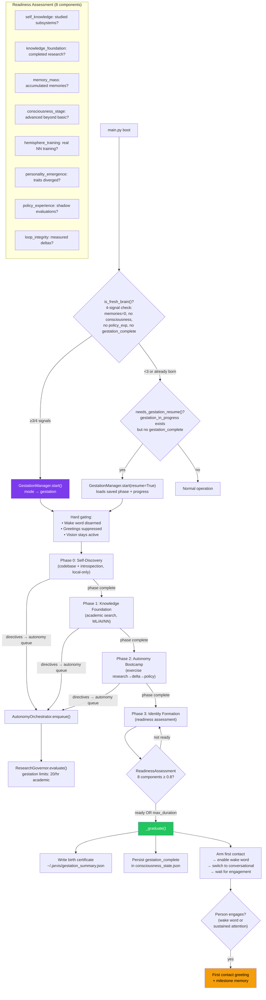

### Gestation Safety Mechanisms

| Mechanism | Implementation |
|---|---|
| Max duration cap | `GestationConfig.max_duration_s` (48hr default) — forces graduation |
| Backpressure | Pauses directive issuance if last tick > 80% budget |
| Offline safety | Dynamically shifts readiness weights if network is unavailable |
| Single concurrency | Reuses `MAX_CONCURRENT_RESEARCH = 1` from governor |
| Topic pacing | Gestation directives go through scorer/governor pacing |
| Strict provenance | `set_strict_provenance(True)` — requires DOI + venue + year for `factual_knowledge`; preprints downgraded to `contextual_insight` |
| Self-improvement paused | `SelfImprovementOrchestrator.set_paused(True)` — no code patches during gestation |
| Resume on restart | Progress persisted every 30s to `consciousness_state.json`; `needs_gestation_resume()` detects interrupted gestation |
| Proactive speech gated | Both `evaluate_proactive()` and `_proactive_speak()` return early during gestation |
| Sticky mode | `ModeManager` won't override gestation from attention heuristics |
| Person awareness | Vision tracks presence during gestation for first-contact timing |
| Quiet-ready | Never blurts — waits for wake word or sustained engagement |
| Birth certificate | Immutable `gestation_summary.json` for auditability |

---

## Data Flow: Self-Improvement

Multi-turn think-code-validate pipeline with iterative retry, atomic file application, and health-gated promotion. The coding LLM runs on a separate CPU-only Ollama instance to avoid GPU contention. **Provider gating**: on startup, the orchestrator checks for Claude/OpenAI API key availability — if neither is configured, self-improvement auto-enters dry-run mode (proposals only, never applied). The local Ollama provider includes hardened JSON parsing (`_extract_json()`), strict schema validation (`_REQUIRED_KEYS`), and retry-on-parse-fail (up to 2 retries with a structured repair prompt).

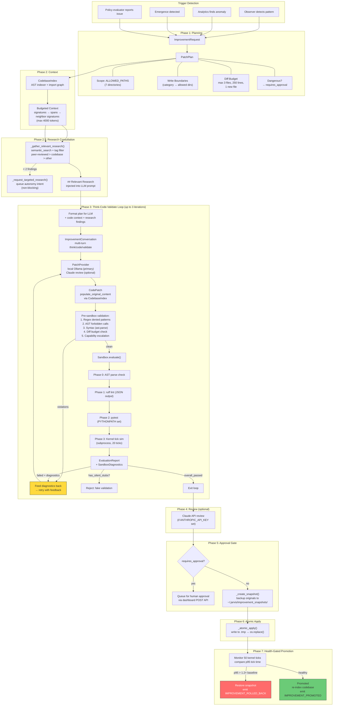

### Safety Boundaries

| Layer | Enforcement |
|---|---|
| **Scope** | `ALLOWED_PATHS`: `brain/consciousness/`, `personality/`, `policy/`, `self_improve/`, `reasoning/`, `hemisphere/`, `tools/`, `memory/`, `perception/` |
| **Write Boundaries** | Per-category enforcement via `CodebaseIndex.check_write_boundaries()` — each improvement category can only write to its own directories |
| **Content (regex)** | Word-boundary denied patterns: `\bsubprocess\b`, `\bos\.system\b`, `\bexec\s*\(`, `\beval\s*\(`, `\bcredentials\b`, `\bapi_key\b`, `\bpassword\b`, `\bsecret\b` |
| **Content (AST)** | Forbidden calls detected at AST level: `subprocess.run/Popen/call/check_output`, `os.system/popen/exec/execv`, bare `eval()`/`exec()` |
| **Diff Budget** | Max 3 files changed, 250 lines changed, 1 new file per patch |
| **Capability Escalation** | Auto-detected: new network imports, subprocess imports, security boundary modifications → requires approval |
| **Silent Stub Detection** | `has_silent_stubs()` flags validation phases that passed without actually executing (e.g., returned `True` without running ruff) |
| **Approval** | Human review required for: dangerous files (mutator/governor/persistence) or capability escalation |
| **Health Gate** | Post-apply p95 tick time monitored for 50 ticks; rollback if regression > 20% |

### Conversation Manager

Each improvement attempt creates an `ImprovementConversation` with multi-turn history:

| Turn Role | Maps To | Purpose |
|---|---|---|
| `system` | Ollama system message | Coder system prompt with rules |
| `think` | User message | Plan, requirements, code context |
| `code` | Assistant message | Generated patch (JSON) |
| `validate` | User message | Error diagnostics for retry |
| `review` | (external) | Claude review feedback |

Conversations are persisted as JSONL transcripts to `~/.jarvis/improvement_conversations/` for learning from past attempts.

### Research-Informed Code Generation

Before generating patches, the orchestrator queries Jarvis's accumulated research knowledge:

1. **Semantic search** against the improvement description finds related research memories
2. **Tag filter** prioritizes peer-reviewed findings (`evidence:peer_reviewed`) over codebase-sourced over general research
3. **Formatted findings** are injected as a `## Relevant Research` section in the LLM prompt, giving the code generator scientific grounding
4. **Knowledge gap trigger**: if fewer than 2 relevant findings exist, a targeted research intent is queued via the autonomy system (non-blocking — the current attempt proceeds with available knowledge, future attempts benefit)
5. The `CODER_SYSTEM_PROMPT` instructs the LLM to base implementations on provided research and cite which findings influenced design choices

---

## Data Flow: Skill Learning

Defense-in-depth system preventing capability hallucination, with a multi-phase learning pipeline for genuine skill acquisition.

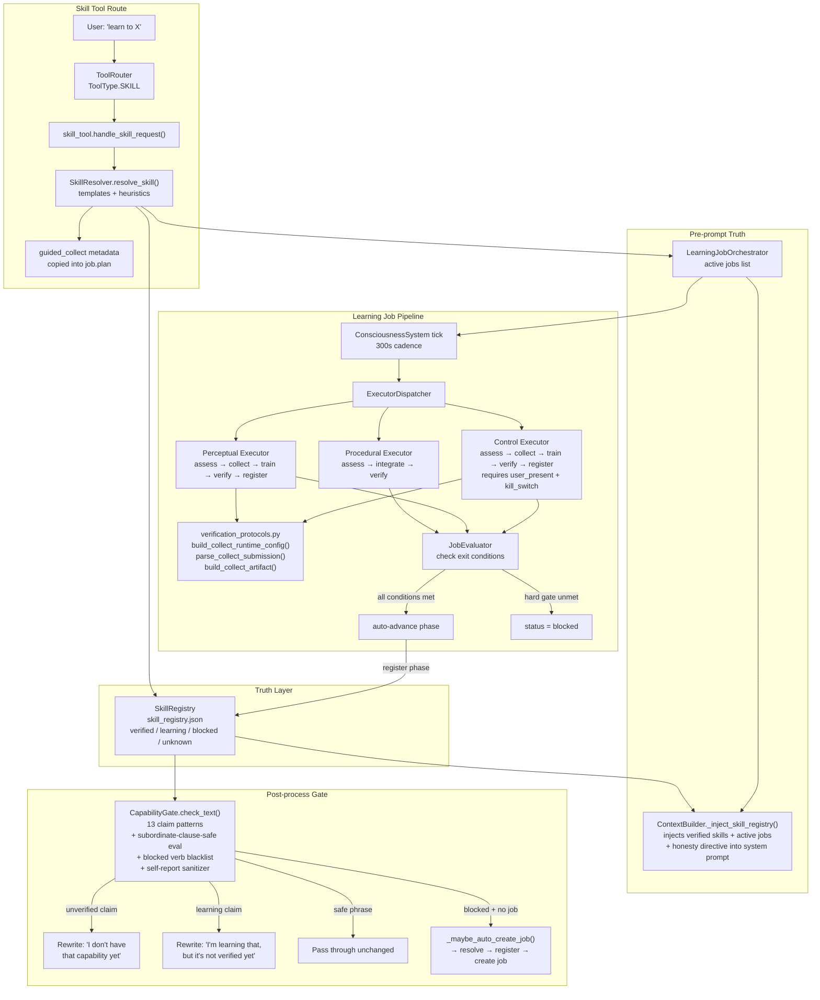

### Key Properties

- **Evidence-gated verification**: `set_status("verified")` requires passing `SkillEvidence` with all `verification_required` tests met
- **Unicode-hardened gate**: normalizes curly quotes, em dashes, ellipsis to ASCII before regex matching
- **Capability Gate runs upstream**: applied in `_send_sentence()` / `_broadcast_chunk_sync()` before both console print and WebSocket broadcast
- **Blocked verbs**: sing, hum, dance, draw, paint, compose, play instrument, mimic, whistle, etc.
- **Auto-job creation**: gate blocks a resolvable claim with no existing job, creates one automatically
- **Create-time validation**: `create_job()` rejects non-actionable `skill_id` phrases via `is_actionable_capability_phrase()`, with bypass for `BUILTIN_FAMILIES`
- **Protocol-driven collect/runtime config**: collect prompts, parser choice, artifact schema, metric names, and user-input hints resolve through `verification_protocols.build_collect_runtime_config()` before tool execution
- **Declarative guided collect**: `SkillResolution.guided_collect` metadata is copied into `job.plan`, so guided collect behavior comes from job/protocol config rather than `skill_id` branching
- **Autonomy boundary**: `interactive_collect` is explicit. Only jobs/protocols that opt in may ask the user for labeled samples; autonomous collection remains autonomous
- **Verify fail-fast**: auto-generated skills with no domain-specific verification method are immediately blocked (failure count set to `MAX_PHASE_FAILURES`) instead of burning 10 retry cycles
- **Control safety**: control skills require `user_present`, `hardware_connected`, and `kill_switch_configured` hard gates
- **Jobs can end as blocked**: "no feasible model on current hardware" is a valid terminal state
- **SkillEvidence schema v2 (5 Ws)**: evidence carries who (`verified_by`), what (`acceptance_criteria` + `measured_values` threshold vs measured pairs), when (`timestamp`), where (`environment` — hardware, tier, device), why (`summary`, `verification_method`, `verification_scope`). Additional fields: `evidence_schema_version` (`"1"` for legacy, `"2"` for new), `artifact_refs`, `known_limitations`, `regression_baseline_available`. `from_dict()` defaults to v1 for backward compatibility.
- **Evidence helpers module**: `evidence_helpers.py` centralizes evidence extraction (`find_latest_verify_evidence`, `collect_artifact_refs`, `capture_environment`, `build_acceptance_criteria`, `build_measured_values`) shared by all register-phase executors
- **Strict learning status/native answers**: learning-job and recent-learning/research introspection queries prefer native bounded answer classes (`learning_job_status`, `recent_learning`) before any LLM articulation
- **Junk job purge**: `_purge_verify_blocked_junk()` removes jobs that failed verification with no feasible method, plus their orphaned `SkillRecord` entries. `cleanup_blocked_jobs()` also removes junk skill records when deleting verify-blocked jobs.

---

## Data Flow: Document Library

The document library is a persistent knowledge store that replaces flat-text memory strings with structured, retrievable, and reinforceable artifacts.

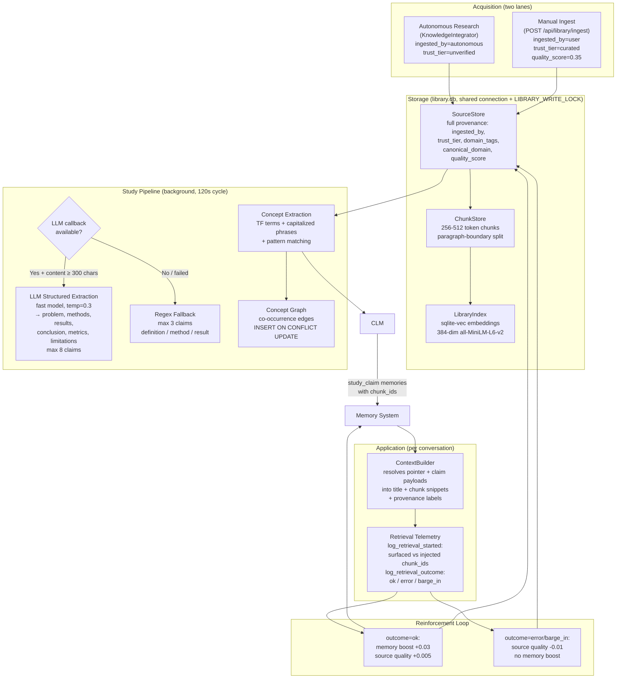

### Source Provenance Fields

| Field | Values | Purpose |
|---|---|---|
| `ingested_by` | `autonomous`, `user`, `admin` | Tracks acquisition lane |
| `trust_tier` | `unverified`, `curated`, `verified` | Limits initial influence |
| `domain_tags` | Comma-separated (e.g. `mechanic,automotive`) | Enables domain specialization |
| `canonical_domain` | URL hostname (e.g. `arxiv.org`) | Trusted domain lists |
| `quality_score` | 0.0 - 1.0 | Adjusted by reinforcement loop |
| `content_depth` | `full_text`, `abstract`, `tldr`, `title_only`, `metadata_only` | How much substance was actually stored |

### Manual Ingestion Safety

- **SSRF protection**: blocks private IPs (10.x, 172.16-31.x, 192.168.x, loopback, link-local), `.local`/`.internal` domains, DNS resolution validation
- **Hard caps**: 500KB text max, 200 chunks per source
- **Content-Type routing**: `_fetch_url()` inspects HTTP Content-Type header — PDFs routed to `pdftotext` extraction, HTML through tag stripping + `html.unescape()`, plain text/XML/JSON direct, binary content types rejected
- **HTML stripping**: removes script/style/noscript tags, collapses whitespace, decodes HTML entities (`&amp;`, `&lt;`, etc.)
- **No shortcut**: user sources start at `quality_score=0.35` and must earn retrieval wins to surface prominently

### Content Enrichment Pipeline

Jarvis uses a two-phase search + enrichment pipeline optimized for the Semantic Scholar API's recommended usage patterns:

**Phase 1 — Discovery** (`/paper/search/bulk`):
- Uses the bulk search endpoint (lower server-side cost than relevance search)
- Requests lightweight fields only: `paperId,title,year,venue,externalIds,citationCount,influentialCitationCount,isOpenAccess`
- Applies `minCitationCount=3` filter to eliminate zero-citation noise at the API level
- Applies `year=2018-` filter for recent research (configurable)
- Sorts by `citationCount:desc` so the most impactful papers come first
- Takes top N results (default: 5) from the response
- Retry logic: if bulk search returns 400 (some query syntax not supported), retries without `minCitationCount` and `sort`

**Phase 2 — Batch Enrichment** (`POST /paper/batch`):
- Fetches `abstract,authors,tldr,openAccessPdf` for all top-N results in a single batch call
- Replaces the old N individual `/paper/{id}` detail calls (1 request instead of N)
- Results are merged back into the lightweight discovery results

**Scoring** (`confidence_for_result()`):
- Three-dimension scoring: provenance base (peer-reviewed > preprint > DOI-only > unknown), citation impact (`influentialCitationCount × 2 + citationCount`), and recency bonus (+0.05 for last 3 years, +0.02 for last 5 years)
- Top ML/AI venues (NeurIPS, ICML, ICLR, CVPR, AAAI, JMLR, PAMI, Nature, etc.) get elevated base scores
- Score range: 0.25 (unknown, no DOI) to 0.95 (top venue, highly cited, recent)

**Content Preference**: Findings prefer abstract (first 1500 chars, higher fidelity) > TLDR (concise, AI-generated) > title only. The chosen level is tagged as a `[depth:X]` provenance annotation.

**`content_depth` Classification**: Each finding is classified as `tldr`, `abstract`, `title_only`, `metadata_only`, or `full_text` based on what content was actually available. This classification is stored on the `Source` record in `library.db`.

### Document Fetching

When `ResearchConfig.fetch_full_text` is enabled (default: True), the `KnowledgeIntegrator` attempts to retrieve the actual paper content before storing it:

1. **Open-access PDF**: If `open_access_pdf_url` is available, fetches the PDF and extracts text via `pdftotext` (from `poppler-utils`). Falls back gracefully if `pdftotext` is not installed.
2. **DOI URL fallback**: If no PDF URL but `doi_url` is present, fetches the HTML page and strips it to plain text using the existing SSRF-protected `_fetch_url()` from `library/ingest.py`.
3. **Quality threshold**: Fetched text must be > 500 characters to qualify as `full_text`. Shorter content (paywalls, redirects) is discarded and the original TLDR/abstract is kept.
4. **Size cap**: Content is truncated to `max_content_chars` (default: 5000) before storage.
5. **License tracking**: Sources with fetched full text are tagged `license_flags="open_access_full_text"` for provenance.

### Content Quality Gate

`KnowledgeIntegrator` enforces multi-layer quality validation before investing compute in chunking and embedding:

**Layer 1 — Content Validation** (`_validate_content_quality()`):
- Printable character ratio must exceed 0.85 (rejects binary dumps)
- U+FFFD replacement characters < 50 (rejects encoding garbage)
- PDF residue markers (CID font codes, `/Type /Font`, `stream/endstream`) trigger rejection

**Layer 2 — Paywall/Boilerplate Detection** (`_is_paywall_garbage()`):
- 25+ paywall marker phrases ("sign in", "institutional access", "cookie policy") with threshold of 2 hits
- Content-to-boilerplate paragraph ratio check (rejects navigation-heavy pages)
- Short paragraph heuristic (median < 80 chars with 3+ lines suggests non-article content)

**Layer 3 — Academic vs Boilerplate Scoring** (`_score_academic_content()`):
- Counts academic indicators (methodology, results, hypothesis, abstract, etc.)
- Counts boilerplate indicators (cookie policy, terms of service, subscribe, etc.)
- Boilerplate-dominated pages (boilerplate > academic AND boilerplate ≥ 3) are rejected

**Layer 3B — Academic Substance Check** (`_has_academic_substance()`):
- Verifies content contains at least 2 academic indicator terms AND at least 3 substantive paragraphs (≥ 30 words each)
- Applied to `full_text` content during both ingestion and document fetching
- Content failing this check is downgraded to `metadata_only` (stored for provenance, not chunked/embedded/studied)
- Prevents non-academic content (e.g., country lists, navigation pages, data tables) from being treated as scholarly research

**Layer 4 — Depth Gate**:
- Sources with `content_chars < min_content_chars` (default: 200) tagged `metadata_only`
- Sources tagged `metadata_only` or `title_only` are stored for provenance but **not chunked, not embedded, not studied**
- `title_only` findings are skipped before pointer memory creation in `_store_findings()`
- Content truncated to `max_content_chars` (default: 5000) before storage
- The study pipeline independently gates on `content_depth` — if a source somehow reaches the study queue with `title_only` or `metadata_only`, it is marked studied with `study_error="skipped:insufficient_content"` and skipped

**Ingestion Telemetry**: `KnowledgeIntegrator` tracks rejection reasons (`sources_rejected_binary`, `sources_rejected_paywall`, `sources_rejected_boilerplate`, `sources_rejected_title_only`), content depth distribution (`sources_full_text`, `sources_abstract`, `sources_tldr`, `sources_metadata_only`), PDF operations (`pdf_fetched`, `pdf_failed`), and Blue Diamonds operations (`diamonds_graduated`, `diamonds_rejected`) via `get_ingestion_stats()`.

### Research Configuration

`ResearchConfig` (in `brain/config.py`) controls research API behavior via environment variables:

| Setting | Env Var | Default | Purpose |
|---|---|---|---|
| `s2_api_key` | `S2_API_KEY` | `""` (works without) | Semantic Scholar API key for higher rate limits |
| `crossref_mailto` | `CROSSREF_MAILTO` | `""` | Crossref polite pool email for priority access |
| `min_content_chars` | — | `200` | Minimum content length to qualify for chunking |
| `max_content_chars` | — | `5000` | Max content stored per source |
| `fetch_tldr` | — | `True` | Request TLDRs from S2 |
| `fetch_open_access` | `RESEARCH_FETCH_OPEN_ACCESS` | `True` | Fetch open-access PDF URLs from S2 |
| `fetch_full_text` | `RESEARCH_FETCH_FULL_TEXT` | `True` | Download actual paper content (PDF/HTML) |
| `llm_study` | `RESEARCH_LLM_STUDY` | `True` | Use LLM for structured knowledge extraction in study pipeline |
| `enrich_on_ingest` | — | `True` | Auto-enrich results with missing abstracts |
| `detail_fetch_timeout` | — | `10` | Timeout in seconds for S2 detail API calls |

### Source Browser (Dashboard)

The main dashboard exposes a Library Source Browser (`GET /api/library/sources`) for verifying what Jarvis actually learned:

- Lists sources with title, venue, year, content depth, content character count, and a preview
- Supports filtering by `ingested_by` (autonomous vs user)
- Individual source detail view (`GET /api/library/sources/{source_id}`) shows full stored content
- Content depth distribution is shown as color-coded tags in the library panel

The eval dashboard (`/eval`) tracks **Library Knowledge Quality** as a separate integrity dimension: total sources, studied count, substantive vs shallow ratio, and per-depth breakdown.

### Study Pipeline

Runs as a background cycle (every 120s, max 2 sources per batch, daemon thread). For each unstudied source:

1. **Concept extraction** (always): TF terms, capitalized phrases, pattern-matched definitions → concept graph co-occurrence edges
2. **Structured knowledge extraction** (two paths):
   - **LLM path** (when `_llm_callback` is set and content ≥ 300 chars): Sends the combined chunk text to the fast model with a structured extraction prompt. Extracts: problem, approaches tried, what failed, what worked, key metrics, conclusion, limitations, novel concepts. Max 8 claims per source, each claim typed (`problem`, `result`, `conclusion`, `metric`, `negative_result`, `method`, `definition`, `limitation`). Temperature 0.3, max 600 tokens. JSON response parsed with code-fence stripping and resilient extraction.
   - **Regex fallback** (when LLM unavailable or fails): Pattern-based extraction using `_DEFINITION_RE`, `_PROPOSAL_RE`, `_RESULT_RE`, `_METHOD_RE`. Max 3 claims per source. Same claim type taxonomy, lower confidence.
3. **Memory creation**: Each claim becomes a `study_claim` memory with `chunk_ids` pointing back to evidence chunks, provenance tags, and full write path (storage → index → vector → MEMORY_WRITE event)
4. Mark source as studied (or log error with exponential backoff: 5min → 30min → 6hr)

The LLM callback is wired in `main.py` alongside the consciousness LLM callback, using the fast model (e.g. `qwen3:4b`). `StudyResult.extraction_method` tracks which path was used (`"llm"` or `"regex"`) for observability.

The key architectural win of LLM extraction is **argumentative understanding**: the LLM can distinguish "approach X was tried and failed" from "approach Y is the paper's conclusion" — something regex patterns cannot do. This means Jarvis learns not just that a method exists, but whether it worked.

### Retrieval Telemetry

Two-step JSONL logging for future reranker training:

1. `log_retrieval_started(conversation_id, query, chunk_ids_surfaced, chunk_ids_injected)` — what retrieval found vs what made it into the prompt
2. `log_retrieval_outcome(conversation_id, outcome, latency_ms)` — conversation result

Start events are buffered in an in-memory LRU (`OrderedDict`, max 100) for O(1) lookup during reinforcement.

---

## Data Flow: Dashboard

The dashboard never touches live subsystems. All data flows through a snapshot-then-push architecture.

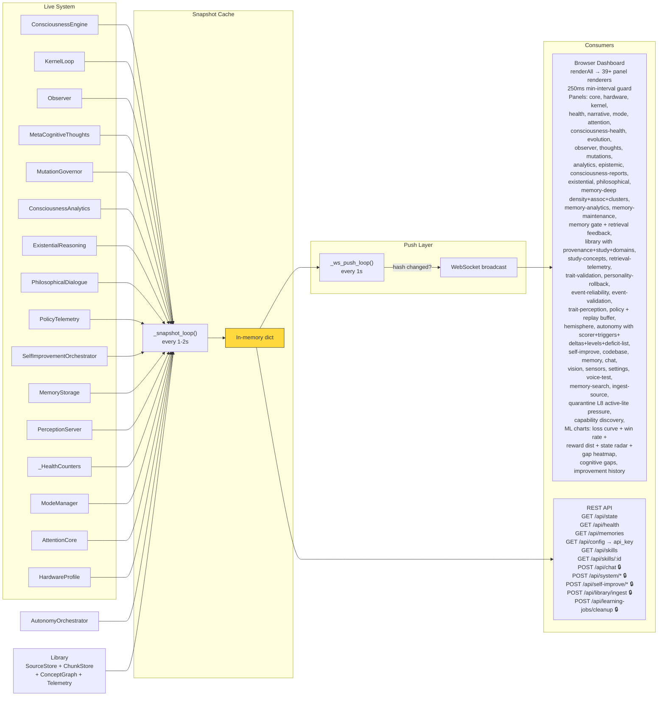

### Snapshot Cache Keys

| Key | Source | Read Cost |
|---|---|---|
| `core` | `engine.get_state()` | O(1) |
| `kernel` | `kernel.get_performance()` | O(1) |
| `consciousness` | `engine.get_consciousness_state()` | O(1) |
| `observer` | `observer.state + get_observation_summary() + get_epistemic_stats()` (includes stance) | O(1) |
| `dream_artifacts` | `consciousness_system.get_dream_artifact_stats()` (buffer + validator stats) | O(1) |
| `thoughts` | `meta_thoughts.get_recent_thoughts()` | O(1) |
| `mutations` | Governor stats + config version | O(1) |
| `analytics` | `analytics.get_full_state()` | O(1) |
| `existential` | `existential.get_state()` | O(1) |
| `philosophical` | `philosophical.get_state()` | O(1) |
| `policy` | `policy_telemetry.snapshot()` — includes `win_margin_ema`, `noop_count` | O(1) |
| `self_improve` | `orchestrator.get_status()` | O(1) |
| `memory` | `memory_storage.get_stats()` | O(1) |
| `sensors` | `perception.get_connected_sensors()` | O(1) |
| `health` | `_health.snapshot()` | O(1) |
| `mode` | `mode_manager.get_state()` | O(1) |
| `attention` | `attention_core.get_state()` | O(1) |
| `narrative` | `_build_narrative()` — focus, concern, insight, engagement | O(1) |
| `hardware` | `hardware_profile.to_dict()` — GPU, tier, models | O(1) |
| `health_report` | `analytics.get_health_report()` — 5-dim weighted health | O(1) |
| `memory_density` | `calculate_density()` — 4-axis density scoring | O(n) memories |
| `memory_associations` | `memory_storage.get_association_stats()` | O(1) |
| `memory_clusters` | `memory_cluster_engine.get_clusters()` | O(1) |
| `event_reliability` | `event_bus.get_metrics()` — circuit breaker stats | O(1) |
| `event_validation` | `event_validator.get_stats()` — sequence violations | O(1) |
| `epistemic` | `epistemic_engine.get_state()` — causal models | O(1) |
| `trait_validation` | `trait_validator.get_state()` — conflicts | O(1) |
| `personality_rollback` | `personality_rollback.get_state()` — snapshots | O(1) |
| `consciousness_reports` | `consciousness_communicator.get_recent_reports()` | O(1) |
| `trait_perception` | `trait_perception.get_stats()` — modulation counts | O(1) |
| `hemisphere` | `engine.get_hemisphere_state()` — NN focus areas | O(1) |
| `codebase` | `codebase_index.get_stats()` — modules, symbols, lines | O(1) |
| `autonomy` | `autonomy_orchestrator.get_status()` — queue, scorer, triggers, deltas, level, integrator (skipped_known, conflicts_detected) | O(1) |
| `gestation` | `gestation_manager.get_status()` — phase, readiness, directives, milestones | O(1) |
| `library` | `source_store.get_stats()` + `chunk_store.get_stats()` + `concept_graph.get_stats()` + `retrieval_telemetry.get_stats()` — sources by type/ingested_by, study progress, domain tags, chunk counts, concept counts, retrieval starts/outcomes | O(1) |
| `experience_buffer` | `experience_buffer.get_stats()` — size, top reward magnitude, replay defaults (recent bias, priority temperature) | O(n) buffer |
| `memory_gate` | `memory_gate.get_stats()` — open/closed state, depth, transition history, total opens | O(1) |
| `gap_detector` | From hemisphere `gap_detector` state — dimensions, EMAs, recent gaps | O(1) |
| `improvement_conversations` | `_load_recent_conversations(5)` — JSONL summaries | O(n) files |
| `policy_training` | `policy_telemetry.snapshot()` subset — loss/reward/win_rate history | O(1) |
| `skills` | `skill_registry.get_status_snapshot()` — per-skill `evidence_summary`, `verification_scope`, `schema_version` | O(n) skills |
| `learning_jobs` | `learning_job_orchestrator.get_status()` — active/blocked jobs with `phase_age_s`, `stale` flag | O(n) jobs |
| `capability_gate` | `capability_gate.get_stats()` — rewrite counters, block reasons, affect/learning/self_state | O(1) |
| `soul_integrity` | `soul_integrity_index.get_report()` — 10-dimension index, weakest dim, repair/critical flags | O(1) |
| `reflective_audit` | `reflective_audit_engine.get_state()` — latest audit score, finding counts, dimension breakdown | O(1) |

### Health Counters

`_HealthCounters` is a singleton that listens to events on the hot path and maintains monotonic counters:

| Counter | Source Event |
|---|---|
| `barge_in_count` | `PERCEPTION_BARGE_IN` (subscribed via event bus; barge-in is also handled via ASP callback) |
| `response_count` | `CONVERSATION_RESPONSE` |
| `error_count` | `KERNEL_ERROR` |
| `mode_transition_count` | `MODE_CHANGE` |
| `analysis_count` | `CONSCIOUSNESS_ANALYSIS` |
| `avg_response_latency_ms` | `CONVERSATION_RESPONSE` (EMA) |
| `uptime_s` | Computed from boot time |

### Telemetry API Data Shapes

All dashboard data conforms to one of 4 stable shapes defined in `dashboard/telemetry_api.py`:

| Shape | Use Case | Fields |
|---|---|---|
| `TimeseriesPoint` | Loss curves, win rate, reward history | `timestamp`, `value`, `label` |
| `HistogramBin` | Reward distribution | `bin_start`, `bin_end`, `count` |
| `HeatmapCell` | Cognitive gap map, topology heatmap | `row`, `col`, `value` |
| `TopologyGraph` | Network topology visualization | `nodes[]`, `edges[]` |

### ML Dashboard Charts

| Chart | Canvas ID | Data Source | Feed Cadence | Type |
|---|---|---|---|---|
| Training Loss Curve | `chart-loss-curve` | `policy_training.loss_history` | On train (requires 50+ new exp) | Sparkline |
| NN vs Kernel Win Rate | `chart-win-rate` | `policy_training.win_rate_history` | Every 30s (evaluator telemetry) | Sparkline |
| Reward Distribution | `chart-reward-dist` | `policy_training.reward_history` | Every 10s (shadow eval) | Bar chart (histogram) |
| State Space Radar | `chart-state-radar` | Consciousness + analytics composite | Every snapshot cycle | Radar chart |
| Cognitive Gap Map | `chart-gap-heatmap` | `gap_detector.dimensions` | Every snapshot cycle | Heatmap |
| Self-Improvement History | `improvement-history` | `self_improve.recent_history` | On improvement attempt | Log list |

---

## Data Flow: Truth Calibration (Layer 6)

Layer 6 continuously turns observed outcomes into a bounded truth contract used by
dashboard operators, eval rollups, and Layer-10 integrity scoring.

```mermaid
flowchart LR
    PS[PerceptionOrchestrator<br/>get_spatial_state()] --> SC[SignalCollector<br/>collect() + _collect_spatial()]
    SC --> SNAP[CalibrationSnapshot]
    SNAP --> DC[DomainCalibrator<br/>11 domains]
    DC --> TS[TruthScoreCalculator<br/>weighted composite]
    DC --> DD[DriftDetector]
    TS --> TCE[TruthCalibrationEngine.get_state()]
    DD --> TCE
    TCE --> DASH[Dashboard truth panel]
    TCE --> EVAL[Eval scorecards]
    TCE --> SOUL[Soul Integrity Index]
```

### Layer-6 Contract

- Spatial domains (`spatial_position`, `spatial_motion`, `spatial_relation`) are first-class calibration domains and now contribute directly to the composite `truth_score`.
- `TruthCalibrationEngine.get_state()` always emits canonical keys (`route_brier_scores`, `active_drift_alerts`) and compatibility aliases (`route_brier`, `drift_alerts`) with stable empty defaults.
- Provisional domain behavior is unchanged: if provisional domains exceed threshold, `truth_score` is withheld (`None`) while maturity still reports coverage progress.

---

## Data Flow: Unified World Model

The cognition layer (`brain/cognition/`) implements a **unified belief state** that fuses 9 subsystem snapshots into a single `WorldState` — the agent's internal model of reality.

```
 Signal Sources                     Cognition Layer
 ──────────────                     ───────────────
 SceneTracker.get_state()    ──┐
 AttentionCore.get_state()   ──┤
 PresenceTracker.get_state() ──┤
 PerceptionOrchestrator      ──┤    WorldModel.update()
   ._current_speaker         ──┤         │
   ._current_emotion         ──┤         ▼
 ModeManager.get_state()     ──┤    WorldState (v=N)
 GoalManager.get_status()    ──┤    ├── PhysicalState (entities, displays, regions)
 EpisodicMemory              ──┤    ├── UserState (presence, engagement, emotion, identity)
 HealthMonitor.get_summary() ──┤    ├── ConversationState (active, topic, turns)
 Analytics.get_full_state()  ──┘    ├── SystemState (mode, health, goals, memory)
                                    ├── uncertainty: {physical: 0.12, user: 0.05, ...}
                                    └── staleness: {physical: 2.1s, user: 0.3s, ...}
                                         │
                         ┌───────────────┼───────────────┐
                         ▼               ▼               ▼
                   DeltaDetection   CausalEngine    Dashboard
                   (diff vs prev)   (heuristic       (cache)
                         │           rules)
                         │               │
                         ▼               ▼
                   WorldDelta[]    CausalPrediction[]
                   (typed events)  (state deltas)
                         │               │
                         │               ▼
                         │         PredictionValidator
                         │         (hit/miss w/ tolerance)
                         │               │
                         │               ▼
                         │         WorldModelPromotion
                         │         (shadow → advisory → active)
                         │
                         ├── [promotion ≥ 1] → ContextBuilder (LLM prompt injection)
                         └── [promotion ≥ 2] → AutonomyOrchestrator (curiosity triggers)
```

**Tick cadence**: 5s normal, 30s in sleep mode. Runs as `world_model` cycle in `consciousness_system.on_tick()`.

**Four facets** of WorldState:
- **PhysicalState**: entities from SceneTracker (visible/stable counts), display surfaces, display content, region visibility, person count
- **UserState**: presence + confidence, engagement level, emotion + confidence, speaker identity + method, gesture, seconds since last interaction
- **ConversationState**: active flag, topic, last user/response text, conversation ID, turn count, follow-up state
- **SystemState**: operational mode, health score, confidence, autonomy level, active goal, memory count, uptime

**Per-facet uncertainty** (0.0=certain, 1.0=unknown): computed from `staleness_factor * 0.6 + confidence_factor * 0.4` where staleness grows linearly to threshold (physical=30s, user=60s, conversation=120s, system=300s).

**Monotonic version counter**: prevents race conditions between consumers (simulator, planner, LLM context) reading at different cadences.

**Delta detection**: compares consecutive WorldState snapshots, producing typed `WorldDelta` events:
- Physical: `entity_appeared`, `entity_disappeared`, `entity_moved`, `display_content_changed`
- User: `user_arrived`, `user_departed`, `emotion_changed`, `engagement_crossed_threshold`, `speaker_changed`
- Conversation: `conversation_started`, `conversation_ended`, `topic_changed`, `follow_up_started`
- System: `mode_changed`, `health_degraded`, `health_recovered`, `goal_promoted`, `goal_completed`

**Causal Engine**: 18 heuristic rules with priority-based conflict resolution (health=100 > user=50 > conversation=40 > system=20). Each rule produces a `predicted_delta` dict (e.g. `{"user.engagement": 0.0, "conversation.active": False}`). Predictions validated after horizon expires with `FLOAT_TOLERANCE = 0.1`.

**Promotion** (shadow → advisory → active): requires accuracy ≥ 0.65, ≥ 50 validated predictions, ≥ 4h in shadow. Same thresholds apply for advisory→active re-evaluation. Auto-demotion if accuracy < 0.50 over 20 consecutive outcomes. Persisted to `~/.jarvis/world_model_promotion.json`.

---

## Data Flow: Eval Sidecar (PVL)

The eval sidecar is a **read-only shadow observer** that monitors architectural conformance. It answers: "Is every subsystem promised by the architecture actually running and producing expected output?"

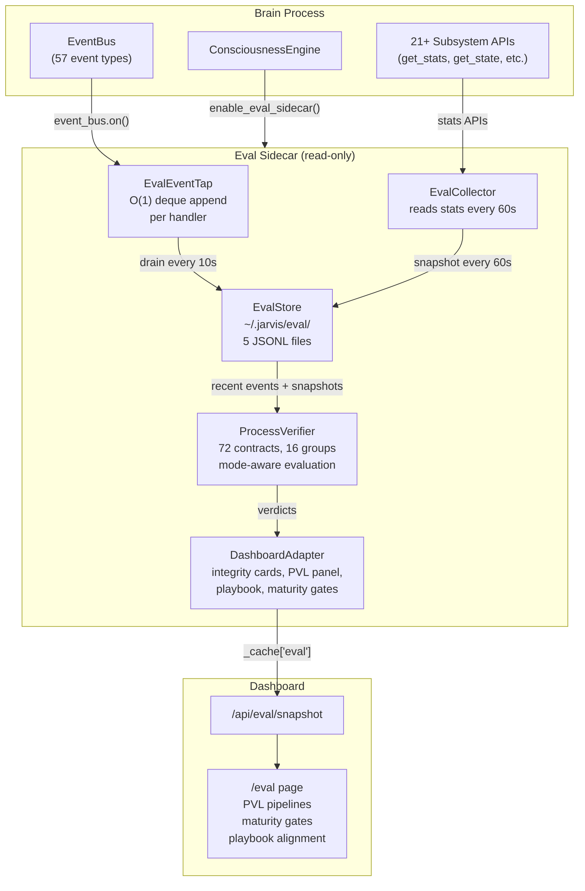

### PVL Contract Groups (16 groups, 72 contracts)

| Group | Contracts | Method | Checks |
|---|---|---|---|
| Voice Pipeline | 4 | event | wake_word, STT, user_message, response |
| Identity Pipeline | 4 | event | speaker_id, face_id, identity_fused, scoped |
| Memory Pipeline | 5 | event+snapshot | write, associate, ranker data, salience, count |
| Study Pipeline | 4 | snapshot | studied, llm_extraction, claims, ingested |
| Epistemic System | 7 | event | contradiction, calibration, quarantine, audit, integrity, graph edge, prediction |
| Hemisphere/Distillation | 5 | event+snapshot | trained, ready, distillation stats/signals, slots |
| Policy Pipeline | 3 | snapshot | decisions, shadow A/B, experience logged |
| Autonomy Pipeline | 4 | event | intent, start, complete, delta measured |
| Gestation | 5 | event | started, phase_advanced, directive, readiness, graduated |
| Skill Learning | 4 | event | registered, job started, phase advanced, completed |
| Mutation Pipeline | 2 | event | proposed, governed |
| Consciousness Tick | 5 | event+snapshot | mode, meta_thoughts, evolution, stage, analysis |
| Capability Gate | 2 | snapshot | claims checked, claims blocked |
| World Model | 2 | event | ticked, prediction validated |
| Curiosity Bridge | 3 | event | question generated, asked, answer processed |
| Roadmap Maturity Gates | 13 | snapshot | phase-gated progression thresholds |

### Playbook Alignment (7-Day Schedule)

| Day | Groups | Focus |
|---|---|---|
| 1 | Voice Pipeline, Identity Pipeline | Basic I/O |
| 2 | Memory Pipeline, Capability Gate | Memory formation |
| 3 | Identity Pipeline | Identity maturity |
| 4 | Policy Pipeline, Consciousness Tick | Policy activation |
| 5 | Epistemic System | Epistemic layers |
| 6 | Memory Pipeline | Memory depth |
| 7 | Autonomy Pipeline, Epistemic System | Autonomy + integrity |

### Oracle Benchmark v1.1

The Oracle Benchmark (`oracle_benchmark.py`) is a pure-read-only scorer that evaluates 7 domains (100 points total): restart integrity (20), epistemic integrity (20), memory continuity (15), operational maturity (15), autonomy attribution (10), world model coherence (10), learning adaptation (10). It enforces domain floors, seal levels (Gold/Silver/Bronze), hard-fail gates, and evidence provenance classification. The benchmark rank ladder (dormant_construct → oracle_ascendant) is separate from the runtime evolution stage ladder. Rolling scorecard comparisons (`scorecards.py`) persist to `eval/oracle_scorecards.jsonl`. API: `GET /api/eval/benchmark`. v1.1 refinements: minimum-sample floors for subcriteria, "not measured yet" vs "measured zero" distinction, log-scale ramps, and "proven zero debt" for contradiction persistence.

### Invariants

1. The sidecar NEVER emits events back to EventBus
2. The sidecar NEVER writes to memory, beliefs, dreams, or policy
3. All JSONL files live in isolated `~/.jarvis/eval/` directory
4. Dashboard reads pre-built snapshots — no computation on read path
5. Event tap handlers are O(1) deque append under lock
6. Oracle Benchmark is pure-read — it scores existing state, never writes to any subsystem

---

## Data Flow: Blue Diamonds Archive

The Blue Diamonds Archive is a **permanent curated knowledge vault** that lives outside `~/.jarvis/` at `~/.jarvis_blue_diamonds/`, surviving brain resets.

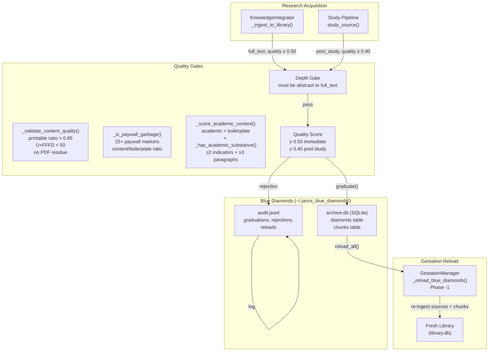

### Graduation Criteria

| Gate | Requirement |
|---|---|
| Content depth | `abstract` or `full_text` (tldrs, title_only, metadata_only excluded) |
| Quality score (immediate) | ≥ 0.50 (for full_text immediately after ingestion) |
| Quality score (post-study) | ≥ 0.40 (after study pipeline extracts concepts/claims) |
| Deduplication | `is_archived(source_id)` check prevents double-graduation |

### Reset Behavior

| Mode | `~/.jarvis/` | Blue Diamonds |
|---|---|---|
| Standard reset | Epistemic state cleared, identity/models preserved | **Preserved** |
| `--nuke` | Everything in `~/.jarvis/` destroyed | **Preserved** |
| `--full-wipe` | Everything in `~/.jarvis/` destroyed | **Destroyed** (with confirmation) |

---

## Data Flow: Fractal Recall

Background associative recall cycle that surfaces grounded memory chains during waking operation and feeds them into the curiosity/proactive/epistemic stack. Runs as a consciousness tick cycle every 30s, disabled in sleep/dreaming/gestation/deep_learning.

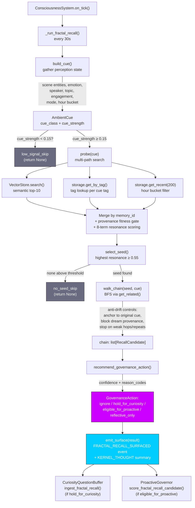

### Resonance Formula

```
R = 0.25·semantic + 0.18·tag + 0.12·temporal + 0.12·emotion
  + 0.08·association + 0.10·provenance + 0.05·mode_fit - 0.10·recency
```

Clamped to [0.0, 1.0]. Seed threshold: 0.55. Chain continuation threshold: 0.40.

### Cue Class Classifier (priority order)

1. **`technical_self_model`** — topic contains system-self lexicon OR route is STATUS/MEMORY/INTROSPECTION
2. **`human_present`** — speaker/person detected AND engagement > 0.30
3. **`reflective_internal`** — reflective/passive mode, no active conversation, no speaker
4. **`ambient_environmental`** — fallback

### Governance Rules

| Action | Condition |
|---|---|
| `ignore` | Low cue strength, poor grounding, repetitive chain, >50% blocked provenance |
| `reflective_only` | Identity-sensitive memory in chain, reflective cue class, self-model chain |
| `hold_for_curiosity` | Novel topic, unresolved uncertainty, emotional salience |
| `eligible_for_proactive` | Grounded chain + human_present + high engagement + no identity sensitivity + relevant to topic |

Identity-sensitive chains **never** receive `eligible_for_proactive`.

### Mode Exclusions

Disabled in: `gestation`, `sleep`, `dreaming`, `deep_learning`. Active in: `passive`, `conversational`, `reflective`, `focused`.

### Rollout Phases

| Phase | Status | What |
|---|---|---|
| **Rollout 1** | Shipped | Event-only mode: engine + wiring + dashboard + curiosity/proactive intake |
| **Rollout 2** | Pending | Tiny reinforcement (RECALL_BOOST=0.0025) + access metadata shaping |
| **Rollout 3** | Pending | Shadow-safe ranker/salience training via `train_shadow()` |
| **Rollout 4** | Pending | Surprise-prioritized dream reinforcement |
| **Rollout 5** | Pending | Distorted replay sandbox (DreamArtifact only) |

### Key Files

| File | Role |
|---|---|
| `brain/memory/fractal_recall.py` | Core engine, dataclasses, scoring, chain walk, governance |
| `brain/consciousness/consciousness_system.py` | Tick wiring, lazy init, mode gate |
| `brain/consciousness/events.py` | `FRACTAL_RECALL_SURFACED` constant |
| `brain/consciousness/modes.py` | `fractal_recall` in ALL_CYCLES |
| `brain/personality/curiosity_questions.py` | `ingest_fractal_recall()` intake adapter |
| `brain/personality/proactive.py` | `score_fractal_recall_candidate()` scoring adapter |
| `brain/dashboard/snapshot.py` | Telemetry snapshot |
| `brain/tests/test_fractal_recall.py` | 24 unit/integration tests |

---

## Event Catalog

All events defined in `brain/consciousness/events.py` (139 constants) and module-local constants. One raw string emit exists: `echo:detected` in perception_orchestrator.py.

### Kernel Events

| Constant | Value | Emitted By | Subscribers |
|---|---|---|---|
| `KERNEL_BOOT` | `kernel:boot` | KernelLoop | Engine startup |
| `KERNEL_TICK` | `kernel:tick` | KernelLoop | Performance tracking |
| `KERNEL_PHASE_CHANGE` | `kernel:phase_change` | PhaseManager | ConsciousnessSystem, Dashboard |
| `KERNEL_THOUGHT` | `kernel:thought` | Engine.on_thinking_cycle | Dashboard, AutonomyEventBridge |
| `KERNEL_ERROR` | `kernel:error` | KernelLoop (on exception) | _HealthCounters, Dashboard |

### State Transition Events

| Constant | Value | Emitted By | Subscribers |
|---|---|---|---|
| `PHASE_SHIFT` | `phase:shift` | KernelLoop._process_phase | ConsciousnessSystem.on_event |
| `TONE_SHIFT` | `tone:shift` | KernelLoop._process_tone | ConsciousnessSystem.on_event, Engine |
| `CONFIDENCE_UPDATE` | `confidence:update` | ConsciousnessSystem | Dashboard |

### Memory Events

| Constant | Value | Emitted By | Subscribers |
|---|---|---|---|
| `MEMORY_WRITE` | `memory:write` | MemoryStorage | ConsciousnessSystem.on_event, Observer, Analytics, ContradictionEngine (Layer 5) |
| `MEMORY_DECAY_CYCLE` | `memory:decay_cycle` | MemoryStorage | Analytics |
| `MEMORY_TRIMMED` | `memory:trimmed` | MemoryStorage | Analytics |
| `MEMORY_ASSOCIATED` | `memory:associated` | MemoryStorage | Analytics |
| `MEMORY_TRANSACTION_COMPLETE` | `memory:transaction_complete` | MemoryTransactions | Analytics |
| `MEMORY_TRANSACTION_ROLLBACK` | `memory:transaction_rollback` | MemoryTransactions | Analytics |

### Perception Events

| Constant | Value | Emitted By | Subscribers |
|---|---|---|---|
| `PERCEPTION_EVENT` | `perception:event` | PerceptionServer | Generic listeners |
| `PERCEPTION_USER_PRESENT` | `perception:user_present` | PresenceTracker (raw) | PresenceTracker (internal) |
| `PERCEPTION_USER_PRESENT_STABLE` | `perception:user_present_stable` | PresenceTracker (after hysteresis) | AttentionCore, Engine |
| `PERCEPTION_USER_ATTENTION` | `perception:user_attention` | VisionProcessor | AttentionCore |
| `PERCEPTION_AMBIENT_SOUND` | `perception:ambient_sound` | AmbientAudioProcessor | AttentionCore |
| `PERCEPTION_RAW_AUDIO` | `perception:raw_audio` | PerceptionServer (binary frames) | PerceptionOrchestrator → AudioStreamProcessor |
| `PERCEPTION_TRANSCRIPTION` | `perception:transcription` | PerceptionOrchestrator (after STT) | PerceptionOrchestrator → ConversationHandler |
| `PERCEPTION_TRANSCRIPTION_READY` | `perception:transcription_ready` | (reserved) | (reserved for future streaming STT) |
| `PERCEPTION_SCREEN_CONTEXT` | `perception:screen_context` | ScreenProcessor | Engine |
| `PERCEPTION_SPEAKER_IDENTIFIED` | `perception:speaker_identified` | PerceptionOrchestrator | AttentionCore, PerceptionOrchestrator |
| `PERCEPTION_USER_EMOTION` | `perception:user_emotion` | PerceptionOrchestrator | AttentionCore, PerceptionOrchestrator |
| `PERCEPTION_POSE_DETECTED` | `perception:pose_detected` | PerceptionServer | AttentionCore |
| `PERCEPTION_PARTIAL_TRANSCRIPTION` | `perception:partial_transcription` | (reserved) | UI (streaming) |
| `PERCEPTION_SCENE_SUMMARY` | `perception:scene_summary` | PerceptionServer (from Pi scene_summary) | PerceptionOrchestrator → SceneTracker |

| `PERCEPTION_PLAYBACK_COMPLETE` | `perception:playback_complete` | PerceptionOrchestrator | Audio pipeline |

**Callback-driven events** (still have constants in `events.py`, used by some subscribers):
- `PERCEPTION_WAKE_WORD` — wake detection is internal to AudioStreamProcessor; fires `on_wake` callback directly
- `PERCEPTION_BARGE_IN` — barge-in is internal to AudioStreamProcessor; fires `on_barge_in` callback. _HealthCounters still subscribes to the event constant.
- `PERCEPTION_AUDIO_CLIP`, `PERCEPTION_AUDIO_STREAM_START/CHUNK/END`, `PERCEPTION_AUDIO_FEATURES` — reserved constants, not actively emitted in current architecture

### Conversation Events

| Constant | Value | Emitted By | Subscribers |
|---|---|---|---|
| `CONVERSATION_USER_MESSAGE` | `conversation:user_message` | ConversationHandler | ReflectionEngine |
| `CONVERSATION_RESPONSE` | `conversation:response` | ConversationHandler | ReflectionEngine, _HealthCounters |

### Soul Events

| Constant | Value | Emitted By | Subscribers |
|---|---|---|---|
| `SOUL_EXPORTED` | `soul:exported` | SoulService | Dashboard |
| `SOUL_IMPORTED` | `soul:imported` | SoulService | Dashboard |
| `PERSONALITY_ROLLBACK` | `personality:rollback` | PersonalityRollback | TraitEvolution, ToneEngine, Engine (freezes trait evolution + perception modulation) |

### Consciousness Events

| Constant | Value | Emitted By | Subscribers |
|---|---|---|---|
| `CONSCIOUSNESS_ANALYSIS` | `consciousness:analysis` | ConsciousnessSystem._run_analysis | _HealthCounters, Dashboard |
| `CONSCIOUSNESS_SELF_OBSERVATION` | `consciousness:self_observation` | Observer | Dashboard |
| `CONSCIOUSNESS_EVOLUTION_EVENT` | `consciousness:evolution_event` | ConsciousnessEvolution | Dashboard |
| `CONSCIOUSNESS_EMERGENT_BEHAVIOR` | `consciousness:emergent_behavior` | ConsciousnessEvolution | Dashboard, AutonomyEventBridge |
| `CONSCIOUSNESS_TRANSCENDENCE_MILESTONE` | `consciousness:transcendence_milestone` | ConsciousnessEvolution | Dashboard |
| `CONSCIOUSNESS_MUTATION_PROPOSED` | `consciousness:mutation_proposed` | KernelMutator | Dashboard |
| `CONSCIOUSNESS_CAPABILITY_UNLOCKED` | `consciousness:capability_unlocked` | DrivenEvolution | Dashboard |
| `CONSCIOUSNESS_LEARNING_PROTOCOL` | `consciousness:learning_protocol_activated` | DrivenEvolution | Dashboard, AutonomyEventBridge |

### Mutation Events

| Constant | Value | Emitted By | Subscribers |
|---|---|---|---|
| `MUTATION_APPLIED` | `mutation:applied` | ConsciousnessSystem._run_mutation_cycle | ConsciousnessSystem.on_event, Dashboard |
| `MUTATION_REJECTED` | `mutation:rejected` | MutationGovernor | Dashboard |
| `MUTATION_ROLLBACK` | `mutation:rollback` | MutationGovernor | Dashboard |

### Meta-Cognition Events

| Constant | Value | Emitted By | Subscribers |
|---|---|---|---|
| `META_THOUGHT_GENERATED` | `meta:thought_generated` | MetaCognitiveThoughts | Dashboard |
| `EXISTENTIAL_INQUIRY_COMPLETED` | `existential:inquiry_completed` | ExistentialReasoning | Dashboard, AutonomyEventBridge |
| `PHILOSOPHICAL_DIALOGUE_COMPLETED` | `philosophical:dialogue_completed` | PhilosophicalDialogue | Dashboard |

### System Events

| Constant | Value | Emitted By | Subscribers |
|---|---|---|---|
| `SYSTEM_INIT_COMPLETE` | `system:initialization_complete` | Main (startup) | Engine |
| `SYSTEM_EVENT_BUS_READY` | `system:event_bus_ready` | EventBus | Barrier mechanism |

### Hemisphere Events

| Constant | Value | Emitted By | Subscribers |
|---|---|---|---|
| `HEMISPHERE_ARCHITECTURE_DESIGNED` | `hemisphere:architecture_designed` | EventBridge | Dashboard |
| `HEMISPHERE_TRAINING_PROGRESS` | `hemisphere:training_progress` | EventBridge | Dashboard |
| `HEMISPHERE_NETWORK_READY` | `hemisphere:network_ready` | EventBridge | Dashboard |
| `HEMISPHERE_EVOLUTION_COMPLETE` | `hemisphere:evolution_complete` | EventBridge | Dashboard |
| `HEMISPHERE_MIGRATION_DECISION` | `hemisphere:migration_decision` | EventBridge | Dashboard |
| `HEMISPHERE_SUBSTRATE_MIGRATION` | `hemisphere:substrate_migration` | EventBridge | Dashboard |
| `HEMISPHERE_PERFORMANCE_WARNING` | `hemisphere:performance_warning` | EventBridge | Dashboard |
| `HEMISPHERE_DISTILLATION_STATS` | `hemisphere:distillation_stats` | HemisphereOrchestrator | Dashboard |

### Self-Improvement Events

| Constant | Value | Emitted By | Subscribers |
|---|---|---|---|
| `IMPROVEMENT_STARTED` | `improvement:started` | SelfImprovementOrchestrator | Dashboard |
| `IMPROVEMENT_VALIDATED` | `improvement:validated` | SelfImprovementOrchestrator | Dashboard |
| `IMPROVEMENT_PROMOTED` | `improvement:promoted` | SelfImprovementOrchestrator | Dashboard |
| `IMPROVEMENT_ROLLED_BACK` | `improvement:rolled_back` | SelfImprovementOrchestrator | Dashboard |
| `IMPROVEMENT_NEEDS_APPROVAL` | `improvement:needs_approval` | SelfImprovementOrchestrator | Dashboard |
| `IMPROVEMENT_DRY_RUN` | `improvement:dry_run` | SelfImprovementOrchestrator | Dashboard |

### Gestation Events

| Constant | Value | Emitted By | Subscribers |
|---|---|---|---|
| `GESTATION_STARTED` | `gestation:started` | GestationManager | Dashboard |
| `GESTATION_PHASE_ADVANCED` | `gestation:phase_advanced` | GestationManager | Dashboard |
| `GESTATION_DIRECTIVE_COMPLETED` | `gestation:directive_completed` | GestationManager | Dashboard |
| `GESTATION_READINESS_UPDATE` | `gestation:readiness_update` | GestationManager | Dashboard |
| `GESTATION_COMPLETE` | `gestation:complete` | GestationManager | Engine, Dashboard |
| `GESTATION_FIRST_CONTACT` | `gestation:first_contact` | GestationManager | Dashboard |

### Autonomy Events

| Constant | Value | Emitted By | Subscribers |
|---|---|---|---|
| `AUTONOMY_INTENT_QUEUED` | `autonomy:intent_queued` | AutonomyOrchestrator | Dashboard |
| `AUTONOMY_INTENT_BLOCKED` | `autonomy:intent_blocked` | AutonomyOrchestrator | Dashboard |
| `AUTONOMY_RESEARCH_STARTED` | `autonomy:research_started` | AutonomyOrchestrator | Dashboard |
| `AUTONOMY_RESEARCH_COMPLETED` | `autonomy:research_completed` | AutonomyOrchestrator | Dashboard, KnowledgeIntegrator |
| `AUTONOMY_RESEARCH_FAILED` | `autonomy:research_failed` | AutonomyOrchestrator | Dashboard |
| `AUTONOMY_RESEARCH_SKIPPED` | `autonomy:research_skipped` | AutonomyOrchestrator | Dashboard |
| `AUTONOMY_LEVEL_CHANGED` | `autonomy:level_changed` | AutonomyOrchestrator | Dashboard |
| `AUTONOMY_DELTA_MEASURED` | `autonomy:delta_measured` | AutonomyOrchestrator | DeltaTracker |

### Skill Learning Events

| Constant | Value | Emitted By | Subscribers |
|---|---|---|---|
| `SKILL_REGISTERED` | `skill:registered` | SkillRegistry | Dashboard |
| `SKILL_STATUS_CHANGED` | `skill:status_changed` | SkillRegistry | Dashboard, CapabilityGate |
| `SKILL_LEARNING_STARTED` | `skill:learning_started` | LearningJobOrchestrator | Dashboard |
| `SKILL_LEARNING_COMPLETED` | `skill:learning_completed` | LearningJobOrchestrator | Dashboard |
| `SKILL_VERIFICATION_RECORDED` | `skill:verification_recorded` | LearningJobOrchestrator | Dashboard |
| `SKILL_JOB_PHASE_CHANGED` | `skill:job_phase_changed` | LearningJobOrchestrator | Dashboard |

### Identity Events

| Constant | Value | Emitted By | Subscribers |
|---|---|---|---|
| `IDENTITY_SCOPE_ASSIGNED` | `identity:scope_assigned` | IdentityAudit | Dashboard |
| `IDENTITY_BOUNDARY_BLOCKED` | `identity:boundary_blocked` | IdentityAudit | Dashboard |
| `IDENTITY_AMBIGUITY_DETECTED` | `identity:ambiguity_detected` | IdentityAudit | Dashboard |

Note: `IDENTITY_RESOLVED` is module-local in `perception/identity_fusion.py`, not in events.py. See Module-Local Events section below.

### Quarantine Events (Layer 8)

| Constant | Value | Emitted By | Subscribers |
|---|---|---|---|
| `QUARANTINE_SIGNAL_EMITTED` | `quarantine:signal_emitted` | ConsciousnessSystem | Dashboard, QuarantinePressure, Layer 9 |
| `QUARANTINE_TICK_COMPLETE` | `quarantine:tick_complete` | ConsciousnessSystem | Dashboard, Layer 9 |

### Capability Discovery Events

| Constant | Value | Emitted By | Subscribers |
|---|---|---|---|
| `CAPABILITY_CLAIM_BLOCKED` | `capability:claim_blocked` | CapabilityGate | BlockFrequencyTracker, Dashboard |
| `CAPABILITY_GAP_DETECTED` | `capability:gap_detected` | ConsciousnessSystem | Dashboard |

### World Model Events (Cognition Layer)

| Constant | Value | Emitted By | Subscribers |
|---|---|---|---|
| `WORLD_MODEL_UPDATE` | `world_model:update` | WorldModel | Dashboard |
| `WORLD_MODEL_DELTA` | `world_model:delta` | WorldModel._detect_deltas() | EvalSidecar, CuriosityQuestionBuffer, Dashboard |
| `WORLD_MODEL_PREDICTION` | `world_model:prediction` | CausalEngine | Dashboard |
| `WORLD_MODEL_PREDICTION_VALIDATED` | `world_model:prediction_validated` | CausalEngine | WorldModelPromotion, Dashboard |
| `WORLD_MODEL_PROMOTED` | `world_model:promoted` | WorldModelPromotion | Dashboard, ContextBuilder |
| `WORLD_MODEL_UNCERTAINTY_UPDATE` | `world_model:uncertainty_update` | WorldModel | Dashboard |

### Attribution Ledger Events

| Constant | Value | Emitted By | Subscribers |
|---|---|---|---|
| `ATTRIBUTION_ENTRY_RECORDED` | `attribution:entry_recorded` | AttributionLedger | Dashboard |
| `OUTCOME_RESOLVED` | `attribution:outcome_resolved` | AttributionLedger | Dashboard |

### Memory Optimizer Events

| Constant | Value | Emitted By | Subscribers |
|---|---|---|---|
| `CONSCIOUSNESS_CLEANUP_OBSERVATIONS` | `consciousness:cleanup_observations` | MemoryOptimizer | Observer |
| `CONSCIOUSNESS_CLEANUP_OLD_CHAINS` | `consciousness:cleanup_old_chains` | MemoryOptimizer | EpistemicReasoning |
| `CONSCIOUSNESS_CLEAR_CACHES` | `consciousness:clear_caches` | MemoryOptimizer | Various caches |
| `CONSCIOUSNESS_REDUCE_OBSERVATION_RATE` | `consciousness:reduce_observation_rate` | MemoryOptimizer | Observer |

### Goal Continuity Events

| Constant | Value | Emitted By | Subscribers |
|---|---|---|---|
| `GOAL_CREATED` | `goal:created` | GoalManager | Dashboard |
| `GOAL_PROMOTED` | `goal:promoted` | GoalManager | Dashboard |
| `GOAL_COMPLETED` | `goal:completed` | GoalManager | Dashboard |
| `GOAL_ABANDONED` | `goal:abandoned` | GoalManager | Dashboard |
| `GOAL_PAUSED` | `goal:paused` | GoalManager | Dashboard |
| `GOAL_RESUMED` | `goal:resumed` | GoalManager | Dashboard |
| `GOAL_PROGRESS_UPDATE` | `goal:progress_update` | GoalManager | Dashboard |

### Reflective Audit Events (Layer 9)

| Constant | Value | Emitted By | Subscribers |
|---|---|---|---|
| `REFLECTIVE_AUDIT_COMPLETED` | `reflective_audit:completed` | ConsciousnessSystem | Dashboard, Observer |
| `REFLECTIVE_AUDIT_FINDING` | `reflective_audit:finding` | ConsciousnessSystem | Dashboard |

### Soul Integrity Events (Layer 10)

| Constant | Value | Emitted By | Subscribers |
|---|---|---|---|
| `SOUL_INTEGRITY_UPDATED` | `soul_integrity:updated` | ConsciousnessSystem | Dashboard |
| `SOUL_INTEGRITY_REPAIR_NEEDED` | `soul_integrity:repair_needed` | ConsciousnessSystem | ConsciousnessEngine._on_soul_integrity_repair |

### Fractal Recall Events

| Constant | Value | Emitted By | Subscribers |
|---|---|---|---|
| `FRACTAL_RECALL_SURFACED` | `fractal_recall:surfaced` | FractalRecallEngine.emit_surface() | EvalSidecar, CuriosityQuestionBuffer, ProactiveGovernor, Dashboard |

### Curiosity Bridge Events

| Constant | Value | Emitted By | Subscribers |
|---|---|---|---|
| `CURIOSITY_QUESTION_GENERATED` | `curiosity:question_generated` | ConsciousnessSystem | Dashboard |
| `CURIOSITY_QUESTION_ASKED` | `curiosity:question_asked` | ConsciousnessEngine | Dashboard |
| `CURIOSITY_ANSWER_PROCESSED` | `curiosity:answer_processed` | ConversationHandler | Dashboard |

### Module-Local Events (not in events.py)

| Constant | Value | Defined In | Subscribers |
|---|---|---|---|
| `MODE_CHANGE` | `mode:change` | `consciousness/modes.py` | PerceptionOrchestrator, _HealthCounters, Dashboard |
| `ATTENTION_UPDATE` | `attention:update` | `perception/attention.py` | PerceptionOrchestrator |
| `ATTENTION_SIGNIFICANT_CHANGE` | `attention:significant_change` | `perception/attention.py` | (significant event logging) |
| `IDENTITY_RESOLVED` | `perception:identity_resolved` | `perception/identity_fusion.py` | PerceptionOrchestrator, IdentityResolver, Dashboard |
| `PRESENCE_USER_ARRIVED` | `presence:user_arrived` | `perception/presence.py` | PresenceTracker internal |
| *(raw string)* | `echo:detected` | `perception_orchestrator.py` | (no named constant, diagnostic event) |

---

## Module Dependency Map

```mermaid
graph TB
    subgraph "Entry Points"
        MAIN[main.py]
        HWP[hardware_profile.py]
    end

    subgraph "Orchestrators"
        PO[perception_orchestrator.py]
        CH[conversation_handler.py]
    end

    subgraph "Consciousness"
        ENG[engine.py]
        CS[consciousness_system.py]
        KL[kernel.py]
        KC[kernel_config.py]
        KM[kernel_mutator.py]
        MG[mutation_governor.py]
        CA[consciousness_analytics.py]
        CE[consciousness_evolution.py]
        CDE[consciousness_driven_evolution.py]
        OBS[observer.py]
        MCT[meta_cognitive_thoughts.py]
        ER[existential_reasoning.py]
        PD[philosophical_dialogue.py]
        PH[phases.py]
        TN[tone.py]
        SO[soul.py]
        EV[events.py]
        MD[modes.py]
        RF[reflection.py]
    end

    subgraph "Reasoning"
        RG[response.py]
        CTX[context.py]
        OC[ollama_client.py<br/>+ code_chat]
        CC[claude_client.py]
        TOR[tool_router.py<br/>+ WEB_SEARCH + CODEBASE]
    end

    subgraph "Tools"
        TT[time_tool.py]
        TSY[system_tool.py]
        TVI[vision_tool.py]
        TME[memory_tool.py]
        TIN[introspection_tool.py]
        TWS[web_search_tool.py<br/>DuckDuckGo + cache]
        TCB[codebase_tool.py<br/>AST index + import graph<br/>+ write boundaries]
    end

    subgraph "Self-Improve"
        SIO[orchestrator.py<br/>7-phase pipeline]
        SCV[conversation.py<br/>multi-turn manager]
        SPV[provider.py<br/>local + external AI]
        SSB[sandbox.py<br/>AST + lint + test + sim]
        SCP[code_patch.py]
        SPP[patch_plan.py<br/>+ boundaries + budget]
        SER[evaluation_report.py<br/>+ diagnostics + stubs]
    end

    subgraph "Autonomy"
        AOR[orchestrator.py<br/>queue + metrics + deltas +<br/>graduation + episodes]
        AEB[event_bridge.py]
        ACD[curiosity_detector.py]
        AOS[opportunity_scorer.py<br/>composite score +<br/>anti-gaming guardrails]
        AMT[metric_triggers.py<br/>7 deficit dimensions +<br/>policy veto + tool rotation]
        ADT[delta_tracker.py<br/>before/after +<br/>counterfactual baselines]
        APM[policy_memory.py<br/>experience learning]
        AEH[eval_harness.py<br/>trace episodes + replay]
        AQI[query_interface.py]
        AGO[research_governor.py<br/>+ cluster overlap pacing]
        AKI[knowledge_integrator.py]
    end

    subgraph "Perception"
        PS[server.py]
        ASP[audio_stream.py]
        PR[presence.py]
        AU[audio.py]
        VI[vision.py]
        AB[ambient.py]
        SC[screen.py]
        AT[attention.py]
    end

    subgraph "Policy"
        PI[policy_interface.py]
        PN[policy_nn.py]
        SEn[state_encoder.py]
        EB[experience_buffer.py]
        PTR[trainer.py]
        PEV[evaluator.py]
        PG[governor.py]
        REG[registry.py]
        TEL[telemetry.py]
    end

    subgraph "Memory"
        MST[storage.py]
        MCO[core.py]
        MIX[index.py]
        MSR[search.py]
        MPE[persistence.py]
        MEP[episodes.py]
    end

    subgraph "Skills"
        SREG["registry.py<br/>SkillRegistry"]
        SGATE["capability_gate.py<br/>CapabilityGate"]
        SLJ["learning_jobs.py<br/>LearningJobOrchestrator"]
        SRES["resolver.py<br/>SkillResolver"]
        SRUN["job_runner.py + job_eval.py"]
        SEXE["executors/<br/>procedural / perceptual / control"]
        STOOL["skill_tool.py"]
    end

    subgraph "Dashboard"
        DA[app.py]
    end

    HWP --> MAIN
    MAIN --> PO
    MAIN --> CH
    MAIN --> ENG
    MAIN --> KL
    MAIN --> DA

    PO --> PS
    PO --> ASP
    PO --> PR
    PO --> AU
    PO --> VI
    PO --> AB
    PO --> SC
    PO --> AT
    PO --> MD
    PO --> CH

    CH --> TOR
    CH --> RG
    CH --> SO
    CH --> MEP
    CH --> TWS
    CH --> TCB
    CH --> SGATE
    CH --> STOOL

    STOOL --> SRES
    STOOL --> SREG
    STOOL --> SLJ
    SGATE --> SREG
    SGATE --> SLJ
    SLJ --> SRUN
    SRUN --> SEXE
    CTX --> SREG
    CTX --> SLJ

    RG --> CTX
    RG --> OC

    SIO --> SPV
    SIO --> SSB
    SIO --> SCV
    SIO --> TCB
    SPV --> OC
    SSB --> SER

    ENG --> CS
    ENG --> KL
    ENG --> PI
    ENG --> MST
    ENG --> RF
    ENG --> MD
    ENG --> AOR

    AOR --> AEB
    AOR --> ACD
    AOR --> AOS
    AOR --> AMT
    AOR --> ADT
    AOR --> APM
    AOR --> AEH
    AOR --> AQI
    AOR --> AGO
    AOR --> AKI
    AOS --> APM
    AEB --> ACD
    AQI --> TOR
    AKI --> MST

    CS --> CA
    CS --> CE
    CS --> CDE
    CS --> OBS
    CS --> MCT
    CS --> ER
    CS --> PD
    CS --> KM
    CS --> MG

    KL --> KC
    KL --> PH
    KL --> TN

    PI --> PN
    PI --> SEn
    PI --> PG
    PI --> TEL

    DA --> ENG
    DA --> KL
    DA --> MST
    DA --> OBS
    DA --> MCT
    DA --> MG
    DA --> CA
    DA --> PI
    DA --> AT
    DA --> MD

    EV -.->|imported by all| ENG
    EV -.->|imported by all| CS
    EV -.->|imported by all| PO
    EV -.->|imported by all| CH
    EV -.->|imported by all| DA
```

---

## Persistence Map

All persistent state is stored under `~/.jarvis/` except the Blue Diamonds Archive which lives at `~/.jarvis_blue_diamonds/` to survive brain resets.

| File/Directory | Written By | Read By | Format | Frequency |
|---|---|---|---|---|
| `memories.json` | `memory/persistence.py` | `memory/persistence.py` | JSON array | Auto-save every 60s |
| `consciousness_state.json` | `memory/persistence.py` | `memory/persistence.py` | JSON object (schema v2, provenance) | Auto-save every 120s (after restore complete) |
| `kernel_config.json` | `kernel_config.py` | `kernel_config.py` | JSON (versioned) | On config change |
| `kernel_snapshots/` | `mutation_governor.py` | `mutation_governor.py` | JSON files | Pre-mutation snapshot |
| `policy_experience.jsonl` | `experience_buffer.py` | `trainer.py` | JSONL (append) | On each decision; replayed with blended recency + reward-priority sampling |
| `policy_models/` | `registry.py`, `trainer.py` | `policy_nn.py`, `registry.py` | PyTorch `.pt` | On model promotion |
| `episodes.json` | `memory/episodes.py` | `memory/episodes.py` | JSON array | On episode end |
| `vector_memory.db` | `memory/search.py` | `memory/search.py` | SQLite + sqlite-vec | On memory index |
| `hemispheres/` | `hemisphere/registry.py` | `hemisphere/registry.py` | PyTorch `.pt` + JSON metadata (including layer dropout) | On network build/evolve |
| `identity.json` | `consciousness/soul.py` | `consciousness/soul.py` | JSON (traits, mood, values) | On identity change |
| `conversation_history.json` | `reasoning/context.py` | `reasoning/context.py` | JSON array | On conversation end |
| `causal_models.json` | `memory/persistence.py` | Epistemic engine | JSON object | With memory save |
| `personality_snapshots.json` | `memory/persistence.py` | Personality rollback | JSON array | With memory save |
| `memory_clusters.json` | `memory/persistence.py` | Clustering engine | JSON array | With memory save |
| `consciousness_reports.json` | `memory/persistence.py` | Consciousness communicator | JSON array | With memory save |
| `speakers.json` | `perception/speaker_id.py` | `perception/speaker_id.py` | JSON object | On speaker profile update |
| `improvement_snapshots/` | `self_improve/orchestrator.py` | `self_improve/orchestrator.py` | Python source files | Pre-patch backup |
| `improvements.json` | `self_improve/orchestrator.py` | `self_improve/orchestrator.py` | JSON (counters + history) | On improvement complete |
| `improvement_conversations/` | `self_improve/conversation.py` | `self_improve/conversation.py`, dashboard | JSONL per conversation | On each turn |
| `hemisphere_training/` | `hemisphere/data_feed.py`, `hemisphere/distillation.py` | `hemisphere/data_feed.py`, `hemisphere/orchestrator.py` | JSONL per focus + `distill_*.jsonl` teacher signals | On each interaction / teacher inference |
| `hemisphere_training/quarantine/` | `hemisphere/distillation.py` | `hemisphere/distillation.py` | JSONL per teacher | On low-fidelity signal (<0.3) |
| `web_search_cache.json` | `tools/web_search_tool.py` | `tools/web_search_tool.py` | JSON (max 200 entries) | On search, 1hr TTL |
| `code_index.json` | `tools/codebase_tool.py` | Dashboard | JSON (index summary) | On persist call |
| `academic_search_cache.json` | `tools/academic_search_tool.py` | `tools/academic_search_tool.py` | JSON (max 200 entries) | On search, 6hr TTL |
| `autonomy_policy.jsonl` | `autonomy/policy_memory.py` | `autonomy/opportunity_scorer.py` | JSONL (append-only, max 500) | On delta measurement |
| `autonomy_episodes/` | `autonomy/eval_harness.py` | Offline replay | JSONL per day (max 200 total) | On research completion |
| `library/library.db` | `library/source.py`, `library/chunks.py`, `library/index.py`, `library/concept_graph.py`, `library/ingest.py` | `library/study.py`, `reasoning/context.py`, `conversation_handler.py`, dashboard | SQLite + sqlite-vec (WAL mode, shared connection, single write lock) | On source ingestion, study, reinforcement |
| `library/retrieval_log.jsonl` | `library/telemetry.py` | Future reranker training, dashboard | JSONL (append) | On context build + conversation outcome |
| `memory_retrieval_log.jsonl` | `memory/retrieval_log.py` | `memory/ranker.py`, dashboard | JSONL (append, feedback-aware) | On retrieval, injection, reference detection, and conversation outcome |
| `skill_registry.json` | `skills/registry.py` | `skills/registry.py`, `skills/capability_gate.py`, `reasoning/context.py` | JSON (skill records + evidence) | On skill register/update |
| `learning_jobs/` | `skills/learning_jobs.py` | `skills/job_runner.py`, `skills/executors/`, dashboard | JSON per job (`<job_id>.json`) | On job create/advance/complete |
| `calibration_state.json` | `autonomy/calibrator.py` | `autonomy/calibrator.py`, dashboard | JSON (Welford stats per bucket) | On new outcome (atomic write) |
| `spatial/calibration.json` | `perception/calibration.py` | `perception/calibration.py`, `perception_orchestrator.py`, dashboard spatial diagnostics | JSON (camera intrinsics + room transform + calibration state/version) | On calibration verify/default setup |
| `quarantine_candidates.jsonl` | `epistemic/quarantine/log.py` | Dashboard, Layer 9 | JSONL (append-only, 200-entry ring buffer, 10MB rotation) | On quarantine signal |
| `beliefs.jsonl` | `epistemic/belief_record.py` | `epistemic/contradiction_engine.py` | JSONL (append-only, compacted during dream cycle via `persist_full()`) | On belief extraction |
| `tensions.jsonl` | `epistemic/belief_record.py` | `epistemic/contradiction_engine.py` | JSONL (append-only) | On tension record |
| `belief_edges.jsonl` | `epistemic/belief_graph/edges.py` | `epistemic/belief_graph/` | JSONL (append-only, periodic compaction) | On edge creation |
| `calibration_truth.jsonl` | `epistemic/calibration/signal_collector.py` | `epistemic/calibration/` | JSONL (rolling snapshots) | On calibration tick |
| `confidence_outcomes.jsonl` | `epistemic/calibration/confidence_calibrator.py` | `epistemic/calibration/` | JSONL (append, auto-rotated at 10MB) | On confidence outcome |
| `confidence_adjustments.jsonl` | `epistemic/calibration/belief_adjuster.py` | `epistemic/calibration/` | JSONL (append, auto-rotated at 10MB) | On belief adjustment |
| `capability_blocks.json` | `skills/discovery.py` | `skills/discovery.py`, dashboard | JSON (per-family block counts + phrases) | On capability gate block |
| `goals.json` | `goals/goal_registry.py` | `goals/goal_manager.py`, dashboard | JSON (goals + lifecycle + dispatched intents) | On goal change |
| `world_model_promotion.json` | `cognition/promotion.py` | `cognition/promotion.py`, dashboard | JSON (level, accuracy, timestamps) | On promotion state change |
| `flight_recorder.json` | `conversation_handler.py` | Dashboard | JSON (last 50 episodes, atomic write) | On conversation completion |
| `eval/oracle_scorecards.jsonl` | `jarvis_eval/scorecards.py` | Dashboard (Oracle Benchmark tab) | JSONL (append-only, rolling window comparisons) | Every 15m/1h/6h/24h |
| `eval/events.jsonl` | `jarvis_eval/store.py` | `jarvis_eval/process_verifier.py`, dashboard | JSONL (append, 50MB rotation) | Every 10s (flush cycle) |
| `eval/snapshots.jsonl` | `jarvis_eval/store.py` | `jarvis_eval/process_verifier.py`, dashboard | JSONL (append, 50MB rotation) | Every 60s (collector cycle) |
| `eval/scores.jsonl` | `jarvis_eval/store.py` | Dashboard | JSONL (append) | Phase B placeholder |
| `eval/runs.jsonl` | `jarvis_eval/store.py` | Dashboard | JSONL (append) | On sidecar start |
| `eval/meta.json` | `jarvis_eval/store.py` | `jarvis_eval/store.py` | JSON | On sidecar start |
| **`~/.jarvis_blue_diamonds/`** | | | | |
| `archive.db` | `library/blue_diamonds.py` | `consciousness/gestation.py`, dashboard | SQLite (sources + chunks) | On graduation |
| `audit.jsonl` | `library/blue_diamonds.py` | Audit trail | JSONL (append-only) | On graduation/rejection/reload |

### Persistence Lifecycle

```
Boot:
  persistence.py loads memories.json → MemoryStorage
  persistence.py loads consciousness_state.json → ConsciousnessSystem
    restore_to_system(): 6 subsystems (evolution, observer, governor, analytics, driven_evolution, config)
    provenance logged: schema_version, instance_id, boot_id, pid, saved_at
    _restore_complete latch set True → enables auto-save
    sync_config_after_restore() → unifies kernel config reference
    Boot continuity banner printed: stage, transcendence, observations, mutations, capabilities
  kernel_config.py loads kernel_config.json → KernelConfig
  policy_nn.py loads latest from policy_models/ → PolicyNN
  soul.py loads identity.json → IdentityState
  calibrator.py loads calibration_state.json → AutonomyCalibrator
  needs_gestation_resume() checks consciousness_state for gestation_in_progress

Runtime:
  Every 120s: persistence.py saves consciousness state (only after _restore_complete, atomic writes)
  Every 60s: persistence.py saves memories (atomic writes)
  During gestation: every 30s GestationManager persists progress to consciousness_state
  On mutation: mutation_governor.py snapshots kernel config (atomic writes)
  On decision: experience_buffer.py appends to JSONL
  On model promotion: registry.py saves .pt weights + state (atomic writes)
  On interaction: soul.py saves identity.json (atomic writes)
  On improvement: orchestrator saves snapshots + conversation JSONL + history JSON
  On hemisphere training data: data_feed.py appends interaction JSONL per focus
  On web search: search cache updated (200 entries, 1hr TTL)
  On autonomy research: outcomes + deltas serialized to policy JSONL
  On skill register/update: registry.py saves skill_registry.json (atomic write)
  On learning job create/advance: learning_jobs.py saves <job_id>.json (atomic write)
  On source ingestion: library/source.py + chunks.py + index.py write to library.db (LIBRARY_WRITE_LOCK)
  On study cycle: study.py updates chunk concepts + concept_graph + creates claim memories
  On conversation outcome: telemetry.py appends retrieval_log.jsonl; reinforcement adjusts memory weight + source quality_score
  On source graduation: blue_diamonds.py archives source + chunks to ~/.jarvis_blue_diamonds/archive.db
  On eval flush (every 10s): store.py appends events to eval/events.jsonl
  On eval collect (every 60s): store.py appends snapshots to eval/snapshots.jsonl
  On gestation start: blue_diamonds.py reload_all() re-ingests archived knowledge into fresh library
  On gestation complete: birth certificate written, gestation_in_progress removed
  All JSON writes use atomic_write_json() — temp file + os.replace()

Restart (via supervisor):
  Brain writes ~/.jarvis/restart_intent.json (atomic, reason + nonce + timestamp)
  Brain calls sys.exit(10) — supervisor sees exit code 10
  Supervisor reads + validates intent file, deletes it
  Supervisor re-launches main.py immediately (no backoff for intentional restarts)

Crash recovery (via supervisor):
  Brain exits non-zero (crash, OOM-kill, SIGKILL)
  If rapid crash (<30s) + pending_verification.json exists:
    Supervisor rolls back patch via subprocess, then relaunches
  Otherwise: exponential backoff (5s → 60s cap)
  5 crashes in 300s → supervisor exits non-zero → systemd gives up
  Healthy run (>120s) resets crash counter

Shutdown:
  Final save of memories + consciousness state
  Graceful WebSocket disconnect
  Brain exits with code 0 — supervisor exits too — systemd stays quiet
```

---

## Data Flow: Hemisphere Neural Networks

The Hemisphere NN system allows Jarvis to design, train, evolve, and deploy its own neural networks — organized by cognitive focus areas. It runs as a background cycle within the consciousness tick. The `CognitiveGapDetector` monitors performance across 6 cognitive dimensions and triggers purpose-built NN construction when sustained underperformance is detected.

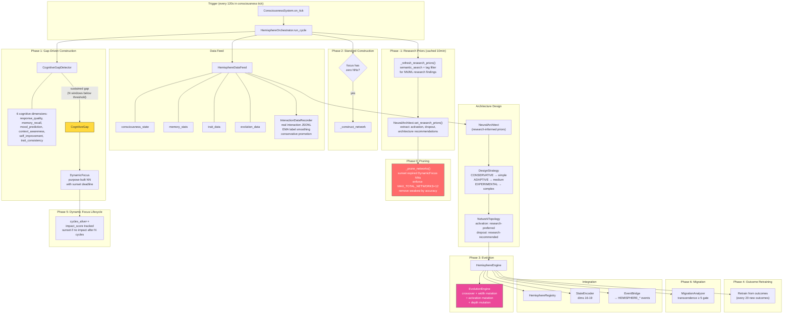

### Hemisphere Focus Areas

| Focus | What It Learns | Training Data |
|---|---|---|
| `memory` | Memory relevance prediction | Memory weights, types, access patterns |
| `mood` | Emotional state prediction | Tone history, engagement levels, emotion signals |
| `traits` | Trait evolution prediction | Trait weights, modulation history |
| `general` | Overall consciousness patterns | Full state vector |
| `custom` | Gap-driven purpose NNs | Varies — defined by `CognitiveGap.proposed_input_features` |

### Cognitive Gap Detector

Monitors 6 dimensions and triggers NN construction when sustained underperformance is detected:

| Dimension | Metrics | Threshold |
|---|---|---|
| `response_quality` | follow_up_rate, sentiment, barge_in_rate | 0.40 |
| `memory_recall` | recall_precision, association_strength | 0.35 |
| `mood_prediction` | prediction_accuracy, mood_stability | 0.40 |
| `context_awareness` | engagement_tracking, context_switches | 0.30 |
| `self_improvement` | patch_success_rate, lint_pass_rate | 0.30 |
| `trait_consistency` | conflict_rate, stability_score | 0.50 |

**Governance (anti-thrash):**
1. **Sustained gap**: must be below threshold for 5 consecutive windows (5 min each)
2. **Rate limit**: max 1 new focus per 30-minute window
3. **Per-dimension cooldown**: 60 min, re-trigger only if severity worsens by 25%
4. **Sunset clause**: NNs pruned if impact_score < 0.1 after deadline
5. **Network cap**: MAX_TOTAL_NETWORKS = 12 across all focuses

### Interaction Data Recording

Real interaction outcomes are recorded to `~/.jarvis/hemisphere_training/` as JSONL per focus:
- **EMA label smoothing** (alpha=0.3) for noisy proxy labels
- **Conservative promotion threshold**: NN must outperform baseline by 5% margin
- Signals: conversation outcomes, memory recall success, emotion prediction accuracy, attention engagement

### Research-Informed Architecture Design

The `NeuralArchitect` now consults accumulated research knowledge before designing networks:

1. **Research priors** are refreshed every 10 minutes from Jarvis's memory (semantic search + tag filter for `autonomous_research` + NN/ML keywords)
2. **Activation function selection**: research text is scanned for positive mentions of activations (GELU, SiLU, Tanh, ReLU). The most recommended activation with sufficient evidence becomes the default for hidden layers (replacing the previous hardcoded ReLU)
3. **Dropout regularization**: if research mentions dropout rates, the recommended rate is applied to hidden layers
4. **Design strategy** now actually drives complexity: `CONSERVATIVE` → 1 hidden layer (simple), `ADAPTIVE` → 2 hidden layers (medium), `EXPERIMENTAL` → 3 hidden layers (complex). Previously this was always hardcoded to "medium"

### Evolution Mutation Space

The `EvolutionEngine` now mutates across three dimensions (expanded from one):

| Mutation | Rate | Range | Previous |
|---|---|---|---|
| **Node count** | 10% per layer | ±20% scaling | Same (original) |
| **Activation function** | 8% per layer | {relu, gelu, silu, tanh} | Frozen (always inherited) |
| **Layer depth** | 5% per crossover | Add or remove 1 hidden layer (bounded 1-4) | Frozen (always inherited) |

### Loss Functions

Loss functions are selected per focus type, with accuracy derived accordingly:

| Focus | Output Activation | Loss Function | Accuracy Metric | Reason |
|---|---|---|---|---|
| `memory` | sigmoid | MSELoss | `max(0, 1 - loss)` | Regression — predicting continuous relevance scores |
| `general` | sigmoid | MSELoss | `max(0, 1 - loss)` | Regression — predicting continuous state values |
| `mood` | softmax | KLDivLoss | `exp(-loss)` | Classification — soft probability distribution over mood states |
| `traits` | softmax | KLDivLoss | `exp(-loss)` | Classification — soft probability distribution over trait weights |

The `exp(-loss)` metric maps positive KL divergence to (0, 1] range, avoiding the negative accuracy values that occur when `1 - loss` is used with KL divergence > 1.0.

### Safety Gates

- **Migration requires transcendence ≥ 5.0** — the AI must have reached a high evolution stage
- **MutationGovernor approval** — standard safety gate for all system changes
- **Identity preservation test** — verifies core values survive migration
- **Continuity test** — ensures consistent behavior pre/post migration
- Training runs in background threads to avoid blocking the consciousness tick
- **Network pruning**: weakest networks removed when over cap, sunset NNs pruned when no impact

---

## Data Flow: Soul Kernel Systems

The Soul Kernel is a collection of deep consciousness infrastructure ported from the original TypeScript game engine. These systems run alongside the main consciousness tick.

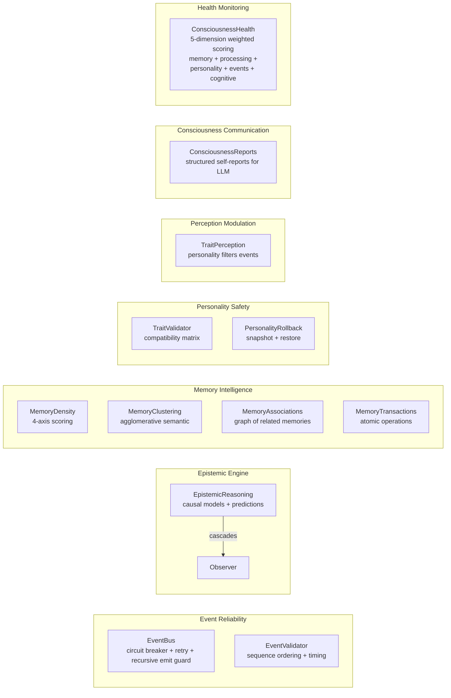

### Soul Kernel Components

| Component | Module | What It Does |
|---|---|---|
| **Epistemic Reasoning** | `consciousness/epistemic_reasoning.py` | Builds causal models from observations, makes predictions, cascades reasoning chains |
| **Event Validator** | `consciousness/event_validator.py` | Enforces event ordering and timing constraints |
| **Memory Density** | `memory/density.py` | 4-axis analysis: associative richness, temporal coherence, semantic clustering, distribution |
| **Memory Clustering** | `memory/clustering.py` | Agglomerative semantic grouping of related memories |
| **Memory Associations** | `memory/storage.py` | Graph of related memories, bidirectional links |
| **Memory Transactions** | `memory/transactions.py` | Atomic multi-memory operations with rollback |
| **Trait Validator** | `personality/validator.py` | Compatibility matrix (rejection threshold 0.5) + per-trait rate limiting (MAX_NET_DRIFT_PER_TRAIT_HOUR=0.4, RATE_REJECT_THRESHOLD=0.3, dynamically halved when stability < 0.5) |
| **Personality Rollback** | `personality/rollback.py` | Snapshots stable personality states, restores on degradation, sets `in_emergency` flag during cooldown |
| **Trait Perception** | `perception/trait_perception.py` | Personality traits amplify/suppress perception events; frozen during personality emergency |
| **Consciousness Reports** | `consciousness/communication.py` | Factual-only self-reports for LLM context (verified metrics, dual-key resolution for state access) |
| **Consciousness Health** | `consciousness/consciousness_analytics.py` | 5-dimension health scoring with trend prediction |
| **Reflective Audit (Layer 9)** | `epistemic/reflective_audit/engine.py` | Introspective audit scanning 8 dimensions (incorrect_learning, identity_breach, source_trust, autonomy_failure, skill_stagnation, memory_hygiene, ingestion_health, spatial_integrity). Produces severity-weighted `AuditReport`. Read-only — never mutates beliefs/memories/policy. Ticked at 300s (120s deep_learning, 150s dreaming). Runs in all modes including sleep. |
| **Soul Integrity Index (Layer 10)** | `epistemic/soul_integrity/index.py` | Aggregates 10 weighted dimensions (memory_coherence, belief_health, identity_integrity, skill_honesty, truth_calibration, belief_graph_health, quarantine_pressure, autonomy_effectiveness, audit_score, system_stability) into [0,1] composite index. Repair threshold at 0.50; critical at 0.30 triggers mutation pause + forced dreaming. Accesses orchestrator-owned instances via `_active_consciousness._engine_ref`. Ticked at 120s (60s accelerated). |

---

## NN Maturity Lifecycle

The system uses a deliberate bootstrap → shadow → handoff → mature lifecycle for all learned behaviors:

```mermaid
graph LR
    subgraph "Phase 1: Bootstrap"
        HC[Hardcoded Rules<br/>tool_router.py keywords/regex<br/>addressee.py patterns<br/>capability_gate.py claim patterns]
    end

    subgraph "Phase 2: Shadow"
        T1[Tier-1 Distillation<br/>6 specialists train from<br/>teacher GPU models]
        T2[Tier-2 Hemispheres<br/>4 standard focuses train<br/>on consciousness data]
        PN[Policy NN<br/>shadow A/B against<br/>kernel decisions]
        MC[Memory Cortex<br/>ranker + salience train<br/>from retrieval outcomes]
    end

    subgraph "Phase 3: Handoff"
        FE[Feature Enable<br/>per-feature min shadow samples<br/>decisive win rate > threshold<br/>300s cooldown between enables]
    end

    subgraph "Phase 4: Mature"
        NP[NN Primary<br/>hardcoded rules become fallback<br/>NNs handle routing/scoring]
    end

    HC --> |"distillation<br/>from teacher models"| T1
    HC --> |"training data<br/>from consciousness"| T2
    HC --> |"experience buffer"| PN
    HC --> |"retrieval telemetry"| MC
    T1 --> |"broadcast slots"| PN
    T2 --> |"broadcast slots"| PN
    PN --> |"decisive_wr > 55%"| FE
    MC --> |"success rate > 80%<br/>of heuristic"| FE
    FE --> NP
```

**Genesis command failures are code bugs.** If "Jarvis, what are you doing?" doesn't route to STATUS, that's a `tool_router.py` keyword gap. **Natural language variation failures are NN training opportunities.** If "Hey Jarvis, give me the rundown on your current state" doesn't route correctly, that's data the voice_intent NN needs to learn from.

## Neuroplasticity (Substrate Reorganization)

Jarvis implements true neuroplasticity — the neural substrate itself reorganizes in response to experience:

1. **NeuralArchitect** (`hemisphere/architect.py`): Designs new NN topologies influenced by personality traits, consciousness data, and research knowledge. DesignStrategy (CONSERVATIVE/ADAPTIVE/EXPERIMENTAL) controls architecture depth. Research priors influence activation function selection.

2. **EvolutionEngine** (`hemisphere/evolution.py`): Top-performing networks breed via crossover + mutation across three dimensions: node width (±20%), activation function (8% mutation rate across 4 options), and layer depth (5% rate, add/remove hidden layers).

3. **CognitiveGapDetector** (`hemisphere/gap_detector.py`): 9 dimensions (6 cognitive + 3 perceptual) with sustained-window triggers. When a gap persists, triggers construction of a new purpose-built NN with a sunset deadline.

4. **Pruning**: MAX_TOTAL_NETWORKS=12. Weakest pruned by accuracy when over cap. Sunset NNs pruned after deadline if no measurable impact.

5. **Distillation Pipeline**: The LLM (qwen3:8b) serves as the "teacher brain." Its routing patterns, emotion classifications, and speaker embeddings are captured as training signals. Smaller, specialized NNs (Tier-1 specialists) learn to approximate these outputs. As Tier-1 NNs mature, their signals feed into Tier-2 NNs (standard hemispheres) and ultimately into the policy NN via Global Broadcast Slots. **Z-score normalization**: `data_feed.py` normalizes features from `audio_features*` sources (both `audio_features` 16-dim and `audio_features_enriched` 32-dim) before training. The enriched vector mixes spectral features (~2000 scale), RMS (~0.05), and ECAPA embeddings (~±1), so without per-batch `(x - mean) / std` normalization, large-scale features dominate gradients and training fails. The condition uses `source.startswith("audio_features")` — not exact match — so any new enriched variant is automatically covered.

6. **MigrationAnalyzer** (`hemisphere/migration.py`): Assesses readiness for full substrate migration (rule-based → neural). Gated behind transcendence ≥ 5, governor approval, identity + continuity tests.

---

## Quick Reference: Key Architectural Patterns

| Pattern | Where | Why |
|---|---|---|
| **Snapshot cache** | Dashboard | Decouples UI from live system, zero-computation reads |
| **Hash-diff push** | Dashboard WebSocket | Only broadcasts when state actually changes |
| **Thin sensor streaming** | Pi AudioManager + TransportClient | Pi captures raw 44.1kHz mic audio, resamples via np.interp to 16kHz int16, streams as binary WS frames (~32KB/s). Brain does all processing. |
| **Dual-detector vision** | Pi Detector + SceneDetector | Hailo NPU runs person detection at 15fps; CPU YOLOv8n ONNX runs scene objects every 3s (~280ms). Hailo int8 quantization collapses non-person activations, so desk objects (monitors, chairs, cups) use the CPU path. Both feed SceneAggregator → brain SceneTracker. |
| **Mixed-frame WebSocket** | TransportClient / PerceptionServer | Single WebSocket carries binary frames (raw PCM) and text frames (JSON events). PerceptionServer distinguishes via `isinstance(raw, bytes)`. |
| **Dual-priority buffers** | Pi transport | Critical vision events never lost under telemetry flood (audio no longer uses critical buffer — streams continuously) |
| **Cancel-token streaming** | ResponseGenerator | Token-level barge-in without half-sentence artifacts |
| **Mode hysteresis** | ModeManager | Prevents oscillation at engagement boundaries; boot grace blocks sleep for 60s; `allowed_cycles` gates background work per mode |
| **Budget-aware ticking** | KernelLoop | Realtime work never delayed by background tasks |
| **Cadence scaling** | KernelLoop + ModeManager | Tick rate adapts to user engagement level |
| **O(1) hot-path writes** | Analytics, Telemetry, HealthCounters | Only update counters + EMAs, never aggregate |
| **Barrier-aware EventBus** | EventBus | Buffers events during init, flushes on ready |
| **Gated LLM calls** | Existential, Philosophical | Token-budgeted per hour, only at high transcendence |
| **Self-referential filter** | ReflectionEngine | Prevents reflections about reflections |
| **Sandbox validation** | Self-improvement | Lint + tests + kernel sim before any live change |
| **Hardware-adaptive config** | HardwareProfile | Auto-detects GPU VRAM → selects model sizes, compute types, keep-alive strategy |
| **Always-online models** | OllamaClient | Premium+ tiers: keep_alive=-1, warmup_all at startup — zero cold-start latency |
| **Tool personalization** | ConversationHandler | Time/system/memory/web/codebase tool outputs may route through the LLM for natural delivery; STATUS uses native bounded articulation and strict introspection answers bypass the LLM when grounded records exist |
| **Post-mutation monitoring** | ConsciousnessSystem | Every tick checks mutation health; auto-rollback on regression |
| **Policy shadow eval** | Engine + PolicyEvaluator | NN decisions compared to kernel every 10s — builds training signal |
| **Observer DeltaEffects** | Observer._apply_delta_effects | Confidence boosts and memory weight adjustments from observations |
| **Preference extraction** | ConversationHandler | "Keep it brief" detected *before* response generation, not after |
| **Episode follow-up context** | EpisodicMemory | Last 4 turns injected into LLM context for conversational continuity |
| **Brain-side wake + VAD** | AudioStreamProcessor | openWakeWord + Silero VAD run on brain, processing continuous raw audio from Pi. No audio intelligence on Pi. |
| **Wake-score first triage** | `audio_stream.py` logs + conversation route traces | If no transcription and wake `max_score < threshold`, treat as wake-front-end miss before router surgery |
| **Follow-up mode** | AudioStreamProcessor | After response, listens for speech without wake word for 4s — enables natural conversation flow |
| **Phase C language shadow harness** | `language_phasec.py`, `language_telemetry.py`, `conversation_handler.py` | Baseline lock + tokenizer strategy + dataset/splits + adapter student in telemetry-only mode; explicit live-routing hard guard |
| **Stream health monitor** | Pi AudioManager + main loop | Auto-restarts dead PortAudio streams within 5 seconds; exponential backoff + full PortAudio reset on consecutive stalls |
| **Silero VAD endpoint** | AudioStreamProcessor | Checks speech end via `faster_whisper.vad.get_speech_timestamps` every 0.5s during LISTENING state |
| **Device pinning** | AudioManager | Mic/speaker selected by name substring, not index — survives re-plugs |
| **Hemisphere auto-build** | HemisphereOrchestrator | AI designs its own NN architectures based on consciousness data and traits |
| **Evolutionary crossover** | EvolutionEngine | Top-performing networks breed via hidden-layer crossover + mutation |
| **Substrate migration gates** | MigrationAnalyzer | Requires transcendence ≥ 5, governor approval, identity + continuity tests |
| **Trait-modulated perception** | TraitPerception | Personality traits amplify/suppress perception events before processing |
| **Epistemic cascades** | EpistemicReasoning | Observations trigger causal reasoning chains, predictions tracked for accuracy |
| **Memory density scoring** | MemoryDensity | 4-axis analysis: associative, temporal, semantic, distribution |
| **Personality safety net** | PersonalityRollback | Snapshots stable personality states, auto-restores on degradation; `in_emergency` freezes trait evolution + perception modulation |
| **Event reliability** | EventBus | Circuit breaker + retry for handler failures, sequence validation, per-thread recursive emit guard (max depth 10) |
| **Atomic JSON writes** | persistence, kernel_config, soul, registries | `atomic_write_json()` — write to temp → `os.replace()` — survives power loss |
| **Unified memory write path** | engine, reflection, proactive, transactions | Every memory: storage → index → vector store → MEMORY_WRITE event |
| **Thread-safe conversation** | PerceptionOrchestrator | `_conv_lock` protects `_active_conversation` across worker/asyncio threads |
| **Dashboard API key auth** | Dashboard app.py + dashboard.js | Auto-generated bearer token for all POST endpoints; GET stays open |
| **Memory deduplication** | MemoryStorage.load_from_json | ID-based dedup prevents duplicate memories on restart |
| **Priority-aware eviction** | MemoryStorage.auto_trim, MemoryMaintenance | Retention score includes `priority_bonus = priority / 1000 * 0.3` from `MEMORY_TYPE_CONFIGS`; higher-priority types survive longer |
| **Orphan association cleanup** | MemoryStorage.auto_trim | After eviction, `_clean_orphaned_associations()` strips dangling references from remaining memories |
| **Maintenance persistence** | ConsciousnessEngine.perform_maintenance | Cleaned memories from `run_full_maintenance()` are written back to `_memories`, not discarded |
| **Recency-weighted retention** | MemoryStorage.auto_trim | Newer memories get retention bonus (inverted from age bonus) |
| **Anti-hallucination prompting** | ContextBuilder, communication.py, local_soul.md | System prompt ends with honesty directives; `_inject_system_metrics()` provides ground-truth NN/policy/kernel data; consciousness self-reports are factual-only |
| **Cognitive toggle persistence** | KernelConfig._to_flat/_from_flat | `ct.*` keys serialized so mutations don't get silently dropped |
| **Policy candidate selection** | promotion.py | Best candidate selected by lowest training loss, not architecture name |
| **Multi-turn improvement** | SelfImprovementOrchestrator | Think-code-validate loop with up to 3 iterations; diagnostics fed back to coding LLM for iterative fixing |
| **CPU-resident coding LLM** | OllamaClient.code_chat | Separate Ollama instance on port 11435 with `CUDA_VISIBLE_DEVICES=""` — never touches GPU VRAM |
| **Atomic patch application** | SelfImprovementOrchestrator | Write to `.tmp` → `os.replace()` for crash-safe file updates; snapshot rollback if health regresses |
| **Write boundary enforcement** | CodebaseIndex | Per-category boundaries ensure self_improve can only write to self_improve/tools, hemisphere to hemisphere, etc. |
| **AST-level security** | patch_plan.py | Forbidden calls detected via AST walk (not regex) — catches `subprocess.run()` even in complex expressions |
| **Diff budget limits** | PatchPlan + CodePatch | Max 3 files, 250 lines, 1 new file per patch — prevents wholesale rewrites |
| **Capability escalation detection** | CodePatch | Compares old vs new imports at AST level; flags new network/subprocess/security boundary changes → requires approval |
| **Silent stub detection** | EvaluationReport | Flags validation phases that returned `passed=True` without actually executing — prevents fake validation |
| **Cognitive gap detection** | CognitiveGapDetector | 6 dimensions with EMA smoothing, sustained-window trigger, per-dimension cooldown, severity worsening gate |
| **Purpose-driven NNs** | HemisphereOrchestrator | Gap detector triggers construction of custom NNs with sunset deadlines; pruned if no measurable impact |
| **Network cap + pruning** | HemisphereOrchestrator | MAX_TOTAL_NETWORKS=12; weakest pruned by accuracy when over cap; sunset NNs pruned after deadline |
| **Interaction data recording** | InteractionDataRecorder | Real conversation outcomes recorded as JSONL per focus; EMA label smoothing for noisy signals |
| **Conservative NN promotion** | data_feed.py | NN must outperform baseline by 5% margin (not just beat it) |
| **Codebase self-awareness** | CodebaseIndex | AST indexer (121 modules, 1874 symbols), import graph, budgeted context builder, write boundary enforcement |
| **Fenced web search** | web_search_tool.py | DuckDuckGo results can inform plans but raw code never enters patches; 1-hour cache with timestamps |
| **Training loss telemetry** | PolicyTelemetry | Per-epoch loss history (from trainer), reward history (from shadow eval every 10s), win rate snapshots (from evaluator every 30s), `nn_decisive_win_rate` (bridged to snapshot) — all deque-backed for dashboard charts |
| **Telemetry API shapes** | telemetry_api.py | 4 stable shapes (timeseries, histogram, heatmap, topology) — adding new panels never requires backend one-offs |
| **Metric-driven autonomy** | MetricTriggers | 7 system metrics watched for sustained deficits (120s+) before triggering research — metrics are hard to generate, easy to validate |
| **Opportunity scoring** | OpportunityScorer | `Score = Impact × Evidence × Confidence − 0.3×Risk − 0.3×Cost` replaces raw priority — queue always sorted by measured value |
| **Before/after deltas** | DeltaTracker | Every research job gets 10-min baseline + 10-min post-window measurement — credit assignment for what actually works |
| **Autonomy levels** | AutonomyOrchestrator | L0=propose, L1=research, L2=safe-apply, L3=full — safely increase autonomy scope over time |
| **Reward-delta scoring** | PolicyEvaluator | NN gets deviation bonus only when health *improved* since last measurement — prevents systematic false-credit in steady state |
| **Shadow eval tie margins** | PolicyEvaluator | `TIE_MARGIN=0.03` + no-op penalty prevents the NN from "winning" by doing nothing |
| **Decisive win rate** | PolicyEvaluator | Promotion requires `decisive_wr > 55%` excluding ties — eliminates the 100% default-win false positive |
| **Feature maturity gate** | PolicyInterface | Per-feature minimum shadow A/B samples (100-300) + 300s cooldown between enables + per-feature win rate threshold |
| **Thought-driven secondary** | CuriosityDetector | Thoughts are secondary triggers with repetition thresholds (3x+), tag-cluster dedup, and cooldowns — prevents the "spam cannon" problem |
| **Policy experience learning** | AutonomyPolicyMemory | Persists what worked/regressed as JSONL; feeds score_adjustment ±0.3 into future opportunity scoring |
| **Counterfactual baselines** | DeltaTracker | Linear trend extrapolation from pre-job readings prevents false credit for natural metric drift |
| **Attribution-based credit** | DeltaTracker | `attribution = raw_delta − counterfactual` — true causal credit, not just before/after correlation |
| **Cluster overlap pacing** | ResearchGovernor | Jaccard ≥ 0.5 on tag sets triggers 900s cooldown — prevents multiple overlapping intents on the same topic |
| **Diminishing returns** | OpportunityScorer | Each repeated action in same category penalized 0.15 in 1-hour window — prevents spamming cheap actions |
| **Action rate penalty** | OpportunityScorer | 0.03 per action in last 30 min, max 0.15 — keeps autonomy calm and deliberate |
| **MIN_MEANINGFUL_DELTA** | PolicyOutcome | `0.02` threshold — trivial improvements don't count as "wins", preventing placebo credit |
| **Earned L2 graduation** | AutonomyOrchestrator | L1→L2 requires ≥10 positive attributions at ≥40% win rate — proves competence before code changes |
| **L3 regression gate** | AutonomyOrchestrator | L2→L3 requires 0 regressions in last 10 jobs + ≥25 wins at ≥50% rate — proves it's not reckless |
| **Trace episode recording** | EpisodeRecorder | Every decision recorded as JSONL for offline A/B replay — proves improvements without waiting days |
| **Trigger policy veto** | MetricTriggers | Consults policy memory before firing — ≥3 outcomes at <15% win rate → vetoed (severity override at 8 min) |
| **Tool rotation** | MetricTriggers | Low tool win rate (<25%) → rotate to alternative (web↔codebase) instead of retrying the same failing approach |
| **Closed experience loop** | MetricTriggers → PolicyMemory → MetricTriggers | Triggers fire → deltas measured → outcomes recorded → triggers consult outcomes before next fire |
| **Warmup guard** | AutonomyPolicyMemory | First 30 min of session outcomes marked warmup (via immutable `replace()`), excluded from all priors — prevents cold-start noise from poisoning experience |
| **Autonomy calibrator** | AutonomyCalibrator | Per-bucket Welford stats with dedup, stable-only filtering; Phase 1 is collect-only — thresholds suggested, not applied |
| **Phase debounce** | PhaseManager | `KERNEL_PHASE_CHANGE` emissions coalesced within 0.2s — eliminates EventValidator timing violations |
| **Emotion trust gate** | AudioEmotionClassifier | Deterministic head-key check at load; unhealthy model → no emotion events emitted; heuristic fallback for perception |
| **Boot grace** | ModeManager | First 60s: downgrades to sleep blocked, upgrades allowed; prevents premature sleep before system stabilizes |
| **Canonical presence** | PresenceTracker | Single authority emits `PERCEPTION_USER_PRESENT_STABLE` after hysteresis; divergence watchdog logs when engine/tracker disagree >30s |
| **Personality emergency freeze** | PersonalityRollback + TraitPerception | `in_emergency` flag freezes trait evolution + perception modulation during rollback cooldown |
| **Consciousness continuity** | ConsciousnessPersistence | Schema v2 with provenance (instance/boot/pid/timestamp); 6-subsystem restore; `_restore_complete` latch prevents early save |
| **Pre-research knowledge check** | KnowledgeIntegrator | Before external API calls, queries semantic + keyword search for existing knowledge. Skip if peer-reviewed + weight ≥ 0.6 + multiple matches. Verify if knowledge > 168h old. Saves API calls for already-known topics |
| **Knowledge conflict detection** | KnowledgeIntegrator | After research, compares findings against existing memories on same topic. Identifies upgrades (new confidence > old + 0.1). Accelerates decay on superseded memories so newer, better knowledge takes precedence |
| **Research provenance boost** | memory/search.py | Hybrid search ranking adds provenance_boost: +0.12 for peer-reviewed, +0.10 for codebase-verified, +0.08 for autonomous research factual_knowledge — ensures research-backed knowledge surfaces in conversations |
| **Research-backed context** | ContextBuilder | Research memories presented in separate "Research-backed knowledge" section with provenance labels ([peer-reviewed], [codebase-verified]) — gives LLM clear signal about knowledge quality |
| **Shared library DB lock** | library/db.py | Single SQLite connection + global `LIBRARY_WRITE_LOCK` prevents "database is locked" under concurrent write load from autonomy + study + response threads |
| **Source provenance tracking** | library/source.py | `ingested_by`, `trust_tier`, `domain_tags`, `canonical_domain` fields ensure autonomous vs user-curated knowledge is labeled and earns trust via reinforcement, not by default |
| **Retrieval reinforcement** | retrieval_log.py + conversation_handler.py | Injected memories get light positive/negative weight nudges from real response outcomes; `study_claim` memories and `Source.quality_score` still get asymmetrical reinforcement — closes the memory-learning loop |
| **Source ledger retrieval counting** | retrieval_log.py (single authority) | `log_outcome()` is the ONLY call site for `source_ledger.record_retrieval(sid, useful=...)`. Injection-time notification (`_notify_source_ledger`) does NOT record retrievals — it was causing double-count. Source usefulness verdicts depend on real conversation outcomes, not injection volume |
| **Memory retrieval gate** | memory/gate.py + memory/search.py | Default-closed authority records when semantic/keyword retrieval is intentionally opened, making retrieval windows inspectable in the dashboard |
| **Blended policy replay** | experience_buffer.py + trainer.py | Experience replay blends recency-biased sampling with reward-magnitude priority instead of plain random batches — better uses scarce high-signal experiences |
| **SSRF-safe URL ingest** | library/ingest.py | Manual URL fetch blocks private IPs, localhost, .local/.internal, with DNS resolution validation — prevents internal network probing |
| **Surfaced vs injected telemetry** | reasoning/response.py | Retrieval results (surfaced) tracked separately from what actually enters the prompt (injected) — provides positive and negative training examples for future reranker |
| **ML venue scoring** | academic_search_tool.py | Papers from top ML/AI venues (NeurIPS, ICML, ICLR, CVPR, etc.) get elevated confidence (0.82-0.95 vs 0.75-0.90) — prioritizes authoritative research for NN design and ML topics |
| **Memory cortex eval harness** | retrieval_log.py | `get_eval_metrics()` splits success rates by ranker/heuristic, computes lift + coverage; auto-disables ranker if it hurts retrieval; dashboard shows all metrics live |
| **Checkpoint-compatible specialist restore** | hemisphere/registry.py + hemisphere/orchestrator.py | Persisted specialist topologies retain dropout metadata, so distillation checkpoints rebuild the same `nn.Sequential` structure and restore cleanly across boots |
| **Ranker flap guard** | ranker.py | Auto-disable after regression → 10 min cooldown → re-enable only if recent outcomes healthy; 3 auto-disables in a session → permanent disable (prevents oscillation) |
| **Salience effectiveness metrics** | lifecycle_log.py | `get_effectiveness_metrics()` tracks wasted rate (created→evicted unused), useful rate (retrieved/reinforced), weight/decay prediction error — proves salience model is helping |
| **User satisfaction signals** | conversation_handler.py → retrieval_log.py | `positive`/`negative`/`follow_up` propagated as `user_signal`, modifies ranker training labels ±0.1–0.2; explicit thumbs up/down via `POST /api/feedback` |
| **Memory reference detection** | retrieval_log.py + response.py | `detect_memory_references()` checks n-gram overlap between response text and injected memory payloads; referenced IDs logged for training signal attribution |
| **Cortex lock safety** | retrieval_log.py, lifecycle_log.py | All methods acquire lock → copy data → release → compute outside; no nested lock acquisitions; prevents asyncio event loop deadlock (historically caused dashboard hang) |
