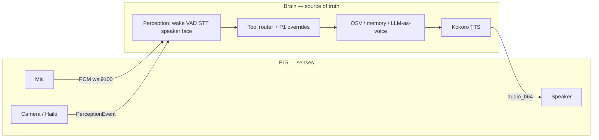
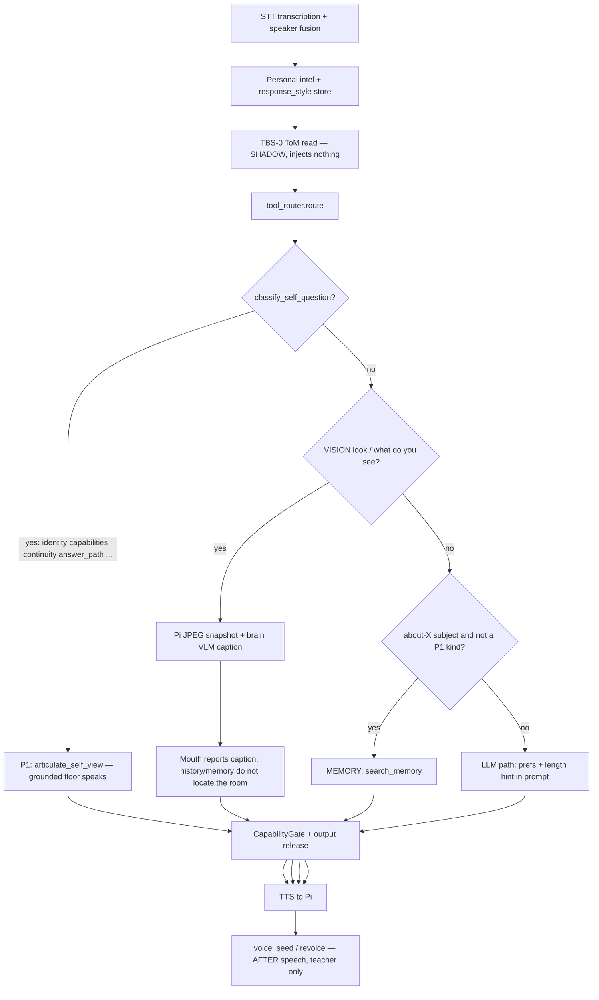
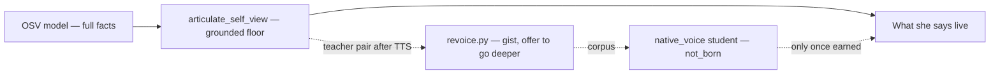
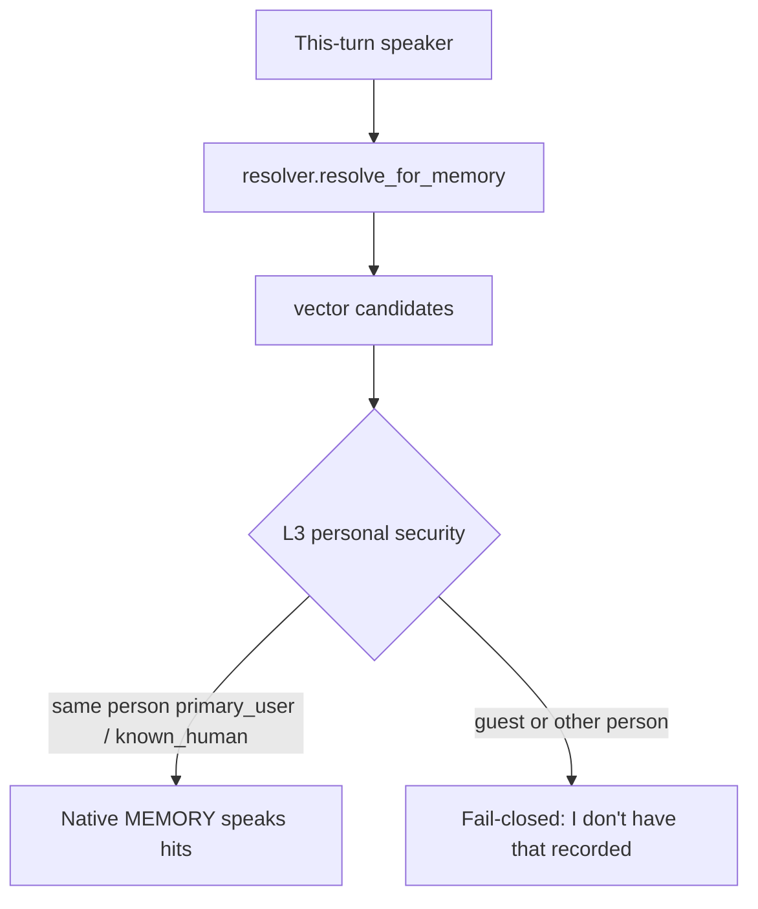

# Agent map — read this before you edit

**This is the unskippable contract.** `AGENTS.md` is the field manual.
This file is what the system *is*, how one spoken turn actually flows, and
what you must not invent. If a change is conversation, OSV, memory, routing,
TTS, or preferences: match a box on these diagrams first.

Lived miss 2026-08-24 (`69d7819`): an agent added `briefing_register` /
exec-tech-ops mouths instead of using the path already drawn here.

---

## What this is

Two devices. One mind. The LLM is **voice**, not the brain.

| Device | Role | Must not |
|---|---|---|
| **Pi 5** (`pi/`) | Senses + speakers: camera, Hailo **person+pose**, JPEG `/snapshot`, mic, playback, kiosk | Decide, remember, route, claim, **CPU YOLO room objects** (not the object path; operator takes the Pi on WiFi) |
| **Brain** (`brain/`, desktop GPU) | Perception finish, **VLM room caption** of the Pi JPEG, Layer 3B tracker, route, memory, OSV, policy, TTS | Be replaced by “just ask the LLM” |

A process restart is **not a wipe**. Weights, memories, and promotion JSON persist.
Tier-2 *authority* re-earns. `current_ok` is live-sourced. Do not “fix” restart
by clearing `~/.jarvis`.

Shadow / `PRE-MATURE` / `not_born` / default-OFF means **wired, zero authority**.
That is not a missing feature. Do not build a parallel.

---

## One spoken turn (this is the thing agents break)

Validated against `conversation_handler.py` (2026-08-24). Order is load-bearing.

| Lane | When | What speaks | LLM authors facts? |
|---|---|---|---|
| **P1 OSV** | Self-question classified (`articulate.py` kinds) | Deterministic articulator | **No.** Revoice is teacher-only until `native_voice` is born |
| **VISION** | Look / what do you see (heuristic router) | Live Pi snapshot + brain VLM caption | **No scene.** Dinner-chat must not name the room. Fail-close kitchen/stove/… if caption lacks them. Lived miss 2026-08-24. |
| **MEMORY** | About a person/pet/topic, not a P1 kind | Recalled payloads, first-sentence aboutness | No self-facts from OSV dump |
| **LLM** | Everything else | Ollama as voice, under L0 | Must not invent tools, jobs, or self-metrics |

Live chooser today: **heuristic keyword router**. Voice-intent NN is **shadow**
and does not pick the turn. Do not “fix routing” by adding a phrase regex for
one prompt. Log friction; fix the class.

---

## Who is the mouth on P1

- Spec-sheet on TTS = the floor. **Expected** until `native_voice` is born.
- `revoice.py` already writes *“lead with the gist”*. It does **not** speak.
- `response_style` (concise/detailed), `_policy_response_length`, ToM
  `verbosity_pref`, TBS-0 `lean_concise` already exist. They hit the **LLM**
  path. P1 bypasses them **on purpose**.
- Do not add `briefing_register` or exec/tech/ops articulators.

---

## Memory: one write path, one recall path

**Write** (`engine.remember`): synthetic-block → identity-stamp → quarantine
→ salience (NN gated, heuristic fallback) → store → vector index → `MEMORY_WRITE`.
Banter/soft tastes downgrade to `casual_conversation`. Do not add a second store.

**Recall** (`search_memory`): vector → **L3 personal security** (identity
boundary) → ranker.
About-me = **this-turn speaker**, not a hardcoded companion. About-X comes
from the query, not soul `known_names`. First sentence must be about the
subject. Curiosity asks are not autobiography. OSV-contradicted wipe claims
stay in the store (never discard) and must not be recalled as fact.

### Personal security (L3) — this is a lock, not a miss

A guest must not hear David's dog, preferences, or family. The fail-closed
line ("I don't have a specific memory recorded about that") for the *wrong
person* is **correct**. Empty recall for the *right* person is a stamp bug
in `identity/resolver.py`, not a reason to weaken `_policy_guest`.

Lived 2026-08-24 17:40: David was mis-stamped **guest**, so the lock hid
Skyler from *him*. Feature working, querier wrong. Do not "fix Skyler" by
letting guests through.

---

## Symptom → existing path (do not invent)

| Inner thoughts, never asks you | Spark would-have → `GroundingQueue` (operator-pull, no TTS). Advisory TTS only after 20 external answers | Flip `GroundingDrivePromotion`; nag TTS in shadow |
| She sounds / does | Existing path | Do not |
|---|---|---|
| Spec sheet on “what can you do” | P1 capabilities floor; mouth is `revoice` / `native_voice` | New register, shorter fake articulator as “source of truth” |
| Walk-through is a 98-list | Kind `answer_path`, not capabilities | Steal into capabilities |
| “Starting fresh” after restart | Kind `continuity` from measured store | LLM wipe narrative; do not clear `~/.jarvis` |
| About Skyler dumps OSV | About-X MEMORY override | INTROSPECTION because the query contains “you” |
| Guest / other person asked about Skyler and she “doesn’t know” | L3 personal security (`guest_blocked_personal`) | Weaken the boundary so recall “works for everyone” |
| “Look at me / see my face” only describes the shirt | IDENTITY enroll/refresh for this-turn speaker | Lower face 0.55; new biometric stack |
| David asked about Skyler and she “doesn’t know” | Stamp bug: querier typed guest. Fix resolver. Store still has the dog. | Delete memories or skip L3 |
| About me is empty / is the dog | Cue rewrite me → this-turn speaker | Hardcode David |
| Too long / too technical | `response_style`, length hint, ToM, TBS-0, revoice | `briefing_register` |
| Wrong tool | Intent class + `nn_fleet_registry.json` | One-off verb regex |
| Flag default-OFF | Governance. See `MATURITY_GATES_REFERENCE.md` | Treat as a bug and flip it |

---

## Operator constraints (this house)

- Do not merge to `main` unless asked.
- Do not start/stop supervisor, `main.py`, or lidar. Operator owns the stack.
- Do not run pytest on the live brain host against `~/.jarvis`. Tests write registries (lived 2026-08-24: `plugin_registry.json` overwritten, restored from snapshot).
- Sync with `./sync-desktop.sh` when code should hit the brain; they bounce.
- Do not flip `OSV_P2_ACTIVE`, revoice-live, voice-intent, or native_voice
  unless the operator asks.
- Do not wipe scars or memories.

---

## Where the long docs live (after this file)

| Need | File |
|---|---|
| Agent field manual (VRAM, events, env) | `AGENTS.md` |
| Full architecture essay | `ARCHITECTURE.md` |
| Two-device mermaid (overview, older) | `docs/SYSTEM_OVERVIEW.md` |
| OSV P0–P5 | `docs/SELF_VIEW_DESIGN.md` |
| Gates | `docs/MATURITY_GATES_REFERENCE.md` |
| NN maturity / `not_born` | `brain/nn_fleet_registry.json` |
| Spark / curiosity | `docs/SPARK_DESIGN.md` |
| Companion / ToM | `docs/COMPANION_COGNITION_DESIGN.md` |
| TBS shadow | `docs/THINK_BEFORE_SPEAK.md` |
| First hour | `docs/FIRST_HOUR_AS_A_RESEARCHER.md` |
| dashboardV2 wiring / maturity ladder | `docs/V2_SURFACE_TRUTH.md` |
| Ground-truth audit 2026-08-24 | `docs/GROUND_TRUTH_AUDIT-2026-08-24.md` |
