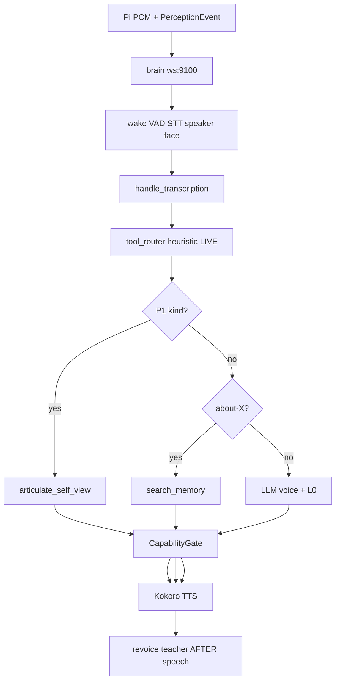

# Ground-truth audit — 2026-08-24

Adversarial, evidence-first. Labels follow `docs/SYSTEM_TRUTH_AUDIT_PROMPT.md`.
Live brain: `duafoo@192.168.1.222`, `main.py` pid **19147** (16:51:30 bounce).
Branch: `feat/osv-p1-answer-path` @ `b7b8208`+ (spark queue fix `ddc6d8b` on disk).

**This is not a claim that every line of the repo was executed.** It is a
reconstructible audit of release-critical loops + live instruments. Anything
not opened is **NOT EXERCISED**, not “fine.”

Evidence order used: live runtime → persisted `~/.jarvis` → validation pack /
probes → source → docs.

---

## Executive verdict

JARVIS is a **real two-device cognitive workshop**, not a chatbot skin.
Inner life, memory store, epistemic stack, autonomy L2, world-model promotion,
and the dashboard instruments are **wired and reporting**.

She is **not** yet “curious then asks you.” Spark is shadow, 11/20 operator
answers, tray empty because those 11 are closed and fuel is thin. The mouth on
self-questions is the **deterministic floor**. The LLM is voice, not the brain.
Policy NN cannot earn control under the current honesty lock.

**Oracle integrative + Validation Pack BLOCKED is expected (Pillar 9), not a
scoring bug.** Do not collapse them. Do not lower gates.

---

## Instrument battery (ran live)

| Probe | Result | Label |
|---|---|---|
| `dashboard_truth_probe` | **PASS** 0 fail / 0 warn | **VERIFIED** |
| `docs_truth_audit` | **PASS** 0 fail / 1 warn (unserved HTML) / 4 info | **VERIFIED** |
| `schema_emission_audit` | **0 violations** (edges 5/5, evidence 10/10) | **VERIFIED** |
| Validation pack | **status=blocked** | **DATA-GATED / recovering** — see math |
| Contract pytest (write-path, P1, spark queue, memory format) | **87 passed** | **VERIFIED** (subset) |
| Full `brain/tests/` (~265 files) | **NOT EXERCISED** this pass | — |

Pack summary: PVL now **81/114 (75%)**, ever **93**, awaiting **11**, failing **16**.
Critical block: `pvl_coverage` current 75% vs 85% (ever 86.1% — historically
proven, **restart debt**). Other blocked ids: `learning_job_started`,
`job_phase_advanced`, `skill_learning_completed`, `skill_learning_lifecycle`
— skill-learning **not firing this window**, not a dead brain.
Language evidence floors FAIL at n&lt;30 — **DATA-GATED**.
HRR truth-boundary / non-influence: **PASS**. Language runtime bridge **OFF**
(correct posture).

---

## A. Spoken turn (ingress → release)

| Hop | Evidence | Verdict |
|---|---|---|
| Pi → brain WS | sync-desktop, live lidar/STT logs | **VERIFIED** |
| STT + fusion | `LaptopSTT ready` cuda; Speaker ID David | **VERIFIED** |
| Heuristic router live | `tool_router.py`; intent-shadow observe-only | **VERIFIED** |
| P1 override | live `kind=answer_path/capabilities/continuity` | **VERIFIED** |
| LLM does not author P1 facts | `articulate_self_view`; persist spoken | **VERIFIED** |
| Revoice / native_voice | `/api/voice-lab` student **not_born**; teacher after TTS | **VERIFIED** shadow |
| Voice-intent does not choose | samples on maturity ≠ primary | **VERIFIED** |
| CapabilityGate L0 | blocks unverified operational claims (lived “pull more details”) | **VERIFIED** |
| Wipe-lie write skip | `persist_response=False` + `contradicts_measured_continuity` | **VERIFIED** (tests) |

**Lived 14:45–15:26:** walk-through = answer_path speakable; “what can you do” =
inventory floor (expected); continuity = restart not wipe, 761 memories;
Skyler/Skylar dog; about-me = David + courtesy leak.

---

## B. Memory

**Write (canonical `engine.remember(CreateMemoryData)`):**
synthetic-session block → identity stamp → create → quarantine **soft**
(tag/downweight, never reject) → salience advisory (NN gated) → store →
tag index → vector db → `MEMORY_WRITE`.

**VERIFIED.** Banter firewall on HUMINT path **VERIFIED**. Ordinary conversation
rows stay `provenance=conversation` (**PARTIAL** vs “all banter is casual”).

**Recall:** hybrid vector → identity boundary → ranker/heuristic; about-me =
this-turn speaker; about-X from query; first-sentence aboutness; curiosity
tag skip; wipe-claim skip. **VERIFIED** in tests for Skyler spelling.

| Hole | Verdict |
|---|---|
| Query **Skylar** vs store **Skyler** | **BROKEN** alias (exact substring) |
| About-me courtesy (“You're welcome, David”) | **BROKEN** / untested filter |
| `engine.remember(str, …)` session-start / enrollment | **BROKEN** — signature is `CreateMemoryData` only; swallowed by `except` |
| Salience/ranker NN | **DATA-GATED**; heuristic fallback **VERIFIED** |

Live store: **~761 memories**, span 2026-06-23 → 2026-08-24. Restart ≠ wipe.
**VERIFIED.**

---

## C. Spark / inner life / ask

**Inner thoughts — VERIFIED, internal, not spoken.**
Meta-thoughts (templates), philosophical A/B debates (9), existential (15),
observer 28k, KERNEL_THOUGHT → CuriosityDetector → **ResearchIntent**
(autonomy L2 “already known” skips). TBS-0 **injects nothing**.

**Spark — VERIFIED code; live earn stalled.**

Math (`GroundingDrivePromotion`):
\[
\text{promote} \iff N_{\text{outcomes}}\ge 20 \;\land\; \text{rate}\ge 0.40 \;\land\; t_{\text{shadow}}\ge 4\text{h}
\]
Confirm **or** refute counts as `grounded=True`. Do **not** tune 20 / 0.40.

Live: **11/20**, rate **1.0**, 1490h shadow, **pending 0**, **TTS 0**.
Those 11 operator answers are correctly closed (Recently Answered).
`inferred_count=1`. Fuel is mostly spent library scrap.

Would-have → queue: code now enqueues without `belief_id` + top_tensions batch
(`ddc6d8b`). **This boot** grounding did **not** win a drive tick (no
`Grounding drive (SHADOW)` log after 16:51) — other drives ran research-skip.
Empty Pending after bounce is **drive-win + fuel**, not “code not loaded.”

Tension-thought seed (`belief_validation_curiosity`) needs
`context.grounding_tension` which `_run_meta_thoughts_inner` does **not**
pass. **PARTIAL / unwired trigger** — inner SPARK thought cannot fire as
designed. Not a gate to flip; a missing context key.

P5b autonomous web-fire **default OFF**. **VERIFIED.**

---

## D. Eval math / maturity / policy / fleet

**Gate formula** (`_gate`):
\[
pct=\min(100,\; 100\cdot c/t),\quad
status=\begin{cases}
\text{active} & c\ge t\\
\text{progress} & 0<c<t\\
\text{locked} & c=0\text{ or }c=\text{None}
\end{cases}
\]
High-water: first `c\ge t` sets `ever_met`; never cleared. **VERIFIED.**

UI remaps: active → ACTIVE; else ever_met → RECOVERING; else PRE-MATURE.
Backend `progress`/`locked` are **not shown as those words**. **PARTIAL signage.**

Live **28/35** (probe later 29/35), **31 ever**. Policy 0/3 never proven.

**Autonomy 5/5 ACTIVE at level 2:** `auto_level` threshold is **2**, not 3.
`auto_wins_l3` is the **same** `total_wins` vs 25 — a **count**, not
`eligible_for_l3` (needs WR≥0.50, 0 regressions, **human evidence_path**).
**MISLEADING signage. Not L3 authority.** Do not tune.

**Policy 0 shadow A/B / 0% decisive win:** after honesty fix,
`nn_reward = kernel_reward = actual_reward` ⇒ margin 0 ⇒ **always tie** ⇒
decisive win rate structurally 0 until interleaved execution exists.
Session counters also reset on bounce. **Measurement failure, not a dead
trainer.** Promotion uncrossable by design. Do not tune 0.55 / 100.

**Hemisphere 8/8:** sample floors. Voice-intent **samples ≠ live router**.
**MISLEADING if read as authority.**

**native_voice:** `/api/voice-lab` `not_born`. Registry row is `voice_seed_NEW`.
**VERIFIED.**

**Oracle vs PVL:** two instruments. Integrative + pack blocked = **honest
divergence**. Pillar 9 forbids collapsing them.

---

## E. Dashboard v2

Catalog: `docs/V2_SURFACE_TRUTH.md`. All probed GETs **200**.
`dashboard_truth_probe` **0 findings**.

`maturity.html` does **not** include spark, native_voice, OSV P2, intent
primary. Cockpit shows thoughts that do not speak. **grounding.html** is
the Johnny 5 tray. Shared **chat** on every page **writes a turn**.

`brain.html` / `flow.html` retired → universe. **VERIFIED.**

Browser click-through of every page: **NOT EXERCISED** (DevTools target closed).

---

## F. Safety / adaptation (spot)

| Path | Verdict |
|---|---|
| Language runtime bridge OFF | **VERIFIED** correct posture |
| HRR / P5 zero authority, no policy/belief/memory writers | **VERIFIED** (pack + import checks) |
| Self-improve Stage 2 human-approve | **NOT EXERCISED** (API up; no apply this pass) |
| Plugin quarantine → active | **NOT EXERCISED** beyond `/api/plugins` 200 |
| Capability acquisition jobs | Pack **blocked** on learning-job checks — **DATA-GATED** |
| Synthetic gyms cannot satisfy lived gates | **VERIFIED** (docs + code comments; run not executed) |
| `OSV_P2_ACTIVE` | **NOT flipped**; shadow **VERIFIED** by design |

---

## G. Restart honesty

Process restart **≠ wipe**. Continuity kind measured 761 memories, dated span.
Matrix specialists **probationary** after boot; autonomy **restored L1→L2**
with evidence (`Boot auto-restore: L1 → L2 … snapshot_match=True`).
High-water retained. **VERIFIED.**

Session-start string-`remember` **does not persist** (type error swallowed).
**BROKEN sidecar**, not store wipe.

---

## Disagreements (docs vs runtime)

| Claim | Reality |
|---|---|
| AUTONOMOUS_DRIVE_MAP: DriveSignals has no self-sensing field | **Stale.** Fields exist; they still drive **no urgency**. |
| POST `/api/grounding/queue/answer` “view-only / belief not mutated” | **Code `_ground_belief` re-stamps provenance.** Doc/UI note **MISLEADING**. |
| nn_fleet `intent_shadow` fix_needed (sample_counts, maybe_promote) | **Stale vs current `intent_shadow.py`.** Authority still shadow. |
| ARCHITECTURE.md line numbers / “26 v2 pages” | **Drift.** 33 HTML; two retired. |
| “One write path” | Canonical path **VERIFIED**; transactions/observer/boot bypasses **PARTIAL**. |

---

## What to finish (order). No gate tuning.

1. **Spark fuel + drive-win** — tray fills only when grounding wins a tick **or**
   batch runs every eval; remaining inferred beliefs must be **world/operator**,
   not paper abstracts. Keep shadow. No TTS.
2. **Memory holes** — Skylar alias; about-me courtesy; `remember(CreateMemoryData)`
   for session-start.
3. **Signage** — autonomy 5/5 ≠ L3; hemisphere 8/8 ≠ router; policy 0/3 ≠
   “train harder.”
4. **Do not** flip revoice, native_voice, OSV P2, GroundingDrivePromotion,
   language bridge, L3.

---

## Coverage statement

**Locked this pass:** turn floor, P1, memory canonical write/recall contracts,
spark promotion math, maturity math, policy honesty lock, probe battery,
v2 API liveness, restart ≠ wipe, inner-thought ≠ ask.

**Not locked:** full pytest, self-improve apply, plugin promotion, every v2
click, connectome pulse↔`bus.emit` identity, acquisition job lifecycle live,
TBS-2, P5 affect coupling.

That is ground truth for the workshop **as of this bounce**, not omniscience.
