# Jarvis Oracle: Master Development Roadmap

> **Authoritative plan for all remaining development.** This document supersedes and consolidates:
>
> - `docs/archive/curiosity_to_conversation_bridge.md` (absorbed into Phase 1)
> - `docs/archive/nextphase.md` (Phase 1 shipped; Phases 2-4 absorbed into Phases 2, 5, 6)
> - `docs/archive/pplans.md` (retrospective analysis archived; forward items absorbed)
> - `docs/archive/SELF_IMPROVE_DEPLOY.md` (remains as reference doc for existing infrastructure; smoke test absorbed into Phase 5)
> - `TODO_V2.md` (retired 2026-04-27; active lanes and status board consolidated here)

---

## Current Single-Source Action List (2026-05-10)

This section supersedes the retired `TODO_V2.md`. Use this roadmap as the single
forward-planning surface. The latest truth artifact is
`docs/validation_reports/critical_truth_audit-2026-04-27.md`.

**Current audit verdict.** JARVIS is architecturally wired and enforcing its
contracts. The blocked self-test / validation-pack state is an honest maturity
signal on the current live brain. HRR/P4 and P5 shadow lanes are shipped and
soaking; skill-acquisition hardening landed in May 2026; memory persistence
and dream processing fixes hardened restart resilience. Do not tune thresholds
to make the dashboard look green.

**Release posture:** JARVIS is no longer in a broad expansion phase. The next
work is to make the open-source release boringly truthful: calibrate live data,
validate maturity gates, keep status markers aligned with earned evidence, and
prove that new or old subsystems do not break the architecture. New feature
work is allowed only when it closes a validation gap or the operator explicitly
chooses an optional lane.

**Current live status before roadmap advancement (updated 2026-05-10):**

1. **Skill-learning proof boundary** — hardened across May 4-5. Skill
   execution contracts, audit packets, operational handoff approval, plan
   quality checks, terminal acquisition failure closure, and retry semantics are
   now wired. Lifecycle/process evidence remains distinct from operational
   capability evidence unless the skill also has a callable executor/tool/plugin
   and a contract smoke result with expected-vs-actual proof.
2. **PVL current coverage recovery** — PVL is wired and has ever-passed above
   threshold, but current coverage is `81.5%` against the `85%` continuation
   gate. Next action: let real runtime events refill the currently failing /
   awaiting contracts, especially the Phase 5 weakness signal / proof chain,
   language promotion progress, and language baseline/evidence floors.
3. **Language evidence floors** — Phase C is trained and shadow-only, but
   response-class evidence floors remain red (`recent_learning`, `recent_research`,
   `identity_answer`, `capability_status`). Next action: collect lived
   conversation examples naturally; keep `ENABLE_LANGUAGE_RUNTIME_BRIDGE=false`
   and `LANGUAGE_RUNTIME_ROLLOUT_MODE=off`. Dashboard operator guidance was
   added under Learning → Language Substrate and Trust → Language Governance so
   users can see the exact manual/lived examples still needed to open these
   gates.
4. **Static dashboard/API signage drift** — cleared 2026-04-27. The static API
   reference now matches the live FastAPI API surface (`129` unique Brain API
   routes documented, `0` missing, `0` phantom), and static wording has been
   updated from pillar / LLM-bootstrap framing to architecture-contract and
   LLM-boundary language. Keep future route additions paired with API-reference
   updates.
5. **HRR/P5 long-soak only** — HRR/P5 fit the system, but they remain
   `PRE-MATURE`, shadow-only, derived-only, and zero-authority. P4.0-P4.6 and
   P5.0 are all shipped; P4.3 (recall advisor) and P4.4 (HRR specialist
   encoder) confirmed shipped via code audit 2026-05-08. Next action:
   observe long-horizon stability and side-effect counters. Do not promote or
   grant authority from the current evidence.
6. **Memory persistence + dream processing hardened (2026-05-08)** — Memory
   cluster persistence now saves full cluster data and restores on boot via
   `MemoryClusterEngine.restore_clusters()`. Evolutionary clustering model
   (`consolidate_memories()`) replaces the destroy/rebuild pattern, matching
   the SyntheticSoul paper's memory bubble consolidation model.
   `ReflectiveValidator` state now persists across restarts. Autonomy research
   pipeline recovered (S2 query quality fix, `title_only` gate removed).

**Primary focus: evidence, calibration, and validation**

1. **PVL current coverage recovery** — let real runtime events refill contracts
   toward the 85% continuation gate. Do not lower thresholds or relabel
   accumulation-gated failures as bugs. Track which contracts are waiting on
   runtime evidence versus actual code defects.
2. **Language evidence floors** — keep `ENABLE_LANGUAGE_RUNTIME_BRIDGE=false`
   and `LANGUAGE_RUNTIME_ROLLOUT_MODE=off` until lived examples fill the
   response-class floors. Treat missing examples as data collection work, not
   a prompt/style problem.
3. **Emergence evidence panel / scientific framing** — show internal thoughts
   and emergent behavior counters as operational substrate evidence, not
   sentience proof. The Diagnostics panel should expose Levels 0-7 with
   source paths, limitations, and falsification notes; Level 7 remains empty
   unless an event survives known-mechanism elimination. First pass is
   snapshot-only by design: do not add a durable emergence ledger until the
   live evidence schema has been reviewed from dashboard/API usage.
4. **Maturity/status-marker alignment** — verify that every `SHIPPED`,
   `PARTIAL`, `PRE-MATURE`, and `DEFERRED` marker matches source code,
   dashboard surfaces, PVL evidence, and runtime state. Fix signage drift
   immediately; do not promote markers for optics.
5. **Architecture-boundary regression checks** — after every change, run the
   validation pack, dashboard truth probe, schema emission audit, and focused
   subsystem tests. Any result that blurs truth boundaries is higher priority
   than new capability work.
6. **Open-source release hygiene** — keep license, notice, third-party license,
   README, API reference, and static dashboard docs aligned with the actual
   release surface. Dependency/model license gaps block public release harder
   than feature gaps.

**Shipped shadow lanes / deferred authority until evidence changes:**

- **P3.11 `dream_synthesis` Tier-2 promotion** — blocked until the dream
  validator produces at least one `quarantined` sample and at least three
  non-zero reason categories.
- **P3.13 IntentionResolver Stage 1** — SHIPPED in shadow mode (2026-05-08).
  `IntentionResolver` with heuristic evaluate(), 24-dim feature encoder,
  4 integration hooks wired, dashboard panel, 36 tests passing. Starts
  `shadow_only` — delivery authority locked until Stage 0 graduation gates
  pass (still at 0/30, 0/5, 0/2). Design: `docs/INTENTION_STAGE_1_DESIGN.md`.
- **P3.15 Addressee inhibition gate** — observation-only until the same
  soft-signal multi-party failure pattern recurs at least 3 times in a 7-day
  rolling window.

**Optional engineering lanes (only after validation work stays clean):**

- **P3.12 Long-horizon attention** for `medication_refill_followup`, if the
  operator chooses a code lane. This should be implemented as a truth-layer
  capability with backing jobs, evidence, and CapabilityGate protection, not as
  a generic reminder hack.
- **Security hardening** for open-source exposure: data export sanitization,
  PII scrub, plugin subprocess boundary documentation/tests, dashboard POST
  endpoint review, and any release-critical auth guidance.
- **Release automation / docs checks**: scripts that verify `LICENSE.md`,
  `NOTICE.md`, `THIRD_PARTY_LICENSES.md`, README, dashboard API docs, and
  status-marker pages are mutually consistent.

**Promotion/evidence lanes (no expansion by default):**

- **P3.13 IntentionResolver Stage 1** — shipped shadow, now soaking for
  graduation evidence. Operator promotes past `advisory_canary` only after
  backed/resolved intention gates and shadow accuracy evidence pass.
- **P4.7 HRR long-run promotion study** — 7-day shadow soak with operator
  evidence review for `PRE-MATURE -> PARTIAL`. No authority flags change during
  the study.
- **Specialist maturation** — dream_synthesis, skill_acquisition, HRR encoder,
  claim_classifier, and other specialists continue accumulating evidence. Do
  not force promotion by changing thresholds.

**Not next / do not expand yet:**

- Stage 2 `intention_delivery` NN authority.
- HRR/P5 influence over memory, belief, policy, autonomy, or Soul Integrity.
- Planner / counterfactual authority beyond existing advisory/data-gated paths.
- L3 autonomy promotion without the existing Phase 6.5 evidence-class gates.

**Validation loop after each action:**

```bash
PYTHONPATH=$(pwd) .venv/bin/python -m scripts.run_validation_pack --no-write
PYTHONPATH=$(pwd) .venv/bin/python -m scripts.dashboard_truth_probe
PYTHONPATH=$(pwd) .venv/bin/python -m scripts.schema_emission_audit --json
```

Acceptance is not "all green immediately"; acceptance is that blocked items
move through their documented maturity gates without weakening governance.

**Latest skill-acquisition verification pass (2026-05-05):** focused
regression suite passed (`100 passed`). Live brain state: Skill registry
`13 verified / 1 blocked`, learning jobs `0 active`, acquisition `0 active /
0 pending plan reviews`, CodeGen available and idle with
`authority=infrastructure_only`. Synthetic weight-room smoke passed `12/12`
with no signal writes; coverage passed `200/200` with `+7` synthetic features
and `+5` synthetic labels. Strict/stress remain operator-flag gated. See
`docs/validation_reports/skill_acquisition_hardening-2026-05-05.md`.

---

## Continuity Pivot (2026-04-23)

The Open-Source Release Truth Pass Phase 2 was originally scoped to include
a destructive reset ceremony (wipe `~/.jarvis/*` to zero, re-gestate, re-earn
every capability). **That step is now `DEFERRED / OPTIONAL`.** Rationale:

- The current brain contains useful runtime data (attestation ledger, 602
  language evaluations, 119-sample corpus, durable audit entries, specialist
  signals, maturity traces) that cannot be re-earned on demand.
- The open-source release is better served by a **continuity-preserving
  runtime proof** than by a cold-start reproducibility proof.
- A verified tar.gz backup (sha256
  `b9e92bf603aa3f7751be9e2620ac3b896f7345b4387b62ca80b559de498e0f6f`, 46 GiB,
  198 files) is preserved at `~/jarvis_continuity_backup_2026-04-23.tar.gz`
  on the desktop brain. Cold-start reproducibility can be executed later if
  and when the operator explicitly chooses that evidence path.

See `docs/validation_reports/continuity_baseline_2026-04-23.md` for the full
baseline artifact, including schema audit (0 violations), dashboard truth
probe (0 findings), three-axis autonomy invariants (all hold), and the
maturity-gated Language evidence floor status.

Phase 2 items now proceed against the current live brain:

- P2.1 Phase 7 isolated_subprocess runtime proof — **LANDED 2026-04-23**
  (`docs/validation_reports/phase_7_isolated_subprocess_runtime_proof-2026-04-23.md`;
  36.42 MB venv, `python-dateutil==2.9.0` installed + imported, 2/2
  invocations success, live in-process plugins untouched, `verify_imports`
  override shipped)
- P2.2 Synthetic route_coverage sweep — **LANDED 2026-04-23**
  (`docs/validation_reports/phase_2_2_synthetic_route_coverage-2026-04-23.md`;
  97/100 utterances, STT=83 routes=83, 332 distillation records, 166
  blocked_side_effects, all 5 invariant leak counters = 0, 13 distinct
  routes exercised, 3 WS reconnects self-healed, 0 regression in schema
  audit / truth probe)
- P2.3 Phase 5 fresh proof chain (weakness → research → intervention → shadow)
- **P2.4 Phase 6.5 continuity re-verification** (three-axis invariants,
  no-auto-promotion sweep — on the live brain, not a fresh one)
- **P2.5 NEW: Data retention + sanitization audit** (classify keep-private /
  export-as-sanitized-evidence / never-commit before open-source)
- P2.6 Dashboard prose refresh (continuity-preserving language, not
  reset-based) — **LANDED 2026-04-24** `24cd7b2`
- P2.7 Final pre-launch verification + launch-day evidence artifact — **LANDED 2026-04-24**
  (`docs/validation_reports/launch_day_verification-2026-04-24.md`;
  4158/4158 regression passes, 0 release regressions, truth audits 0 violations,
  three-axis autonomy invariants intact, all Phase 7 post-ship residuals closed,
  stale Phase E plan checkboxes closed, Phase D rollout stages banner landed as
  post-release operator runbook, release ships at Stage 0 baseline)

### TODO_V2 Cleanup + Unblock Sprint — Reset gate closed (2026-04-24; TODO_V2 retired 2026-04-27)

Post-launch engineering sprint executed against the live desktop brain via
`sync-desktop.sh`, closing the two real P3.5 code bugs, thirteen smaller
Matrix / Tier-2 / TLA+ / epistemic / Language Kernel items, and certifying
reset-gate criteria met. The destructive reset remains `DEFERRED / OPTIONAL`.

- **P3.5** Matrix unblock fixes — `shadow_runner.set_hemisphere_signals()` wired
  through `consciousness/engine._on_tick`; `hemisphere/orchestrator.py` stamps
  `specialist_verification_ts` at `PROBATIONARY_TRAINING → VERIFIED_PROBATIONARY`;
  latent `EventBus.emit(MATRIX_EXPANSION_TRIGGERED, dict)` `TypeError` dead-code
  path fixed by `**kwargs` unpack.
- **P3.1** TLA+ `docs/formal/phase_65.tla` + `.cfg`, strength domain
  `none | archived_missing | verified` matching code.
- **P3.2 / P3.3** Production belief-edge writers for `user_correction` +
  `depends_on`; schema audit 0 violations.
- **P3.4** Language Kernel seed registration — `/api/language-kernel` reports
  `status=registered`; `phase_e_language_kernel_identity = SHIPPED` (dynamic
  gate: `status=registered ∧ total_artifacts≥1 ∧ live_artifact` — intentionally
  not gated on hash match, which drifts during active training).
- **P3.6–P3.10** Tier-2 specialist lifecycle regression tests using canonical
  vocabulary (`CANDIDATE_BIRTH`, `PROBATIONARY_TRAINING`, `VERIFIED_PROBATIONARY`,
  `BROADCAST_ELIGIBLE`, `PROMOTED`, `RETIRED`).
- **P3.11** `dream_synthesis` Tier-2 feasibility — promotion gated on class
  distribution + task quality, not signal volume.
- **P3.12** Long-horizon attention — use case pinned
  (`medication_refill_followup`) + success metric + degradation guard. No code.
- **P3.13** IntentionResolver Stage 1 — **shipped in shadow mode**; delivery
  authority remains deferred until lived gates pass (`backed_commitments 0/30`,
  `recent_resolutions 0/5`, variance `0/2` at the April reset-readiness audit).

Final evidence: `docs/validation_reports/reset_gate_status-2026-04-24.md`.

The focused `TODO_V2.md` lane board has now been consolidated into this
roadmap. Do not recreate a second active TODO file; update this roadmap and the
appropriate validation report instead.

---

## What Is Already Complete

Before planning forward, here is what exists and is verified working:


| Subsystem                                                                | Status                     | Notes                                                                                                                                                                                                                                                                                                                                                                                                                                                                      |
| ------------------------------------------------------------------------ | -------------------------- | -------------------------------------------------------------------------------------------------------------------------------------------------------------------------------------------------------------------------------------------------------------------------------------------------------------------------------------------------------------------------------------------------------------------------------------------------------------------------- |
| Epistemic Immune System (Layers 0-12, 3A, 3B)                            | **SHIPPED**                | All 11 core layers + identity persistence + scene continuity (shadow) + compaction + intention truth layer (Stage 0)                                                                                                                                                                                                                                                                                                                                                       |
| Autonomy Pipeline (Foundation + Maturity + Hardening + Self-Calibration) | **SHIPPED**                | `calibrator.py` with per-bucket Welford stats, policy memory, drive system                                                                                                                                                                                                                                                                                                                                                                                                 |
| Dream Observer Architecture (Phases 1-4)                                 | **SHIPPED**                | Stance system, dream artifacts, reflective validator + Phase 4 Tier-1 validator-shadow specialist (DREAM_SYNTHESIS)                                                                                                                                                                                                                                                                                                                                                        |
| Hemisphere NNs                                                           | **SHIPPED**                | Tier-1 distillation (incl. diagnostic, code_quality, plan_evaluator, claim_classifier, dream_synthesis, skill_acquisition) + Tier-2 standard + evolution + broadcast slots                                                                                                                                                                                                                                                                                                  |
| SI Intelligence Specialists (Tracks 1-6)                                 | **SHIPPED**                | DIAGNOSTIC (43-dim, + negative examples) + CODE_QUALITY (35-dim) shadow-only specialists, codebase/friction/history enrichment, stage system, dead path fixes, 8-tab dashboard                                                                                                                                                                                                                                                                                             |
| Self-Improvement Pipeline                                                | **STAGE 2 PROVEN**         | Provider, sandbox, supervisor, systemd, restart-verify, crash protection. Stage 2 human-approval active. First approved patch applied and survived health check. Pending approval persistence shipped.                                                                                                                                                                                                                                                                     |
| Capability Acquisition Pipeline                                          | **PROVEN E2E + HARDENED** | Current plugin path is 11 lanes including `environment_setup`. Unit converter (2026-04-14) + dice roller (2026-04-15) completed the earlier path; May 2026 hardening added skill proof bridge, incomplete-plan refusal, terminal handoff closure, shared CodeGen truth surface, and synthetic skill-acquisition weight room.                                                                                                                                                                                                              |
| Process Verification Layer (PVL)                                         | **SHIPPED / CURRENTLY EVIDENCE-GATED** | 114 total contracts, 108 currently applicable, dashboard eval panel, playbook alignment, roadmap maturity gates; latest audit shows 81.5% current coverage and 91.7% ever coverage (as of 2026-05-05)                                                                                                                                                                                                                                                                                         |
| Goal Continuity Layer (Phase 2)                                          | **SHIPPED**                | Dispatch + alignment + hard gate + soft suppression                                                                                                                                                                                                                                                                                                                                                                                                                        |
| Unified World Model (Phase 1 + Ontology)                                 | **SHIPPED**                | Canonical schema, archetypes, zones, projector, 18 rules, Level 2 promotion                                                                                                                                                                                                                                                                                                                                                                                                |
| Curiosity-to-Conversation Bridge (Phase 1)                               | **SHIPPED**                | 4 question categories, proactive governor integration, answer feedback loop, PVL contracts                                                                                                                                                                                                                                                                                                                                                                                 |
| Temporal Credit (Phase 2)                                                | **SHIPPED**                | MetricHistoryTracker + blended counterfactual, data accumulating                                                                                                                                                                                                                                                                                                                                                                                                           |
| Companion Training Automation (Phase 4)                                  | **SHIPPED**                | OnboardingManager + Readiness Gate + dashboard training tab                                                                                                                                                                                                                                                                                                                                                                                                                |
| Companion Training Playbook                                              | **DESIGNED**               | 7-day playbook written, now wired into guided dialogue via OnboardingManager                                                                                                                                                                                                                                                                                                                                                                                               |
| Gestation Persistence Fix                                                | **SHIPPED**                | `save_from_system()` now preserves gestation progress flags across auto-saves                                                                                                                                                                                                                                                                                                                                                                                              |
| Language Substrate Phase A                                               | **SHIPPED**                | Corpus capture, negative examples, provenance, dashboard stats                                                                                                                                                                                                                                                                                                                                                                                                             |
| Language Substrate Phase C (shadow lane)                                 | **SHIPPED**                | Baseline lock, tokenizer strategy eval, grounded dataset/split harness, adapter student, telemetry-only shadow compare, `/api/language-phasec`                                                                                                                                                                                                                                                                                                                             |
| Language Substrate Phase D (guarded bridge)                              | **SHIPPED (default OFF)**  | Runtime-consumption bridge, rollout config, class-level guard, runtime diagnostics, validation + PVL safety checks                                                                                                                                                                                                                                                                                                                                                         |
| Ingestion Quality Self-Diagnosis                                         | **SHIPPED**                | Wired into L6 calibration, L9 audit, introspection                                                                                                                                                                                                                                                                                                                                                                                                                         |
| Stale Goal Pruning                                                       | **SHIPPED**                | `prune_stale()` in GoalManager tick                                                                                                                                                                                                                                                                                                                                                                                                                                        |
| TODO Execution Plan                                                      | **COMPLETE**               | All items deployed, evidence accumulation phase started                                                                                                                                                                                                                                                                                                                                                                                                                    |
| Fractal Recall Engine                                                    | **SHIPPED**                | Background associative recall, 8-term resonance, 4-action governance, chain walking                                                                                                                                                                                                                                                                                                                                                                                        |
| Personality Seeding + Dashboard                                          | **SHIPPED**                | Traits seed from soul on boot, `/api/personality`, dashboard panel                                                                                                                                                                                                                                                                                                                                                                                                         |
| Synthetic Perception Exercise                                            | **SHIPPED**                | Quarantined growth lane, 4 profiles, proven safe (6 runs, 0 leaks), specialist growth measured                                                                                                                                                                                                                                                                                                                                                                             |
| Action Confabulation Guard                                               | **SHIPPED**                | 3-layer fix: 15 claim patterns, confab narration detection, deterministic creation-request catch, 46 regression tests                                                                                                                                                                                                                                                                                                                                                      |
| Synthetic Claim Exercise                                                 | **SHIPPED**                | 12 categories, ~130 templates, CLAIM_CLASSIFIER training harness, claim_exercise.py                                                                                                                                                                                                                                                                                                                                                                                        |
| Phase 6.5: L3 Escalation + Attestation Governance                        | **SHIPPED**                | Escalation store + approval flow, attestation ledger (hash-attested, operator-seeded), 3-axis snapshot (`current_ok` / `prior_attested_ok` / `activation_ok`), L3 Escalation UI tab, durable `AutonomyAuditLedger` (JSONL + `/api/autonomy/audit`), event taxonomy split (`AUTONOMY_L3_PROMOTED` clean-only), smoke integration test. Live-brain full-lifecycle ceremony + restart continuity captured in `docs/validation_reports/phase_6_5_live_evidence-2026-04-23.md`. |


Reality check, 2026-03-29 (post-reset brain, 18+ hours runtime):

- Full brain reset on 2026-03-27. Pre-reset state captured in `docs/PRE_RESET_SNAPSHOT_2026_03_27.md` (Oracle 92.6 Gold, 1224 memories, 921 beliefs).
- New brain successfully reached **Integrative** stage (highest) with transcendence 10.0.
- Memory: **2000** (at cap), 60 memories clustered into 7-9 clusters per dream cycle, 306 dream cycles.
- Beliefs: **702** (rebuilding from 921 pre-reset). Belief edges: **324** (rebuilding from 2121).
- Mutations: **168** (8 rollbacks). Governor healthy, regression detection active.
- Policy NN: **4 features promoted** (budget_allocation at 99.1% win rate, task_scheduling, thought_weight_delta, mutation_ranking). 234 policy experiences accumulated.
- World Model: **v6540**, promotion level 2, 59 observations, 56 entities. CausalEngine: 3150 validated.
- Hemisphere evolution: general hemisphere at generation 401, 91.1% accuracy. 130 evolution events.
- Distillation specialists: speaker_repr 97.8%, face_repr 99.9%, emotion_depth 93.2%, voice_intent 100%, speaker_diarize 100%.
- **Synthetic perception exercise proven**: 6 runs, 273 utterances, 215 hard-stopped, 860 distillation records, zero leaks. 3315 distillation corpus records accumulated. Transport resilient (20 reconnects across 2 idle soaks, all recovered).
- Fractal recall: running every ~33s, 130 candidates per probe, seed threshold 0.55.
- Real conversations: 14 this session, all correctly processed.
- **All Phases 1-5 shipped. Phase 6.1 + 6.3 + 6.4 shipped. Fractal recall shipped. Synthetic exercise shipped and validated.**
- Kernel health: p95 well under 50ms budget. System healthy after all monitored mutations.

Reality check, 2026-03-31 (post-reset brain, 22.3 hours runtime):

- **Oracle Benchmark: 96.0/100 — Oracle Gold, Rank: Oracle Ascendant** (up from 92.6 Adept pre-reset). All 7 domains green (previously 2 yellow).
- Memory: **2,000** (at cap). Beliefs: **702**. Belief edges: **554** (up from 324).
- Mutations: **365** (26 rollbacks). Policy NN: **v61, 5/8 features promoted, 99.4% decisive win rate, 3,474 experiences**.
- World Model: **v9804**, Level 2 (active), **4,743 validated predictions, 99.8% accuracy** (vs 41.6% pre-reset — rule calibration fix confirmed).
- Mental Simulator: **1,612 validated, 82% accuracy, 41.1h shadow** (needs 48h for advisory — ~7h remaining).
- Hemisphere NNs: **8 active** (memory 93.1%, general 93.3%, face_repr 92.2%, speaker_repr 87.4%, emotion_depth 86.1%, voice_intent 85.1%, speaker_diarize 99.5%). Evolution gen 401+. Migration readiness 49.5%.
- Autonomy: **Level 2 (safe_apply)**. Dream cycles: **657**. Fractal recall: active.
- Truth calibration: **0.651** (up from 0.532), Brier: **0.088** (down from 0.430). Soul integrity: **0.833** (slight gap from 0.85 target).
- **Brier score fix validated**: honest calibration now that WM rules predict correctly. This single fix accounts for the 3.4-point Oracle improvement.
- **Self-improvement pipeline**: dry-run passed, auto-frozen. Ready to unfreeze when operator decides.
- Package-level "shipped" means the framework/path exists; some sub-paths remain intentionally gated, skeletal, or feed-dependent until enough real interaction data is present.

---

## Prioritization Principles

1. **User-facing impact first** — features that make Jarvis feel alive to someone running it
2. **Data prerequisites gate everything** — no phase starts until its data thresholds are met
3. **Open-source readiness** — every phase must work on any NVIDIA GPU (4GB-24GB+) without API keys
4. **No feature without verification** — every new capability gets PVL contracts
5. **Restart-resilient truth** — always report both current gate state and ever-proven gate history
  so roadmap decisions can distinguish reboot recovery from unproven capability.

---

## Historical Active Near-Term Target (2026-04-15)

Recently completed:

- **Action confabulation fix + synthetic claim exercise** (2026-04-15): Critical P0 fix from audit finding F1. CapabilityGate now catches past-tense/progressive action confabulations ("I've created a plugin", "I'm building a tool"). Three-layer surgical fix: (1) 2 new `_CLAIM_PATTERNS` + 2 new `_SYSTEM_ACTION_NARRATION_RE` patterns, (2) expanded `_BLOCKED_CAPABILITY_VERBS` (timer/alarm/reminder/plugin) + `_INTERNAL_OPS_RE` (plugin/tool/extension/timer/alarm), (3) deterministic pre-LLM `_check_capability_creation_request()` catch in conversation_handler.py. Synthetic claim exercise (`synthetic/claim_exercise.py`): 12 categories, ~130 templates, feeds CapabilityGate.check_text() for CLAIM_CLASSIFIER specialist training. 46 regression tests. **REGRESSION GUARD**: Do not make the NONE route more permissive, do not remove system-object nouns from blocked verbs, do not bypass the pre-LLM creation catch. Tightening NONE against unbacked action/research commitments is allowed and expected when it preserves ordinary general conversation. This fix was deployed to stop Jarvis from lying about creating plugins and setting timers. See audit finding F1 in `docs/audits/audit_16_full_system_truth.md`.
- **Claim classifier hemisphere specialist** (2026-04-15): 10th Tier-1 specialist — CLAIM_CLASSIFIER (28-dim → 8-class). Shadow-only gate action class predictor. Teacher signal from every CapabilityGate decision. Friction correction from FrictionMiner (ring buffer, 60s window, fidelity 0.7). `claim_encoder.py`, data_feed tensor prep, dashboard label distribution, 38 new tests. All docs updated.
- **Pending approval persistence** (2026-04-15): Stage 2 pending approvals now serialize to `~/.jarvis/pending_approvals.json` and restore on boot. Full ImprovementRecord (request, patch with file contents, report, plan) survives restarts. Atomic write via tempfile. 6 new tests.
- **Second plugin dogfood: dice roller** (2026-04-15): Full pipeline exercise. Plugin built, quarantined, shadow-observed (60min), activated. Full lifecycle proven.
- **Stage 2 first approved-patch campaign** (2026-04-15): First real auto-triggered patch at Stage 2. Scanner detection → codegen → sandbox ALL PASSED → operator approval → disk apply → health check passed → no rollback.
- **No-Reset Prep Gate** (2026-04-15): 5/6 green, 1 ever-proven counter rebuilding. Per Restart Continuity Rule: gate satisfied.
- **SI Intelligence Specialists (Tracks 1-6)** (2026-04-12): DIAGNOSTIC + CODE_QUALITY specialists, stage system, dead path fixes, 8-tab dashboard.
- **Phase 5 promotion criteria fully met** (2026-04-13): 8 interventions promoted, autonomy L2 at 75% win rate, 1,490 policy experiences, 7/8 policy features promoted.
- **CapabilityGate route-aware evaluation** (2026-04-13): Route-aware evaluation on NONE route. Three-layer separation intact: general chat can stay natural, but retrieval/research/tool/follow-up claims require backing evidence.

All 5 previous active build targets are now complete. Historical targets from
this section are preserved below; the current action list is at the top of this
roadmap.

1. **Phase 7: Tiered Plugin Isolation** (SHIPPED)
  Subprocess isolation for plugins needing pip packages. In-process path proven with 2 plugins. Design captured in `Phase 7` section below and `.cursor/plans/tiered_plugin_isolation_design_f6def610.plan.md`.
2. **Phase 9: Dream Artifact Assessor** (SHIPPED)
  Tier-1 validator-shadow specialist (DREAM_SYNTHESIS) that learns ReflectiveValidator artifact disposition from durable dream-cycle evidence. 16-dim feature vector (3 blocks: artifact intrinsic/system state/governance pressure), 4-class label with structured reason metadata. Shadow-only; does not write memory, promote artifacts, or bypass validator authority.
3. **Phase D rollout evidence pass** (operator action)
  Keep runtime bridge default OFF. Canary-enable only with safety evidence per the checklist in `TODO.md`.
4. **Phase 6.5: L3 Escalation + Human-in-the-Loop** (SHIPPED 2026-04-23)
  All load-bearing code landed across six commits (`1e529d1` through
   `a9e5a6b`): escalation store + approval flow, attestation ledger with
   3-axis snapshot separation, L3 Escalation UI tab, durable audit ledger,
   event-taxonomy fix, end-to-end smoke integration test. Live-brain
   full-lifecycle ceremony executed on desktop on 2026-04-23 covering all
   five shipping criteria (attestation seed, manual L3 promotion,
   escalation lifecycle, restart continuity, taxonomy invariant sweep).
   Evidence preserved at
   `docs/validation_reports/phase_6_5_live_evidence-2026-04-23.md`.
5. **GPU tier boundary review** (deferred)
  RTX 4080 at premium/ultra boundary. Not the current leverage point.

---

## Phase 1: Curiosity-to-Conversation Bridge — COMPLETE

**Status: SHIPPED** — merged and verified in live runtime

### What Was Built

`brain/personality/curiosity_questions.py` — `CuriosityQuestionBuffer` (singleton, ring buffer maxlen 20) bridges internal subsystem observations into grounded conversational questions. Four question categories:


| Category              | Trigger                                                 | Unlock Gate                       |
| --------------------- | ------------------------------------------------------- | --------------------------------- |
| Identity Curiosity    | `IdentityFusion` unknown_present with enrolled profiles | >= 1 enrolled identity profile    |
| Scene Curiosity       | `SceneTracker` entity observations accumulate           | >= 50 entity observations         |
| Research Curiosity    | `AutonomyOrchestrator` inconclusive outcomes            | >= 20 completed research episodes |
| World Model Curiosity | `WorldModel` level promotion                            | World model Level 1+ (advisory)   |


### Integration

- Consciousness tick cycle `_run_curiosity_questions()` (60s interval, mode-gated)
- Plugs into `ConsciousnessEngine.check_proactive_behavior()` — curiosity questions prioritized after greetings but before wellness/soul prompts
- Answer feedback loop in `conversation_handler.py` — processes user responses, creates memories, offers identity enrollment when relevant
- Events: `CURIOSITY_QUESTION_GENERATED`, `CURIOSITY_QUESTION_ASKED`, `CURIOSITY_ANSWER_PROCESSED`
- PVL contracts in `curiosity_bridge` group (3 contracts)
- PVL `roadmap_maturity` group (13 contracts) tracks data prerequisites for all phases

### Files

- **New**: `brain/personality/curiosity_questions.py`
- **Modified**: `brain/consciousness/engine.py`, `brain/consciousness/consciousness_system.py`, `brain/consciousness/events.py`, `brain/consciousness/modes.py`, `brain/conversation_handler.py`, `brain/dashboard/app.py`, `brain/jarvis_eval/process_contracts.py`, `brain/jarvis_eval/collector.py`, `brain/jarvis_eval/event_tap.py`

---

## Phase 2: Temporal Credit + Counterfactual Baselines — SHIPPED

**Status: SHIPPED** — code complete, data accumulation in progress

**Data prerequisites**: 3+ days continuous runtime with metric data

### Problem

The DeltaTracker uses linear trend extrapolation for counterfactual baselines. If a research job completes at 3am when the system is naturally quiet, it gets false credit for the low-noise environment. Time-of-day awareness prevents this.

### Design

**New file**: `brain/autonomy/metric_history.py`

`MetricHistoryTracker` — per-hour-of-day (0-23) Welford stats per metric:

- Accumulates on each `record_metrics()` call in `DeltaTracker`
- Persists to `~/.jarvis/metric_hourly.json` (24 buckets × 8 metrics)
- Requires `MIN_DAYS_FOR_TOD_BASELINE = 3` days (minimum 20 samples per hour bucket)

**Blended counterfactual** in `DeltaTracker._extrapolate_trend()`:

```
trend_predicted = <current linear extrapolation>
tod_expected = metric_history.get_hour_avg(target_hour, metric_name)

if metric_history.has_sufficient_data(target_hour):
    # Use the more conservative estimate
    if metric_name in LOWER_BETTER:
        predicted = max(trend_predicted, tod_expected)
    else:
        predicted = min(trend_predicted, tod_expected)
else:
    predicted = trend_predicted  # fall back to trend-only
```

`DeltaResult` gets `counterfactual_source` field ("trend", "time_of_day", "blended") for dashboard transparency.

### Files Touched

- **New**: `brain/autonomy/metric_history.py`, `brain/tests/test_temporal_credit.py` (24 tests)
- **Modified**: `brain/autonomy/delta_tracker.py` (`DeltaResult.counterfactual_source`, blended `_extrapolate_trend`), `brain/autonomy/orchestrator.py` (MetricHistoryTracker wiring + feed), `brain/autonomy/constants.py` (`MIN_DAYS_FOR_TOD_BASELINE`)

---

## Phase 3: World Model Phase 2 — Mental Simulator — SHIPPED + PROMOTED

**Status: SHIPPED** — deployed 2026-03-23. **Promoted to advisory** (Level 1) after
accumulating 717 validated simulations, 85% accuracy, 67.1h shadow runtime. Phase 7
(Planner) prerequisite is met.

**Delivered:**

- `brain/cognition/simulator.py` — MentalSimulator (read-only forward projection, max depth 3)
- `brain/cognition/promotion.py` — SimulatorPromotion (shadow → advisory, accuracy-gated)
- Wired into WorldModel tick cycle (advisory mode, every 3rd tick)
- Dashboard panels on main dashboard (World tab) + eval dashboard
- 3 PVL contracts + 1 roadmap maturity gate
- 42 acceptance tests

**Advisory mode**: Simulator can now inject "if X then likely Y" summaries into
conversation context. Foundation for Phase 7 (Planner).

---

## Phase 4: Companion Training Automation — SHIPPED

**Status: SHIPPED** — code complete, ready for first user to start training

**Data prerequisites**: Phase 1 (curiosity bridge) must be complete

### Problem

The Companion Training Playbook (`docs/COMPANION_TRAINING_PLAYBOOK.md`) exists as a document that users must read and follow manually. For an open-source release, Jarvis needs to guide its own training — detecting what's missing and prompting the user through exercises.

### Design

**New file**: `brain/personality/onboarding.py`

`OnboardingManager` — tracks playbook progress:

- Which playbook day the user is on (auto-detected from checkpoint metrics)
- What checkpoints have been met per day
- What exercises to suggest next (via curiosity bridge infrastructure)
- Auto-activates when identity confidence is below threshold (no enrolled profiles)
- Suppressed if `ENABLE_ONBOARDING=false`

**Readiness Gate composite score** — SHIPPED in `OnboardingManager.compute_readiness()`:

```
readiness = weighted_average(
    face_confidence      * 0.12,
    voice_confidence     * 0.12,
    rapport_score        * 0.15,
    boundary_stability   * 0.15,
    memory_accuracy      * 0.15,
    soul_integrity       * 0.15,
    autonomy_safety      * 0.16,
)
```

**Graduation**: `COMPANION_GRADUATION` event when readiness >= 0.92. Persisted to `~/.jarvis/onboarding_state.json`.

**Dashboard training tab**: SHIPPED — 7-day card view with checkpoint tracking, readiness bar, exercise counts. Renders in eval page via `renderTraining()`.

**API endpoints**: `POST /api/onboarding/start`, `GET /api/onboarding/status`.

**Events**: `ONBOARDING_DAY_ADVANCED`, `ONBOARDING_CHECKPOINT_MET`, `ONBOARDING_EXERCISE_PROMPTED`, `COMPANION_GRADUATION`.

### Files Touched

- **New**: `brain/personality/onboarding.py`, `brain/tests/test_onboarding.py` (35 tests)
- **Modified**: `brain/personality/proactive.py` (added `"onboarding"` to `ProactiveSuggestion` type), `brain/dashboard/app.py` (onboarding snapshot + API endpoints), `brain/dashboard/static/eval.html` (training panel; later consolidated into `maturity.html` + `history.html`), `brain/dashboard/static/eval.js` (`renderTraining()`; later consolidated), `brain/consciousness/engine.py` (`_check_onboarding_prompt`), `brain/consciousness/consciousness_system.py` (`_run_onboarding_tick` + metric collection), `brain/consciousness/events.py` (4 new constants), `brain/consciousness/modes.py` (`"onboarding"` in `ALL_CYCLES`)

---

## Phase 5: Continuous Improvement Loop + Self-Improvement L2 — SHIPPED + STAGE 2 PROVEN

**Status: Code-complete 2026-03-25, Stage 2 proven 2026-04-15.**
All 4 sprints are deployed. Phase 5 runtime includes backlog-safe intervention
loading, richer autonomy telemetry, and completed live shadow lifecycles.
8 interventions promoted with positive measured deltas. First Stage 2 approved patch
applied to live system and survived health check.

**Self-Improvement Intelligence (Tracks 1-6, 2026-04-12):** The self-improvement pipeline now includes shadow-only DIAGNOSTIC and CODE_QUALITY hemisphere specialists that learn from scanner activity. Stage system matured (0=frozen → 1=dry-run → 2=human-approval with runtime promotion). Dead pipeline paths fixed for honest training data. Pending approval persistence shipped (2026-04-15) — approvals survive restarts. See `docs/SELF_IMPROVEMENT_TRACE_MASTER.md` for full trace and completion status.

> **Curiosity is not for self-enrichment. It is for deficit reduction.**

**Data prerequisites**: Sufficient conversation history for friction mining (Sprint 5.1).
L2 self-improve requires 10+ positive autonomy attributions at 40%+ win rate (Sprint 5.3).

### The Problem

JARVIS has a complete autonomy pipeline: deficit detection → research → knowledge
integration → delta measurement → policy memory. But the loop breaks at two places:

1. **Research produces memories, not interventions.** A paper becomes a library source
  and some pointer memories. It never becomes a config change, threshold adjustment,
   routing heuristic, or eval contract. Knowledge accumulates but behavior doesn't change.
2. **Deltas only measure health metrics.** The 8 tracked metrics (tick_p95, confidence,
  etc.) don't capture the primary output of research: knowledge quality. A study that
   improves retrieval accuracy shows zero delta and gets scored as "didn't help."

### Sprint 5.1a: Conversation Friction Mining

**Execution order: FIRST.** This is the fastest ROI — the user is already generating
the best supervision signal in the system.

**New file**: `brain/autonomy/friction_miner.py`

Extracts learning signals from real user interactions:


| Signal              | Detection                             | Severity | Action                        |
| ------------------- | ------------------------------------- | -------- | ----------------------------- |
| User correction     | "no, I meant..." / rephrase           | high     | deficit + negative example    |
| Terse rebuttal      | 1-2 word dismissive reply             | medium   | route-class quality alert     |
| Retry/rephrase      | same intent, different words          | medium   | routing/comprehension deficit |
| Annoyance markers   | "I already told you" / "that's wrong" | high     | high-priority deficit         |
| Dissatisfaction     | "never mind" / topic abandon          | medium   | response quality deficit      |
| Identity/scope leak | wrong person's data, capability lie   | critical | identity deficit              |
| Style annoyance     | verbosity, padding, overexplaining    | low      | language corpus negative      |


`FrictionEvent` schema includes: `episode_id` (for eval replay correlation),
`candidate_rewrite` (for language corpus / intervention extraction), `cluster_key`
(computed from route + friction_type pattern), severity model (low/medium/high/critical).

Maps friction to: route class, response class, candidate rewrite, negative corpus example.
Feeds friction clusters into `metric_triggers` as 8th deficit dimension (`friction_rate`).
Persisted as append-only JSONL at `~/.jarvis/friction_events.jsonl`.

### Sprint 5.1b: Knowledge-Quality Attribution

**Execution order: SECOND.** Fixes the scoring blindness so research can get
credit for knowledge improvement, not just health metric movement.

**Modified**: `brain/autonomy/delta_tracker.py` — 4 new knowledge-aware metrics:


| Metric                          | Definition                                                                    | Direction     | Window                      |
| ------------------------------- | ----------------------------------------------------------------------------- | ------------- | --------------------------- |
| `retrieval_hit_rate`            | `get_eval_metrics(3600)["lift"]` from retrieval_log                           | Higher better | 1h                          |
| `belief_graph_coverage`         | Fraction of recent knowledge-linked memories (last 100) with >=1 support edge | Higher better | 1h                          |
| `contradiction_resolution_rate` | `resolved / (resolved + open_debt)` from contradiction engine                 | Higher better | **2h** (wider, 0.5x weight) |
| `friction_rate`                 | `friction_events / conversations` in window                                   | Lower better  | 1h                          |


**New file**: `brain/autonomy/source_ledger.py` — per-source usefulness tracking:


| Verdict                          | Meaning                                                      |
| -------------------------------- | ------------------------------------------------------------ |
| `useful`                         | source memories retrieved and contributed to correct answers |
| `interesting_but_non_actionable` | stored but never retrieved                                   |
| `redundant`                      | overlaps with existing knowledge                             |
| `misleading`                     | produced memories that were later contradicted               |
| `low_evidence`                   | insufficient downstream signal to judge                      |
| `failed_to_improve`              | retrieved but didn't improve response quality                |


Source lineage added to research-derived memories in `knowledge_integrator.py`
(`intent_id`, `source_id`, `finding_index`, `tool_used`, `trigger_event`, `tag_cluster`).
Provisional verdicts available within 6h; final verdicts require 24h window.
Wired back to `policy_memory` to boost/penalize research topics.

### Sprint 5.2: Deficit-to-Intervention Bridge

**Execution order: THIRD.** Works best once friction creates better deficits and
attribution can score knowledge effects.

**New file**: `brain/autonomy/interventions.py`

`CandidateIntervention` with controlled `TargetSubsystem` enum (8 values:
conversation, routing, memory, calibration, eval, autonomy, language, world_model)
and `InterventionType` enum:


| Allowed (Sprint 5.2)     | Deferred (Sprint 5.3+ / L2) |
| ------------------------ | --------------------------- |
| `threshold_change`       | `code_patch`                |
| `routing_rule`           | `schema_change`             |
| `prompt_frame`           | `new_subsystem`             |
| `eval_contract`          |                             |
| `memory_weighting_rule`  |                             |
| `calibration_adjustment` |                             |
| `research_no_action`     |                             |


**New file**: `brain/autonomy/intervention_runner.py` — shadow queue with
propose/activate/promote/discard lifecycle. Backlog safety limits: max 3 active
shadow interventions per subsystem, max 10 unresolved globally, 1800s cooldown
per deficit family. Extraction stays lightweight (extract cheap, evaluate later).

**No-action as success path**: `research_no_action` with disciplined reasoning
scores neutrally in policy_memory, not negatively. Prevents intervention spam.

### Sprint 5.3: Eval Harness Activation + L2 Prep

**Execution order: LAST.** Only after friction, attribution, and interventions exist.

**Eval activation**: Schedule `compare_policies()` during dream/reflection cycles
(every 3600s). Compare current scorer vs baseline heuristic on last 200 episodes.
Dashboard panel showing A/B history + intervention promotion/discard + source
usefulness verdict distribution.

**L2 bridge contract** (preparation only, not activation):

- `_route_to_self_improve()` stub in orchestrator
- Validates `change_type in ("code_patch",)` and `autonomy_level >= 2`
- Routes through existing `SelfImprovementOrchestrator` sandbox
- Gated by `FREEZE_AUTO_IMPROVE` flag (remains `true`)

**L2 scope** (when eventually activated):

- `brain/dashboard/static/` (HTML/JS/CSS only — not `app.py`)
- `brain/tests/` (full access)
- `*.md` (docs only)
- Denied: no Python logic changes

### Safety Rules

1. No research episode is complete until it yields either an intervention or a no-action verdict
2. No intervention is promoted without measurable evidence from the shadow window
3. No code-changing intervention auto-applies in Phase 5 (L2 prep only)
4. Conversation friction is a first-class signal, but must be clustered before acting
5. Interesting research is not useful research unless it changes future behavior or evaluation

### Success Criteria

JARVIS can repeatedly demonstrate this chain:

1. A real weakness occurred (from metrics, friction, or conversation patterns)
2. It detected and named the weakness
3. It investigated using bounded, evidence-aware curiosity
4. It proposed a specific change (candidate intervention)
5. It shadow-tested the change
6. It measured improvement against baseline
7. It promoted only if the gain was real
8. It can explain that whole chain honestly

**Milestone metric:** >30% of research topics produce positive downstream attribution.

### Files Touched

- **New**: `brain/autonomy/friction_miner.py`, `brain/autonomy/source_ledger.py`, `brain/autonomy/interventions.py`, `brain/autonomy/intervention_runner.py`
- **Modified**: `brain/conversation_handler.py`, `brain/autonomy/metric_triggers.py`, `brain/autonomy/delta_tracker.py`, `brain/autonomy/knowledge_integrator.py`, `brain/autonomy/orchestrator.py`, `brain/autonomy/policy_memory.py`, `brain/memory/retrieval_log.py`, `brain/autonomy/research_intent.py`, `brain/autonomy/eval_harness.py`, `brain/dashboard/app.py`, `brain/dashboard/static/eval.js`

---

## Phase 6: Epistemic Trust System

**Priority: HIGH — "build the system that proves the system is right"**

The system crossed from "can learn" to "produces and promotes learned intelligence
autonomously" when the policy training loop was proven. Phase 6 builds the trust
layer that validates all intelligence produced by the system.

### Phase 6.1: Confidence Outcome Pipeline — SHIPPED (2026-03-25, integrity fix 2026-03-26)

**Status: Proven operational, bridge integrity hardened.**

The calibration engine (`ConfidenceCalibrator`) was fully built but starved — only
user corrections (`correct=False`) ever entered the pipeline. Phase 6.1 wired 4
outcome bridges that feed real data from existing subsystems:


| Bridge   | Source                                               | Frequency          | Status                                                    |
| -------- | ---------------------------------------------------- | ------------------ | --------------------------------------------------------- |
| Bridge 1 | `PredictionValidator.tick()` → validated predictions | Per-tick           | Wired                                                     |
| Bridge 2 | `WORLD_MODEL_PREDICTION_VALIDATED` event             | High (~79/session) | Wired — uses actual CausalRule `prediction_confidence`    |
| Bridge 3 | `OUTCOME_RESOLVED` attribution ledger event          | On resolution      | Wired — requires user signal for conversation correctness |
| Bridge 5 | Explicitly positive signals (thanks/great/etc)       | Per-conversation   | Wired — bare follow-ups no longer counted                 |


All bridges now accept real `response_confidence` from `_language_example_seed["confidence"]`
instead of hardcoded per-route defaults.

**Integrity fix (2026-03-26)**: Audit revealed 4 problems: (1) follow-up inflation in
Bridge 5, (2) hardcoded confidence everywhere, (3) world model self-calibrating rolling
hit-rate in Bridge 2, (4) "I replied" = success at 0.9 confidence in Bridge 3. All fixed.
Oracle Benchmark dipped from Gold to Silver — this is the honest score.

Files: `brain/epistemic/calibration/__init__.py`, `brain/conversation_handler.py`,
`brain/dashboard/static/eval.js`, `brain/cognition/world_model.py`,
`brain/consciousness/attribution_ledger.py`, `brain/perception_orchestrator.py`.

### Phase 6.2: Attribution Event Wiring — SHIPPED (included in 6.1)

`OUTCOME_RESOLVED` subscription was included as Bridge 3 in Phase 6.1.
`ATTRIBUTION_ENTRY_RECORDED` subscription was evaluated and correctly cancelled —
it fires at entry creation (no outcome signal), not resolution.

### Phase 6.3: Overconfidence Control — SHIPPED (2026-03-25)

**Status: Deployed.** Calibration now influences behavior via existing signal paths.
No new subsystems introduced — all changes consume existing calibration outputs.

**Core wave:**

- Confidence domain weight in truth_score: 0.03 → 0.10 (salience 0.10 → 0.03)
- Capped overconfidence penalty in policy health reward: `reward -= 0.15 * min(oc, 0.25)`
- Correction penalty cascade: route-local OC → global OC → skip
- Belief adjuster threshold: OVERCONFIDENCE_THRESHOLD 0.15 → 0.05

**Optional wave:**

- Retrieval provenance blend: 50% static + 50% dynamic accuracy (min 20 samples)
- State encoder dim 4: 0.7 × analytics + 0.3 × truth_score, ENCODER_VERSION=2

Files: `brain/epistemic/calibration/truth_score.py`, `brain/consciousness/engine.py`,
`brain/conversation_handler.py`, `brain/epistemic/calibration/belief_adjuster.py`,
`brain/consciousness/events.py`, `brain/policy/state_encoder.py`, `brain/policy/promotion.py`,
`brain/epistemic/calibration/confidence_calibrator.py`.

### Phase 6.4: Explainability Layer — SHIPPED (2026-03-26)

**Problem**: Rich internal provenance exists (provenance_verdict on every response,
attribution ledger causal chains, BeliefRecord confidence, memory retrieval log) but
none reached the user.

**Build targets**:

- Surface `provenance_verdict` in response metadata
- "Cite your sources" instruction for memory-backed responses
- "Why this answer" trace using attribution ledger `get_chain()`
- Evidence chain visualization in dashboard

**Implementation**: `brain/reasoning/explainability.py` (provenance trace builder,
evidence chain narrator, citation extractor, compact hot-path trace). Response events
now carry provenance dict. Two new API endpoints: `/api/explainability/recent`,
`/api/explainability/trace/{id}`. Dashboard Explainability panel with trace history
and verdict distribution. 66 tests (32 explainability + 34 language scorers).

### Phase 6.5: L3 Escalation + Human-in-the-Loop (SHIPPED 2026-04-23)

**Status (2026-04-23):** All load-bearing code, regression coverage, AND
live-brain ceremony are in. The full promotion + escalation lifecycle
was exercised end-to-end on the live desktop brain and survived a full
process restart. Every shipping criterion below is satisfied; the
governance layer is proven both in tests and in live runtime. Evidence
artifact: `docs/validation_reports/phase_6_5_live_evidence-2026-04-23.md`.

**Data prerequisites**: L2 running stably for 1+ weeks with positive outcomes
(timer started 2026-04-15). Live evidence requirements are spelled out under
"Shipping criteria" below.

### Control philosophy

Phase 6.5 treats autonomy as **explicit internal governance**, not one
confidence blob. Six evidence classes are kept structurally separate:


| Field                  | Source                               | What it means                                                   |
| ---------------------- | ------------------------------------ | --------------------------------------------------------------- |
| `current_ok`           | Live `check_promotion_eligibility()` | L3 earned *this session*                                        |
| `prior_attested_ok`    | `AttestationLedger`                  | L3 *previously proven* via hash-attested operator-seeded record |
| `request_ok`           | `current_ok OR prior_attested_ok`    | Eligible to *request* L3 promotion                              |
| `approval_required`    | `not activation_ok`                  | Manual human approval still gates activation                    |
| `activation_ok`        | `live_autonomy_level >= 3`           | L3 is actually active right now                                 |
| `attestation_strength` | `verified`/`archived_missing`/`none` | Trust quality of the attestation evidence                       |


Two **hard invariants** protect the honesty boundary:

1. **No L3 auto-promotion, ever.** The internal promotion loop only emits
  `AUTONOMY_L3_ELIGIBLE`; actual 2→3 transitions require `POST  /api/autonomy/level` with an explicit `evidence_path`.
2. `**current_ok` is strictly live-sourced.** It is never backfilled from
  the attestation ledger, `ever_ok`, or persisted autonomy state.
   Attestation unlocks `request_ok`, not `current_ok`.

### What shipped (six commits, 2026-04-18 → 2026-04-22)


| Layer                                                                                                                                                                                                                                                                                       | Commit               | Files                                                                                                                                                                                                                             |
| ------------------------------------------------------------------------------------------------------------------------------------------------------------------------------------------------------------------------------------------------------------------------------------------- | -------------------- | --------------------------------------------------------------------------------------------------------------------------------------------------------------------------------------------------------------------------------- |
| **Escalation control path**: `EscalationStore`, metric trigger, approval flow, REST endpoints                                                                                                                                                                                               | `1e529d1`, `607d46c` | `brain/autonomy/escalation.py`, `brain/autonomy/orchestrator.py`, `brain/dashboard/app.py`, `brain/tests/test_l3_escalation.py`                                                                                                   |
| **Attestation boundary**: snapshot 3-axis cache, validation-pack separation, tests for "no backfill" regression                                                                                                                                                                             | `2bf5d56`            | `brain/dashboard/snapshot.py`, `brain/jarvis_eval/validation_pack.py`, `brain/autonomy/attestation.py`, `brain/tests/test_l3_snapshot_caches.py`, `brain/tests/test_validation_pack.py`                                           |
| **L3 Escalation UI**: new tab on `self_improve.html` (Current Live Health / Prior Attestation / Escalation Queue + Lifecycle) + three-axis badges on `dashboard.js` autonomy row                                                                                                            | `c0327fd`            | `brain/dashboard/static/self_improve.html`, `brain/dashboard/static/dashboard.js`                                                                                                                                                 |
| **Durable audit subscriber + event taxonomy fix**: `AutonomyAuditLedger` persists 10 autonomy/escalation events to JSONL; `AUTONOMY_L3_PROMOTED` split from denials (now `outcome="clean"` only); `AUTONOMY_ESCALATION_PARKED` / `EXPIRED` events added; `GET /api/autonomy/audit` endpoint | `7474951`            | `brain/autonomy/audit_ledger.py` (new), `brain/consciousness/events.py`, `brain/autonomy/escalation.py`, `brain/autonomy/orchestrator.py`, `brain/main.py`, `brain/dashboard/app.py`, `brain/tests/test_autonomy_audit_ledger.py` |
| **End-to-end smoke integration test**: full contract exercised in-process with isolated tmp-path ledgers and a fresh `EventBus`                                                                                                                                                             | `a9e5a6b`            | `brain/tests/test_phase_6_5_smoke.py` (new)                                                                                                                                                                                       |


### Hard contracts (mechanically tested)

- `current_ok` never backfills from attestation, persisted state, or `ever_ok`.
- Attestation ledger has **no write path** to `maturity_highwater.json`,
autonomy state, or any `ever_`* counter.
- `AUTONOMY_L3_PROMOTED` fires **only** on a clean 2→3 transition with
`outcome="clean"`. Denials live on `AUTONOMY_L3_ACTIVATION_DENIED`;
rollbacks of the triggering escalation live on
`AUTONOMY_ESCALATION_ROLLED_BACK`.
- `POST /api/autonomy/level` to set L3 requires an explicit `evidence_path`
and a non-empty `reason`; operator override only opens when
`ALLOW_EMERGENCY_OVERRIDE=1` and without either `current_ok` or
`prior_attested_ok` available.
- Approved escalations widen the allowed path set only **per request**
(`declared_scope`), never globally — no mutation of
orchestrator `ALLOWED_PATHS`.
- `AutonomyAuditLedger` is a read-only observer of the bus. Disk failures
are logged and swallowed; audit faults never block cognition.

### Shipping criteria (what flips this to SHIPPED)

Phase 6.5 flips to SHIPPED only when **all** of the below are demonstrated on
the live brain (not only in tests) and captured as dashboard + audit-ledger
evidence:

1. **Attestation seed path exercised on live brain.** An `autonomy.l3` record
  is seeded (via CLI or hand-edited JSON); `/api/full-snapshot` reports
   `prior_attested_ok=true`, `attestation_strength="verified"`,
   `request_ok=true`, with `current_ok` independent.
2. **Manual L3 promotion via API.** One `POST /api/autonomy/level` with
  `level=3` and a real `evidence_path` lands a clean 2→3 transition;
   `/api/autonomy/audit` shows exactly
   `autonomy:level_changed(2→3)` followed by `autonomy:l3_promoted(outcome="clean")`,
   with the correct `approval_source`, `caller_id`, and `evidence_path` payloads.
3. **End-to-end escalation lifecycle.** At least one real escalation traverses
  `proposed → approved → applied` (or a clean rollback), with the
   corresponding audit-ledger events persisted and the dashboard
   "Escalation Queue + Lifecycle" panel reflecting the terminal state.
4. **Restart continuity.** After a brain restart, the audit ledger still
  surfaces the prior session's L3 events via `GET /api/autonomy/audit`,
   the escalation store still holds the terminal lifecycle rows, and the
   attestation ledger still produces `prior_attested_ok=true`.
5. **No taxonomy regressions in live events.** No
  `AUTONOMY_L3_PROMOTED` with a non-`clean` outcome ever appears in the
   live audit ledger.

**All five criteria captured on 2026-04-23** in
`docs/validation_reports/phase_6_5_live_evidence-2026-04-23.md` — the
live brain executed each step, all audit events are preserved on disk
at `~/.jarvis/autonomy_audit.jsonl`, and the attestation ledger hash
matches the source artifact after restart.

### Non-goals (explicit)

- No cryptographic signing of attestation records (the ledger is
hash-attested + operator-accepted, not signed; defer stronger signing).
- No auto-promotion to L3 under any live-runtime condition.
- No global widening of `ALLOWED_PATHS` via the escalation approval path.
- No backfill of `current_ok`, `ever_ok`, or `maturity_highwater.json`
from the attestation ledger.
- No history-surface persistence beyond the JSONL audit ledger (the
dashboard reads from that ledger; no second truth store).

### Files

- **New**: `brain/autonomy/escalation.py`, `brain/autonomy/attestation.py`,
`brain/autonomy/audit_ledger.py`
- **Modified**: `brain/autonomy/orchestrator.py`,
`brain/consciousness/events.py`, `brain/main.py`,
`brain/dashboard/snapshot.py`, `brain/dashboard/app.py`,
`brain/dashboard/static/self_improve.html`,
`brain/dashboard/static/dashboard.js`,
`brain/jarvis_eval/validation_pack.py`
- **Tests**: `brain/tests/test_l3_escalation.py`,
`brain/tests/test_l3_snapshot_caches.py`,
`brain/tests/test_l3_promotion_invariant.py`,
`brain/tests/test_autonomy_audit_ledger.py`,
`brain/tests/test_validation_pack.py` (extended),
`brain/tests/test_phase_6_5_smoke.py`

---

## Phase 7: Tiered Plugin Isolation (SHIPPED)

**Priority: MEDIUM — required before complex plugin acquisition (3D printer, API integrators, etc.)**

**Data prerequisites**: In-process plugin path stable and dogfooded (unit converter + dice roller proven, entry point fix + JSON fallback + stdlib allowlist shipped). Plugin activation in non-background mode to be confirmed before implementing subprocess mode.

### Problem

All plugins currently execute in-process via `importlib`. This works for stdlib-only plugins (unit converter, text formatters) but breaks for plugins that need external pip packages (e.g., `trimesh` for 3D printing, `Pillow` for image processing). Installing packages into the brain's own venv is dangerous and a restart would be required.

### Design

Two execution modes, declared per plugin version (immutable — changing mode requires new version through full promotion path):


| Mode                | `execution_mode`        | Isolation                | Dependencies            | IPC                    |
| ------------------- | ----------------------- | ------------------------ | ----------------------- | ---------------------- |
| In-process          | `"in_process"`          | Shared brain process     | stdlib + allowlist only | Direct function call   |
| Isolated subprocess | `"isolated_subprocess"` | Own venv + child process | Pinned pip packages     | JSON over stdin/stdout |


**Architectural invariants:**

1. Execution mode is immutable per version — part of the versioned deployment artifact
2. No "Tier 0 / Tier 1" in code — manifest field is `execution_mode` with string values
3. Subprocess isolation is partial until filesystem/env/network boundaries are enforced — label as "process-isolated" not "sandboxed"
4. `invocation_schema_version` declared by every plugin for protocol migration
5. `setup_commands` explicitly forbidden in v1 — no arbitrary shell commands
6. Dependencies must be pinned (`package==x.y.z`), with lockfile + install transcript recorded

**Subprocess runner** modeled on CoderServer pattern (`brain/codegen/coder_server.py`):

- JSON-over-stdin/stdout IPC (no port allocation, no network surface)
- Lazy start, idle shutdown (default 5 min)
- Generic child wrapper shipped with brain (`plugin_runner_child.py`), not generated
- Hard cwd rule: child runs in plugin dir, never inherits brain cwd
- Environment hardening: strips `JARVIS_`*, `OLLAMA_*`, API key env vars

**New acquisition lane**: `environment_setup` between `implementation` and `plugin_quarantine` — creates venv, installs pinned deps, verifies imports via test subprocess.

**Iterative clarification**: `ClarificationRequest` artifact type for complex plugins that need human input before planning (e.g., "What printer model? What slicer format?"). Reuses the existing reject-and-revise cycle.

**Progressive autonomy**: Past Q&A pairs stored as tagged memories. Over time, a PLUGIN_DESIGN hemisphere specialist learns what questions to ask for what kind of plugin.

Full design document: `.cursor/plans/tiered_plugin_isolation_design_f6def610.plan.md`

### Files (future, not now)

- **New**: `brain/tools/plugin_process.py` (PluginProcessManager), `brain/tools/plugin_runner_child.py` (generic child wrapper)
- **Modified**: `brain/tools/plugin_registry.py` (manifest fields, subprocess invoke path), `brain/acquisition/orchestrator.py` (`environment_setup` lane, clarification support), `brain/acquisition/job.py` (`ClarificationRequest` artifact)

---

## Phase 8: World Model Phase 3 — Planner (was Phase 7)

**Priority: MEDIUM-LOW — requires simulator maturity**

**Data prerequisites**: Mental simulator promoted to advisory, 100+ simulations with verified predictions

### Design

**New file**: `brain/cognition/planner.py`

`CognitivePlanner` — multi-step goal decomposition and action planning:

- Takes a user goal or system objective
- Decomposes into tasks using simulator to evaluate action sequences
- Selects the best path based on simulated confidence and risk
- Integration with `GoalPlanner`: delegates to `CognitivePlanner` for task generation instead of template-based expansion
- Integration with autonomy: can propose multi-step research sequences (not just single intents)
- Read-only simulation: planner evaluates but does not execute. Execution goes through autonomy orchestrator or conversation handler.

### Files Touched

- **New**: `brain/cognition/planner.py`
- **Modified**: `brain/goals/planner.py`, `brain/autonomy/orchestrator.py`

---

## Phase 9: Dream Artifact Assessor — Tier-1 Validator Shadow (SHIPPED)

**Status: SHIPPED (2026-04-16)**

**What shipped:**

- `DreamArtifactEncoder` (16-dim feature vector, 3 conceptual blocks: artifact intrinsic [8], system state [5], governance pressure [3])
- 4-class validator-outcome label encoding (promoted/held/discarded/quarantined) with 8 structured reason categories
- Durable teacher-signal JSONL persistence in `ReflectiveValidator._evaluate()`, paired by `artifact_id`
- System context gathering via `consciousness_system._gather_dream_validation_context()`
- `DREAM_SYNTHESIS` registered as permanent Tier-1 in `HemisphereFocus`, `DISTILLATION_CONFIGS`, `_TIER1_FOCUSES`
- Tensor preparation (`_prepare_dream_observer_tensors`) with metadata-based pairing
- Architect output size (4) with KL-div loss → softmax activation
- Dashboard specialist visibility (`_SI_SPECIALIST_FOCUSES`)
- 45 tests including 8 hard anti-authority boundary tests (AST import isolation, no mutation path, no validator consumption of NN output)

**Anti-authority contract (mechanically tested):**

- Encoder has no import path to `dream_artifacts`, `memory`, or `events` modules
- Encoder exposes only static encode/label methods, returns only primitives
- `_evaluate()` does not reference NN infrastructure
- `_record_distillation_signal()` only calls `collector.record()`, never mutates artifact state or memory
- Tensor prep only calls `get_training_batch()`, no side effects

**Data prerequisites** (ALL required, gate MET):

- 500+ reviewed dream artifacts with validator outcomes
- 100+ promoted or strong held/discard decisions
- 4+ artifact types with 20+ outcomes each
- Stable promotion/hold/discard/quarantine rates (variance < 15% over 24h)
- Validator policy maturity verified by human audit

### Design

A Tier-2 hemisphere NN (`HemisphereFocus.DREAM_SYNTHESIS`) that learns to score dream artifact candidates from labeled validator outcomes.

**Input** (~16 dims): memory density, cluster count/coherence, graph density, contradiction debt, dream cycle count, retrieval failure rate, salience gradient, soul integrity, quarantine pressure, awareness, fatigue, trait stability, mood volatility, novelty index, session duration.

**Output** (~6 dims): per-artifact-type promotion scores (bridge_candidate, symbolic_summary, tension_flag, consolidation_proposal, waking_question, overall_confidence).

**Loss**: KL-div against 4-class validator outcome softmax (standard Tier-1 distillation pattern).

**Behavioral contract**: The NN suggests. The reflective validator decides. The NN never bypasses the validator, writes to memory, creates beliefs, or promotes artifacts without validator approval. This is mechanically enforced by anti-authority boundary tests.

---

## Phase 10: Counterfactual Evaluation Engine (was Phase 9)

**Priority: LOW — enhances learning quality but not required for core operation**

**Data prerequisites**: 200+ conversation outcomes with attribution data, policy experience buffer > 500 entries

### Design

After important decisions (conversation response, autonomy action, memory reinforcement, policy choice), the system stores the actual action + outcome + context, then simulates alternatives during dream/reflection cycles. This turns learning from two categories (success, failure) into three (success, failure, **missed opportunity**).

**New package**: `brain/epistemic/counterfactual/`

- `record.py` — `CounterfactualRecord` dataclass
- `evaluator.py` — runs during dream/deep_learning/reflective cycles
- `simulator_bridge.py` — uses `MentalSimulator` (Phase 3) for outcome prediction

Feeds into:

- Policy training as enhanced reward signal
- Reflective audit (Layer 9) as "what would have been better" evidence

---

## Phase 11: Holographic Cognition / HRR-VSA Research Lane — PRE-MATURE

**Priority: RESEARCH — enabled after reset-gate closure (2026-04-24); current
state verified by `critical_truth_audit-2026-04-27.md`**

**Status: `PRE-MATURE` / shadow-only. Must earn influence through normal specialist lifecycle + Phase 6.5 governance.**

### Intent

Add Holographic Reduced Representations (HRR/VSA) as a derived neural-intuition
substrate for compositional internal representations
(`subject ⊗ relation ⊗ object`). Goal: let JARVIS represent relations inside
fixed-width vectors, superpose many such relations into one compact "mental
scene" vector, then query / compare / unbind / clean up / eventually feed world
modeling, mental simulation, associative recall, and specialist training —
without becoming canonical truth anywhere.

### Non-negotiable boundaries

1. HRR is **not** canonical truth. Canonical truth remains symbolic (memory,
   belief graph, identity, capability, autonomy, attestation).
2. HRR does **not** write belief edges directly. It may propose candidates; the
   belief graph writer still enforces evidence basis, confidence, subject
   identity, provenance, and schema constraints.
3. HRR does **not** influence policy, broadcast slots, autonomy, or
   self-improvement until it passes the specialist lifecycle + operator
   approval.
4. Truth-boundary counter `hrr_side_effects` must equal `0` in Stage 0 and
   Stage 1. No writes to memory, identity, conversation, TTS, transcription,
   belief graph, world model durable state, or autonomy state.
5. Raw HRR vectors must **never** enter the LLM articulation layer. Only
   deterministic human-readable summaries (e.g. cleanup metrics) may.

### Staged plan

| Stage | Scope | Status |
|-------|-------|--------|
| P4.0 | Primitive library (`brain/library/vsa/*`) + symbol dictionary + cleanup memory + synthetic capacity exercise + truth-boundary test | SHIPPED / PRE-MATURE marker retained |
| P4.1 | World-state shadow encoder — pure function, no mutation, no policy influence | SHIPPED shadow lane / PRE-MATURE |
| P4.2 | Mental simulation shadow traces — simulator output unchanged when HRR shadow disabled vs enabled | SHIPPED shadow lane / PRE-MATURE |
| P4.3 | HRR-assisted recall advisory — `brain/memory/hrr_recall_advisor.py` wired into FractalRecallEngine as shadow observer (LRU cache, token-based encoding, observe/metrics); no ranker influence | SHIPPED shadow lane / PRE-MATURE |
| P4.4 | HRR specialist candidate (Tier-1 `hrr_encoder`) — `brain/hemisphere/hrr_specialist.py` encoder (8-dim feature vector) registered in `HemisphereFocus` enum, `_TIER1_FOCUSES`, `_SHADOW_ONLY_TIER1_FOCUSES`; network builds through real lifecycle vocabulary when training data accumulates | SHIPPED shadow lane / PRE-MATURE |
| P4.5 | Dashboard + API surface (`/api/hrr/status`, `/api/hrr/samples`; `holographic_cognition_hrr` status marker) | SHIPPED observability / PRE-MATURE marker retained |
| P4.6 | Validation pack integration — HRR primitive, truth-boundary, policy/belief/memory non-influence, P5 fixture/live checks | SHIPPED guardrails |
| P4.7 | Long-run promotion study (≥7 days) — PRE-MATURE → PARTIAL → SHADOW-MATURE gated on operator-approved evidence | NOT STARTED |
| P5.0 | Internal Mental World / Spatial HRR Scene lane (`spatial_hrr_mental_world` marker, twin-gated, derived-only). Scene graph adapter (`cognition/spatial_scene_graph.py`), encoder (`brain/library/vsa/hrr_spatial_encoder.py`), facade (`cognition/mental_world.py`), mental navigation (`cognition/mental_navigation.py`), dashboard `/hrr-scene`, Pi particle scalar feed. Standalone Pi `/mind` kiosk was removed in P3.14. See [`docs/plans/p5_internal_mental_world_spatial_hrr.plan.md`](plans/p5_internal_mental_world_spatial_hrr.plan.md). | SHIPPED observability / PRE-MATURE, shadow-only, zero-authority |

### Representation design (Stage 0)

- Classic real-valued HRR, circular convolution via FFT, local `torch` backend
  (no heavy dep). Default dim `1024`, experiment dims `{256, 512, 1024, 2048}`.
- Role-filler fact encoding:
  `FACT = bind(ROLE_SUBJECT, subject_id) + bind(ROLE_RELATION, relation_id) + bind(ROLE_OBJECT, object_id) + bind(ROLE_CONTEXT, context_id) + bind(ROLE_TIME, time_bucket)` then project.
- Deterministic symbol generation from `(namespace, name, seed, dim)` — symbols
  survive restart without storage.
- Unbind via conjugate (circular correlation) first, not division
  (`fft(b) / fft(k)` is numerically unstable when the key spectrum has small
  components).

### Stage 0 acceptance thresholds (tunable, documented as actuals)

- `cleanup_accuracy ≥ 0.90` at ≤ 8 facts, dim 1024, no noise.
- `cleanup_accuracy ≥ 0.75` at ≤ 16 facts, dim 1024, no noise.
- `false_positive_rate ≤ 0.05`.
- All truth-boundary counters equal `0` before/after the synthetic exercise.

### First sprint (`P4-S0`) — what lands, what does not

Lands: `brain/library/vsa/{__init__,hrr,symbols,cleanup,metrics}.py`;
`brain/synthetic/hrr_exercise.py`; `brain/tests/test_hrr_{primitives,symbol_dictionary,cleanup_memory,truth_boundary}.py`;
`docs/plans/p4_holographic_cognition_vsa.plan.md`;
`docs/validation_reports/p4_hrr_stage0_baseline-YYYY-MM-DD.md`.

Must not touch: `world_model.py`, `mental_simulator.py`,
`memory/fractal_recall.py`, `policy/*`, `hemisphere/*`, `epistemic/*`,
`autonomy/*`, LLM articulation, Soul Integrity.

Plan: `docs/plans/p4_holographic_cognition_vsa.plan.md`.
Governance rules: `AGENTS.md` → "HRR / VSA Governance Rules".

---

## Spatial Cognition Growth Path

**Status: FOUNDATION SHIPPED / GROWTH MILESTONES PENDING**

The architectural foundation for spatial world modeling is shipped across
Layer 3B (SceneTracker), `cognition/spatial_schema.py` (SpatialTrack,
SpatialAnchor, SpatialRelationFact), P5 Mental World facade
(`cognition/mental_world.py`), mental navigation
(`cognition/mental_navigation.py`), and HRR spatial encoding
(`cognition/hrr_spatial_encoder.py`). These components are wired, tested
(175+ P4/P5 tests pass), and soaking at PRE-MATURE / zero-authority.

**Vision**: JARVIS builds an internal spatial model from canonical
perception, can mentally navigate captured scenes, replay spatial history,
and proactively surface hazard or anomaly warnings to the user.

**Growth milestones** (each earned through existing maturity gates, not
through new architectural layers):

| Milestone | Scope | Prerequisites |
|-----------|-------|---------------|
| S1: Spatial memory promotion | Meaningful spatial episodes written to long-term memory via `SpatialMemoryGate` | P5 mental world at PARTIAL+, spatial episodes accumulating |
| S2: Scene replay | Navigate previously captured spatial snapshots from memory | S1 shipped, spatial memories retrievable via semantic search |
| S3: Temporal scene comparison | Detect changes between spatial snapshots over time | S2 shipped, >= 10 spatial memories with temporal spread |
| S4: Proactive spatial awareness | Surface hazard/anomaly warnings through `ProactiveGovernor` | S3 shipped, temporal comparison accuracy gated, operator approval |
| S5: Mobile spatial integration | GPS/IMU sensor fusion for outdoor spatial tracking via Pi sensor bus | Hardware available, skill acquisition pipeline handles new sensor type |

**Architectural principle**: These are **capability growth problems**, not
architectural gaps. Each milestone uses existing subsystems (skill
acquisition, perception pipeline, ProactiveGovernor, memory search) to
learn new spatial capabilities. The Pi is a universal sensor/actuator bus;
additional hardware (GPS, IMU, lidar) integrates through the skill learning
pipeline, not through architectural changes to the brain.

**What this section is NOT**: a timeline or engineering sprint plan. Each
milestone matures when its prerequisites are met through accumulated
evidence and runtime experience. Do not schedule these as sprints — let the
maturity gates govern the pace.

---

## Items Dropped From Source Documents


| Item                                                  | Source         | Reason                                                                                          |
| ----------------------------------------------------- | -------------- | ----------------------------------------------------------------------------------------------- |
| Cognitive architecture comparison (ACT-R, Soar, LIDA) | `pplans.md`    | Retrospective analysis, not actionable                                                          |
| AGI benchmark discussion (ARC-AGI, Hendrycks levels)  | `pplans.md`    | Context only; PVL + Soul Integrity Index already serves this purpose                            |
| Layers 8-10 build instructions                        | `pplans.md`    | Already shipped                                                                                 |
| Phase 1 Self-Calibration                              | `nextphase.md` | Already shipped (`brain/autonomy/calibrator.py`)                                                |
| Phase 1D Policy Evaluator Tie Margin Calibration      | `nextphase.md` | Low impact; adds complexity to working system. Revisit only if decisive win rate shows problems |


---

## Phase Dependency Graph

```mermaid
flowchart TB
    subgraph shipped [Already Shipped]
        EpistemicLayers["Epistemic Layers 0-12"]
        AutonCal["Autonomy Calibrator"]
        DreamP1to3["Dream Phases 1-3"]
        WorldModelP1["World Model Phase 1"]
        PVL["PVL (114 contracts; 81.5% current coverage)"]
        SelfImpInfra["Self-Improve Infrastructure"]
        SISpecialists["SI Specialists (Tracks 1-6) ✓"]
        GoalLayer["Goal Continuity Phase 2"]
        CuriosityBridge["Phase 1: Curiosity Bridge ✓"]
        TemporalCredit["Phase 2: Temporal Credit ✓"]
        Simulator["Phase 3: Mental Simulator ✓"]
        Onboarding["Phase 4: Training Automation ✓"]
        IntentionStage0["Intention Truth Layer Stage 0 ✓"]
        HRR_P4["P4: HRR/VSA Shadow (P4.0-P4.6) ✓"]
        P5_Mental["P5: Mental World (shadow, zero-authority) ✓"]
        DreamNN["Phase 9: Dream Assessor ✓"]
        EscalationShipped["6.5: L3 Escalation ✓"]
        MemPersistence["Memory Persistence Hardening ✓"]
    end

    subgraph phase5 [Phase 5: SHIPPED - Validation In Progress]
        InterventionBridge["5A: Intervention Bridge ✓"]
        KnowledgeAttribution["5B: Knowledge Attribution ✓"]
        FrictionMiner["5C: Friction Mining ✓"]
        SelfImproveL2["5D: Self-Improve L2 (data-gated)"]
        EvalHarness["5E: Eval Harness ✓"]
    end

    subgraph phase6 [Phase 6: Epistemic Trust System]
        ConfidenceOutcome["6.1: Confidence Outcomes ✓"]
        OverconfidenceCtrl["6.3: Overconfidence Control ✓"]
        Explainability["6.4: Explainability Layer ✓"]
    end

    subgraph pendingEvidence [Pending Evidence Gates]
        IntentionStage1["P3.13: IntentionResolver Stage 1"]
        P4_7_Soak["P4.7: HRR Long-Run Promotion Study"]
        SpatialGrowth["Spatial Cognition Growth Path"]
    end

    subgraph phase7 [Phase 7: Planner]
        CogPlanner["CognitivePlanner"]
    end

    subgraph phase10 [Phase 10: Counterfactual]
        CounterfactualEval["Counterfactual Evaluator"]
    end

    shipped --> phase5
    SelfImpInfra --> SISpecialists
    SISpecialists --> SelfImproveL2
    AutonCal --> KnowledgeAttribution
    SelfImproveL2 -->|"L2 stable 1+ weeks"| EscalationShipped
    ConfidenceOutcome --> OverconfidenceCtrl
    OverconfidenceCtrl --> Explainability
    Simulator -->|"advisory promotion"| phase7
    GoalLayer --> phase7
    shipped -->|"200+ outcomes"| phase10
    FrictionMiner -.->|"friction signals"| InterventionBridge
    KnowledgeAttribution -.->|"usefulness verdicts"| InterventionBridge
    IntentionStage0 -->|"graduation gates"| IntentionStage1
    HRR_P4 -->|"7-day soak"| P4_7_Soak
    P5_Mental -->|"spatial memory accumulation"| SpatialGrowth
```




---

## SyntheticSoul Alignment

Each phase maps to the SyntheticSoul paper's architecture:


| Phase                          | SyntheticSoul Section                                         | Mapping                                                 |
| ------------------------------ | ------------------------------------------------------------- | ------------------------------------------------------- |
| 1. Curiosity Bridge            | §5.1 Self-Prompting, §5.2 Curiosity Loops                     | Autonomous thought surfaced as conversation             |
| 2. Temporal Credit             | §5.4 Neural Reward Architecture                               | Adaptive utility with temporal awareness                |
| 3. Mental Simulator            | §5.5 Memory-Driven Introspection, Counterfactual Reasoning    | "What if?" projection from world state                  |
| 4. Training Automation         | §12.1 Sentient Agents with Persistent Identity                | Guided relationship formation                           |
| 5. Continuous Improvement Loop | §5.4 Neural Reward Architecture, §6.2 Shadow Copy Fine-Tuning | Deficit-driven learning flywheel with shadow evaluation |
| 6. Epistemic Trust System      | §5.4 Neural Reward Architecture, §6.2 Shadow Copy             | Calibration-driven trust + self-governance              |
| 7. Planner                     | §5.5 Counterfactual Reasoning                                 | Multi-step goal decomposition                           |
| 8. Dream NN                    | §6.4 Consolidation and Reorganization: Synthetic REM          | Learned dream synthesis                                 |
| 9. Counterfactual              | §5.4 Neural Reward Architecture                               | Learning from missed opportunities                      |
| 11. HRR/VSA                    | §5.5 Memory-Driven Introspection, §6.3 Compositional Repr.    | Holographic internal scene representation               |
| 12. Spatial Cognition          | §5.5 Counterfactual Reasoning, §12.1 Persistent Identity      | Earned spatial awareness through capability growth       |


---

## Open Source Readiness

Every phase must work without API keys (Claude/OpenAI are optional enhancements):

- Self-improvement auto-enters dry-run mode without external providers
- Curiosity bridge uses local LLM for question generation (no external API)
- All NNs train on local GPU via PyTorch
- Hardware profile auto-scales model sizes to available VRAM (7 tiers: 4GB → 24GB+)
- PVL runs on all tiers
- Pi 5 sensor node is optional (brain runs standalone with reduced perception)

**Documentation deliverable per phase**: update `AGENTS.md`, `ARCHITECTURE.md`, and add PVL contracts.

---

## Timeline Expectations

**Phases 1-5 are code-complete.** Phase 5 has live positive-intervention proof;
current work is PVL/current-window recovery and continued attribution
monitoring, not new Phase 5 construction.

**Phase 5 validation monitor:**

- Sprint 5.1a (Friction Mining): OPERATIONAL — keep watching current-window friction rate and source of corrections.
- Sprint 5.1b (Knowledge Attribution): FIXED — source ledger writes restored; continue validating usefulness verdicts from real retrieval outcomes.
- Sprint 5.2 (Intervention Bridge): OPERATIONAL — promoted/discarded/no-action ratios are evidence, not tuning targets.
- Sprint 5.3 (Eval Harness): OPERATIONAL — scheduled in dream/reflective cycles.
- Sprint 5D (Self-Improve L2): DATA-GATED — keep human approval and attribution evidence separate; do not auto-escalate authority.

**All previous build targets shipped** (items 1-8 above complete).

**Current active release targets** (in priority order, updated 2026-05-10):

1. **Evidence accumulation + PVL recovery** — let runtime events refill PVL contracts toward the 85% continuation gate. Phase 5 weakness signal / proof chain, language evidence floors, and several accumulation-gated contracts remain. Do not weaken maturity gates to clear the dashboard.
2. **Status-marker and dashboard truth alignment** — keep `SHIPPED` / `PARTIAL` / `PRE-MATURE` / `DEFERRED` signage synchronized across source, API payloads, dashboard static pages, roadmap, and validation reports. Signage drift is release-blocking.
3. **Language evidence calibration** — Phase D guarded bridge stays default OFF. Canary-enable only with explicit operator evidence per the checklist and only for response classes whose floors are met.
4. **Open-source release hygiene** — finish license/notice/third-party license inventory, README/API reference consistency, data-retention/export guidance, and public-clone-safe defaults.
5. **P3.13 IntentionResolver Stage 1** — shipped shadow (2026-05-08). Soak for backed/resolved intention evidence; delivery authority remains locked until gates pass.
6. **P4.7 HRR long-run promotion study** — 7-day shadow soak with operator evidence review for `PRE-MATURE -> PARTIAL`. All P4 substages (P4.0-P4.6) and P5.0 are shipped; authority remains zero.
7. **Specialist maturation** — Tier-1 specialists (including dream_synthesis, skill_acquisition, claim_classifier, HRR encoder) accumulate toward training-ready. Promotion requires evidence, not code pressure.
8. **Optional build lane: long-horizon attention** — only if the operator chooses it. Implement as a backed, truth-layer capability with explicit evidence, not as generic reminder/confabulation behavior.

Phase D operator rollout gates are tracked in `TODO.md` under "Phase D rollout checklist (operator go/no-go)".

Language Substrate status:

- Phase A: shipped
- Phase B: shipped
- **Phase C: shipped in strict shadow-only mode**
- **Phase D guarded bridge: shipped (default OFF, reversible)**
- Phase D rollout activation + Phase E: data-gated follow-on work

**Self-advancing (no engineering needed):**

- Mental Simulator: **promoted to advisory** (pre-reset: 717 validated, 85% accuracy, 67.1h shadow). Rebuilding on new brain.
- Policy NN: **7/8 features promoted** at 99.1%+ win rate. 1,490 experiences accumulated. Weights persist across restarts.
- Confidence outcomes: accumulating with honest bridge inputs post-Brier fix
- Distillation specialists: 12 Tier-1 configs growing via synthetic exercise + live runtime (emotion_depth 93.2%, face_repr 99.9%, voice_intent 100%, claim_classifier accumulating, skill_acquisition accumulating)
- Hemisphere evolution: general net at gen 401, 91.1% accuracy

**Recently proven/shipped (2026-03-27 through 2026-05-08):**

- **Intention Infrastructure Stage 1 — IntentionResolver Shadow (2026-05-08)**:
  `IntentionResolver` shipped in shadow mode with heuristic evaluate(), 24-dim
  feature encoder, 4 integration hooks (consciousness_system tick, proactive.py
  candidates, bounded_response.py status, fractal_recall.py context), dashboard
  panel with verdict distribution and reason-code histogram, 36 tests passing,
  3 API endpoints. Starts `shadow_only`; delivery locked until Stage 0
  graduation gates pass. Design: `docs/INTENTION_STAGE_1_DESIGN.md`.
- **Memory persistence + dream processing hardening (2026-05-08)**: Memory
  cluster persistence now saves full cluster data and restores on boot via
  `MemoryClusterEngine.restore_clusters()`. Evolutionary clustering model
  (`consolidate_memories()`) replaces the destroy/rebuild pattern — clusters
  evolve incrementally during dream cycles, matching the SyntheticSoul paper's
  memory bubble consolidation model. `ReflectiveValidator` state persists
  across restarts. Autonomy research pipeline recovered (S2 query quality
  improvement, `title_only` gate fix).
- **Data Processing Live + Language Truth-Lane Alignment (2026-05-05)**:
  data processing live proof, language truth-lane alignment for response-class
  evidence accumulation.
- **Skill-Acquisition Hardening + Synthetic Weight Room Closeout (2026-05-05)**:
  lifecycle regression tests (`100 passed`), terminal acquisition failure
  closure, concurrent-run protection, synthetic weight-room profiles (smoke
  `12/12`, coverage `200/200`). See
  `docs/validation_reports/skill_acquisition_hardening-2026-05-05.md`.
- **Skill Approval Bridge + Matrix Protocol Guide (2026-05-04)**: skill
  approval bridge connecting acquisition pipeline to skill verification,
  Matrix Protocol operator guide documentation.
- **Skill Verification Contracts + Skill Proof Bridge (2026-05-04)**: skill
  execution contracts, audit packets, operational handoff approval, plan
  quality checks (incomplete technical design refusal), terminal handoff
  closure, shared CodeGen truth surface labeling.
- **Critical Truth Audit + roadmap consolidation (2026-04-27)**: audit-only pass across architecture contracts, maturity/PVL/trust, LLM boundary, HRR/P5, autonomy, NN/distillation, and dashboard/static documentation. Verdict: architecture and guardrails are real; validation pack is honestly blocked by evidence gates (`PVL 78.7%`, skill-learning lifecycle incomplete, language evidence floors red); dashboard truth probe `0 findings`; schema audit `0 violations`; 201 focused tests passed. `TODO_V2.md` retired after consolidation into this roadmap. Evidence: `critical_truth_audit-2026-04-27.md`.
- **Static dashboard/API reference recovery (2026-04-27)**: API reference now matches the live FastAPI API surface (`129` unique Brain API routes documented, `0` missing, `0` phantom). Static pages were updated away from pillar / LLM-bootstrap wording toward architecture-contract and LLM-boundary language. Dashboard truth probe remains `0 findings`; schema audit remains `0 violations`.
- **Skill-learning lifecycle recovery (2026-04-27)**: fixed an actionability-gate mismatch where the resolver exposed `data_processing_v1` but discovery rejected data-format capability phrases. Ran real low-risk job `job_20260427T224557Z_c8d0` through `assess -> research -> integrate -> verify -> register`; validation pack now reports skill-learning lifecycle `4/4` current pass. Removed stale blocked `speaker_diarization_v1` job `job_20260422T125532Z_e2c1`; the skill remains blocked without an active job until real audio-feed/profile gates are met. Remaining validation pack blockers are PVL coverage `81.5%`, Phase 5 weakness/proof-chain evidence, and language evidence floors.
- **TODO_V2 Phase 3 sprint (2026-04-25)**: eight-lane post-reset-gate sprint shipped against the live brain — **continuity-preserving, no reset, no L3 promotion, no canonical writes from any new specialist**.
  - **P3.1 TLA+ formal verification of Phase 6.5 invariants**: bounded model check on the brain authority host (32-worker TLC, OpenJDK 21, `tla2tools.jar` 2.19) — **9,724,247 states / 2,528,932 distinct / depth 34 / 0 counterexamples / ~3 s wall**. Five model-checked invariants (`TypeOK`, `NoAutoPromotion`, `AttestationImmutability`, `RequestOkDerivationInv`, `SafetyInvariants`) plus three structurally enforced (`CurrentOkIsLiveSourced`, `EvidenceClassSeparation`, `AuditLogAppendOnly`). Documentation-grade artifact only — **zero production code changed**. Spec at `docs/formal/phase_65.tla`, report at `tla_phase_65-2026-04-25.md`.
  - **P3.5 M6 broadcast slot expansion (gate-confirmation closeout)**: production fixes shipped 04-24; this 04-25 closeout proves all four invariants live (`set_hemisphere_signals()` wired through engine tick, `specialist_verification_ts` stamped at `VERIFIED_PROBATIONARY`, `_check_expansion_trigger()` passes synthetic gates). M6 correctly **dormant** — no Tier-2 specialists PROMOTED yet → trigger not met. 10/10 M6 tests, 383/383 hemisphere + Matrix sweep.
  - **P3.6→P3.10 — Five-lane Tier-2 Matrix specialist template set complete**: `positive_memory`, `negative_memory`, `speaker_profile`, `temporal_pattern`, `skill_transfer`. All shipped at **CANDIDATE_BIRTH only** with pure-function 16-dim `[0, 1]` encoder, deterministic `compute_signal_value()` ∈ `[0, 1]` (never accuracy-as-proxy), orchestrator dispatch ahead of accuracy fallback, architect topology override, schema-audit clean. Lane-specific guardrails: `negative_memory` does NOT consume `emotion_depth`; `speaker_profile` raw 192-dim ECAPA-TDNN embeddings never cross encoder boundary or appear in any API/dashboard surface; `temporal_pattern` performs NO schedule/weekday/hour-of-day inference; `skill_transfer` respects "similarity is not capability". Schema-audit emitted-focus count 17 → 23. Cumulative 452/452 focused tests / 4532/4532 full sweep. Closeout: `p3_tier2_matrix_template_closeout-2026-04-25.md`.
  - **P3.11 dream_synthesis Tier-2 (Phase 1 feasibility) DEFERRED**: 369 total signals (gate 1 OK), but 0 quarantined samples + degenerate `reason_distribution` at 100% `uncategorized` (gates 2/4/5 fail). **No code shipped.** Re-run when validator emits ≥1 quarantined sample + ≥3 non-zero reason categories. Report: `p3_11_dream_synthesis_feasibility-2026-04-25.md`.
  - **P3.14 Pi `/mind` consolidation**: standalone `/mind` kiosk view deleted (redundant duplicate of brain dashboard `/hrr-scene`), seven bounded mental-world scalars merged into the existing Pi consciousness particle visualizer (`pi/ui/static/particles.js`) via the existing `consciousness_feed` WebSocket transport. Wire contract: `{enabled, entity_count, relation_count, cleanup_accuracy, relation_recovery, similarity_to_previous, spatial_hrr_side_effects}` — **no** entities/relations/vectors/authority flags ride the Pi feed. Four subtle visual mappings including a red canary halo on `spatial_hrr_side_effects > 0` (zero-authority alarm). Operator scene-graph view stays on the brain — single source of truth.
  - **First emergent-social observation (informational, NOT a bug)**: 2026-04-25 15:11 EDT — wake fired during a multi-party room conversation; JARVIS engaged on a side conversation about contractor payments under conflicting soft signals (`gesture=leaning_away`, `speaker_confidence=0.411`, `identity_confidence=0.618`, no second-person construction). **Perception mature, inhibition immature**. Recorded as longitudinal evidence for the eventual P3.8 `speaker_profile` promotion gate. If §9 conjunction recurs ≥3× in a 7-day rolling window, escalate to provisional engineering lane **P3.15 — Addressee inhibition gate**. Until then, observe only. Report: `emergent_addressee_overreach_observation-2026-04-25.md`.
- **P4 HRR/VSA shadow substrate + P5 spatial mental world + P5.1 runtime-flag persistence (2026-04-24 → 2026-04-25)**: a three-stage shadow-only / derived-only / zero-authority research-lane landing. P4 introduces a NumPy-native HRR primitive substrate (circular-convolution `bind`, conjugate `unbind`, cosine cleanup) wired into the engine tick as a recording lane. P5 derives a spatial scene graph (`subject ⊗ relation ⊗ object` over 8 spatial relations) from canonical perception. P5.1 adds an opt-in `~/.jarvis/runtime_flags.json` precedence layer so an owner brain can keep both lanes on across restarts without compromising public-clone safe-by-default. **All authority flags pinned `False`** throughout — `no_raw_vectors_in_api = True` on every payload, `spatial_hrr_mental_world` marker stays `PRE-MATURE`. 7-day live shadow soak held all invariants. **142 P4/P5/P5.1 regression tests pass.** Plans: `p4_holographic_cognition_vsa.plan.md`, `p5_internal_mental_world_spatial_hrr.plan.md`. Reports: `p4_hrr_live_shadow_soak-2026-04-24.md`, `p5_spatial_hrr_populated_scene-2026-04-25.md`, `p5_hrr_runtime_flags-2026-04-25.md`.
- **TODO_V2 Cleanup + Unblock Sprint — Reset Gate Closed (2026-04-24)**: post-launch cleanup + unblock sprint executed against the live desktop brain via `sync-desktop.sh`. Closes the two real P3.5 code bugs and 13 smaller Matrix / Tier-2 / TLA+ / epistemic / Language Kernel items surfaced by the TODO_V2 trace validation. Reset is **DEFERRED** — release pivots to continuity-preserving (no `reset-brain.sh` ceremony). Final evidence: `reset_gate_status-2026-04-24.md`. Reset gate criteria all met: schema audit 0 violations, dashboard truth probe 0 findings, `phase_e_language_kernel_identity = SHIPPED`, three-axis autonomy invariants intact.
- **Open-Source Release Truth Pass + Continuity Pivot (2026-04-23)**: Phase 1 ship — release pivots from "wipe and restart" to "carry the trained brain forward." Pre-reset evidence artifact at `pre_reset_truth_pass-2026-04-23.md`. Continuity baseline at `continuity_baseline_2026-04-23.md`. Backup snapshot at `~/jarvis_continuity_backup_2026-04-23.tar.gz`.
- **P2.7 Launch-Day Verification (2026-04-24)**: full TODO + MASTER_ROADMAP reconciliation certifies release-ready at Stage 0 baseline. **4158/4158** regression passes, 0 release regressions, schema audit 0 violations, dashboard truth probe 0 findings. All 3 Phase 7 post-ship residuals closed. Voice Intent NN Shadow confirmed as explicitly-gated future scope. Evidence: `launch_day_verification-2026-04-24.md`.
- **Phase 6.5 L3 Escalation Governance (2026-04-18 → 2026-04-23)**: attestation + audit + smoke + live ceremony shipped. Three-axis evidence-class separation (`current_ok` / `prior_attested_ok` / `activation_ok`) production-live. Now also formally model-checked in TLA+ via P3.1 (above).
- **Claim classifier hemisphere specialist (2026-04-15)**: 10th Tier-1 specialist — CLAIM_CLASSIFIER (28-dim → 8-class). Shadow-only gate action class predictor with friction correction. 38 new tests.
- **Pending approval persistence (2026-04-15)**: Stage 2 approvals now survive restarts via atomic JSON persistence. 6 new tests.
- **Stage 2 first approved-patch campaign (2026-04-15)**: First real approved patch applied to live system, health check passed, no rollback. End-to-end Stage 2 live path proven.
- **Second plugin dogfood: dice roller (2026-04-15)**: Full pipeline exercise. JSON extraction fallback + stdlib allowlist fixes shipped. Full lifecycle: quarantined → shadow → active.
- **Plugin entry point fix + isolation design (2026-04-15)**: Codegen two-file contract, relative imports, quarantine fallback, bundle synthesis. Tiered isolation designed.
- **First end-to-end plugin acquisition (2026-04-14)**: unit converter plugin completed all 10 lanes. Five pipeline bugs fixed.
- **SI Intelligence Specialists (2026-04-12)**: DIAGNOSTIC (43-dim) + CODE_QUALITY (35-dim) shadow-only specialists, stage system, dead path fixes, 8-tab dashboard
- **Plan Evaluator Shadow NN (2026-04-11)**: first acquisition-native Tier-1 specialist, 32-dim → 3-class verdict prediction, 46 tests
- **Phase D guarded runtime bridge (2026-04-04)**: feature-flagged runtime consumption, runtime guard telemetry, dashboard diagnostics
- **Synthetic perception exercise**: quarantined growth lane, 6 validated runs, 0 leaks, specialist growth proven
- **Fractal recall engine**: background associative recall, 8-term resonance, 24 tests
- **Personality seeding**: traits seed from soul on boot, dashboard panel
- **Brain reset**: full state capture, clean restart, rebuilt to Integrative stage in 18h
- (Pre-reset) Audit v2, Brier integrity fix, Audit 15, Skill routing, Dream dashboard, CueGate, all Phase 6 items

Phases 7 (Planner) and 10 (Counterfactual) remain data-gated. Phase 6 (6.1-6.5)
and Phase 9 (Dream Assessor) are shipped. The PVL roadmap maturity gates (13
contracts) track prerequisite data accumulation in real time — check the eval
dashboard.

**What "undeniable" looks like:** JARVIS can demonstrate a real weakness → research →
candidate intervention → shadow test → measured improvement → honest explanation chain.
That is Phase 5's success criteria — **now met** (8 promoted interventions, 75% autonomy win rate).

**What is now proven:**

- The self-improvement loop survives its first real approved patch: scanner detection → codegen → sandbox → operator approval → disk apply → health check → no rollback. Pending approvals persist across restarts.
- The plugin acquisition pipeline produces real working plugins (2 data points: unit converter + dice roller) through 10 autonomous lanes, with codegen fallback parsing and stdlib import resilience.
- The synthetic perception lane safely grows perception-side specialists at scale with zero contamination leaks.
- Systems that depend on real lived interaction (policy NN, memory cortex, rapport, identity) still correctly require real lived interaction. This separation is architecturally intentional.
- Memory persistence survives restarts with evolutionary clustering and full cluster data restore. Dream processing state (ReflectiveValidator) persists across restarts.
- The skill-acquisition pipeline is hardened with execution contracts, audit packets, terminal handoff closure, and a synthetic weight room (smoke + coverage profiles proven).
- HRR/P4 shadow substrate (P4.0-P4.6) and P5 spatial mental world are fully shipped and soaking at PRE-MATURE / zero-authority. 175+ regression tests pass. All truth-boundary invariants hold.

