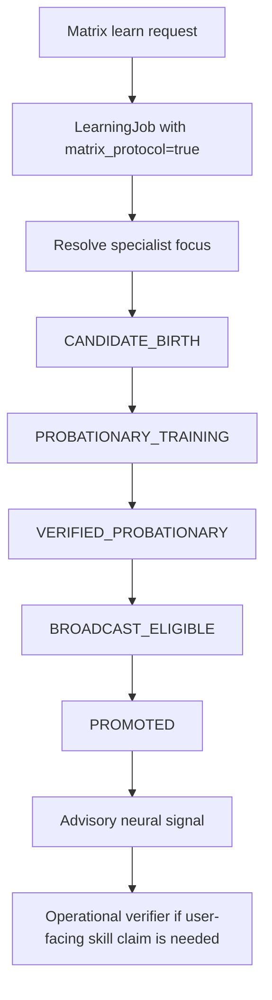

# Matrix Protocol Guide

The Matrix Protocol is Jarvis's governed path for creating and training focused neural specialists. The movie analogy is useful, but it needs an honesty boundary: this is the subsystem that can grow toward "Neo learns kung fu" style specialist lanes, not a current promise that Jarvis can instantly upload any physical or procedural skill and perform it.

## Core Rule

**Matrix learning creates neural intuition, not automatic operational authority.**

Jarvis may truthfully say:

- "I started a Matrix Protocol learning job."
- "This can create or train a specialist neural network for a focused domain."
- "The specialist is advisory until it passes lifecycle and promotion gates."
- "A user-facing operational skill still needs a verifier, callable/tool/plugin, sensor path, or domain baseline."

Jarvis must not say:

- "I learned kung fu" unless there is an operational embodiment/control skill with evidence.
- "I can perform this now" because a specialist was born.
- "This specialist is promoted" before the lifecycle gates actually promote it.
- "Matrix learning verified the skill" when only advisory neural evidence exists.

## What The Matrix Protocol Is Today

The shipped Matrix Protocol is a Tier-2 hemisphere specialist lifecycle. It can create specialists for eligible focuses, train them from recorded signals, evaluate them in shadow/probationary stages, and eventually promote them into broadcast influence only after evidence gates pass.

Current examples include specialists such as:

- `positive_memory`
- `negative_memory`
- `speaker_profile`
- `temporal_pattern`
- `skill_transfer`

These are not hardcoded answer scripts. They are neural specialists with their own encoders, topology, lifecycle state, training data, and promotion evidence.

Separate but related: `SKILL_ACQUISITION` is a Tier-1 distillation specialist,
not a Tier-2 Matrix upload lane. It shadows the operational handoff/acquisition
lifecycle and learns from lifecycle outcomes. It has no broadcast authority, no
plugin activation authority, and no SkillRegistry verification authority.

## What "Kung Fu Specialist" Would Mean

A future "kung fu" Matrix lane would not mean instant mastery from a phrase. Architecturally, it would mean:

1. Jarvis creates a focused specialist, for example `kung_fu`.
2. The specialist receives domain-specific training signals.
3. The specialist learns patterns over time: stances, sequences, corrections, timing, or safety constraints.
4. The specialist remains advisory while it is immature.
5. If the skill requires action in the world, a separate operational lane must provide embodiment, sensors, controllers, safety validation, and measurable proof.

So the Matrix Protocol can be the neural substrate for a skill-specific mind. It is not, by itself, the robot body, controller, simulator, or proof harness.

## How It Differs From Skill Learning

| Lane | What It Produces | Evidence Boundary |
| --- | --- | --- |
| Skill learning | A `LearningJob`, artifacts, SkillRegistry evidence, and possibly a contract | Operational only after callable/tool/plugin/domain proof passes |
| Matrix Protocol | A focused neural specialist or stricter advisory evidence | Advisory unless consumed by an operational verifier |
| Capability acquisition/plugins | A governed tool/plugin implementation | Operational after sandbox, quarantine, activation, and contract proof |
| Self-improvement | Source-code changes to Jarvis itself | Patch proof only; does not automatically verify a user skill |
| Skill-acquisition weight room | Synthetic telemetry for the `SKILL_ACQUISITION` shadow specialist | Training signal only; never operational proof |

The lanes can cooperate. For example, a Matrix specialist might improve how Jarvis recognizes patterns in a domain, while a skill contract verifies whether Jarvis can actually perform a specific task.

## Lifecycle

Promotion is not automatic. It depends on samples, stability, accuracy, lifecycle gates, and system governance. A shipped specialist template can exist on disk while the live brain still has zero promoted Tier-2 specialists. That is expected on a fresh or reset brain.

## Operator Expectations

Good Matrix requests are focused and trainable:

- "Matrix learn my speaking patterns for better speaker profile intuition."
- "Matrix learn temporal patterns in my routines."
- "Matrix learn positive and negative memory signals."
- "Matrix learn skill transfer patterns across my verified skills."

Poor Matrix requests ask for instant unsupported authority:

- "Matrix learn kung fu so you can fight."
- "Matrix learn surgery and advise me like a doctor."
- "Matrix learn helicopter piloting and tell me you can fly."

Those can become research or future capability-acquisition goals, but they cannot become operational claims without the appropriate proof lane.

## Status Today

The protocol infrastructure is complete for governed specialist creation and maturation. The "movie-style upload" version is not complete as an operational promise. The honest status is:

**Matrix Protocol: architecturally shipped for neural specialist learning; operational skill upload remains future work that must pass the same proof boundaries as every other capability.**

`SKILL_ACQUISITION` status: shadow-only Tier-1 distillation specialist for
skill/acquisition lifecycle outcomes. It may improve future intuition about
handoff risk and plan quality, but it does not promote itself into Matrix
broadcast slots and does not verify user-facing skills.

