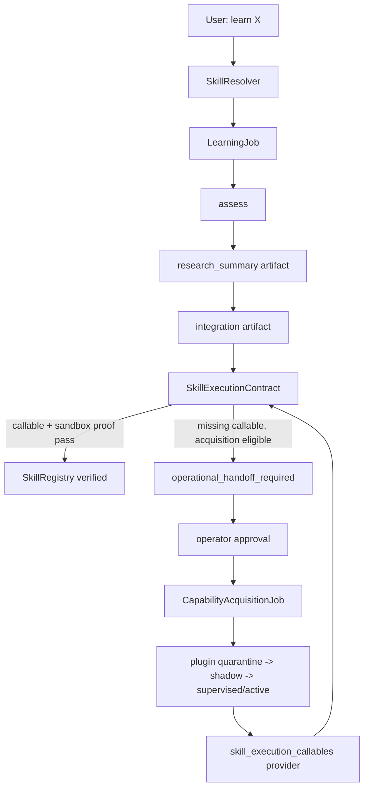

# Skill Learning Guide

> **Primary reading surface:** The dashboard `/learning` page now consolidates
> the skill-learning operator guide for open-source release. This Markdown file
> remains source/reference material and should not be deleted until a later
> archive pass.
>
Jarvis can learn skills, but "learn a skill" does not mean every request instantly becomes an operational tool. Different user requests land in different evidence lanes. Some are knowledge skills, some are procedural, some need user examples, some need sensors, and some need a governed plugin/tool before Jarvis may honestly claim it can do the task.

This guide is the operator-facing reference for how skill learning works, what the current expectations are, and where proof artifacts live.

---

## Core Rule

**A skill is not operational until it has proof.**

Jarvis may truthfully say:

- "I created a learning job."
- "I need examples or data before verification."
- "This needs a governed plugin/tool before it can be operational."
- "This skill is advisory until it passes contract proof."
- "This skill is verified because it passed expected-vs-actual tests."

Jarvis must not say a skill works merely because a learning job reached the end of a lifecycle. Lifecycle evidence is process evidence. Operational evidence requires a callable executor/tool/plugin, contract smoke proof, sandbox proof when required, and SkillRegistry verification.

---

## The Four Capability Lanes

| Lane | What It Does | Operational Claim Boundary |
|---|---|---|
| Skill learning | Creates a `LearningJob`, runs phases, records SkillRegistry evidence | Operational only after a callable executor/tool/plugin passes the skill contract or domain baseline |
| Matrix Protocol | Trains specialists or records stricter advisory evidence | Advisory unless consumed by an operational verifier; see [Matrix Protocol Guide](MATRIX_PROTOCOL_GUIDE.md) |
| Capability acquisition/plugins | Builds tools/plugins through planning, codegen, quarantine, verification, activation | Operational after sandbox proof plus supervised/active plugin state |
| Self-improvement | Modifies Jarvis source code under sandbox, approval, rollback, and health checks | Patch-level proof only; does not automatically verify a user-facing skill |

These lanes can cooperate, but they are not interchangeable. The SkillRegistry remains the symbolic truth owner for user-facing skill status.

---

## Current Skill Data Flow

Important artifacts:

- `~/.jarvis/learning_jobs/<job_id>.json` stores phase, events, evidence, and artifacts.
- `operational_handoff_required.json` records when a skill contract needs a governed implementation and is waiting for operator approval.
- `~/.jarvis/acquisitions/<acquisition_id>.json` records the plugin/callable build lane.
- `~/.jarvis/acquisition_verifications/<verification_id>.json` records sandbox and lane proof.
- `~/.jarvis/plugins/registry.json` records plugin lifecycle state.
- `/api/skills/{skill_id}` exposes the read-only audit packet, including the proof chain.

---

## Terminal Acquisition Closure

Once an operational handoff has created or linked an acquisition job, the two
lifecycles are intentionally coupled:

- If acquisition succeeds and produces a sandbox-proven supervised/active
  callable, the learning job can re-run verification against that proof.
- If acquisition is rejected, cancelled, or fails a terminal lane such as
  verification/plugin activation, the linked learning job is promptly marked
  `blocked` with the terminal acquisition reason.
- The skill record remains honest: `blocked` or `learning` is not a verified
  operational claim.
- Retry is explicit. A new handoff/acquisition attempt should preserve the
  audit trail of the failed attempt instead of mutating history.

This closure path exists so a failed plugin build cannot leave a `LearningJob`
stuck in `active` / `awaiting_acquisition_proof` while the acquisition has
already failed. The dashboard surfaces linked acquisition IDs, lane errors,
planning diagnostics, terminal status, and retry actions in the skill detail
modal and Learning tab.

---

## Acquisition Plan Quality Gate

Skill-linked acquisition may use the shared `CodeGenService`, but it must still
start from a complete Jarvis-authored plan. An acquisition plan is not eligible
for approval if the generated technical design is missing the required:

- `technical_approach`
- `implementation_sketch`
- `test_cases`

Missing fields are recorded as planning diagnostics and shown to the operator.
The correct action is rejection/revision or retry, not approving an empty plan.

CodeGen is intentionally slow and CPU-first. The CoderServer default is
`CODER_GPU_LAYERS=0`, so skill code design and plugin generation do not compete
with live GPU workloads such as STT, TTS, Ollama, speaker ID, emotion, or
embeddings. Operators should expect codegen to take minutes on CPU; speed is not
a correctness signal.

---

## Synthetic Skill-Acquisition Weight Room

The synthetic weight room is a training lane for the shadow-only
`SKILL_ACQUISITION` specialist. It is not skill proof.

Profiles:

| Profile | Purpose | Records signals |
|---|---|---|
| `smoke` | Invariant check for wiring and truth boundary | No |
| `coverage` | Synthetic lifecycle/outcome variety for training telemetry | Yes |
| `strict` | Heavier gated training profile | Yes, operator flag required |
| `stress` | Heavy stress profile | Yes, operator flag required |

Hard boundary:

- Synthetic workouts cannot verify skills.
- Synthetic workouts cannot promote plugins.
- Synthetic workouts cannot unlock capability claims.
- Synthetic workouts cannot satisfy lived maturity gates.
- `SKILL_ACQUISITION` does not affect policy, Matrix broadcast slots, plugin
  activation, or SkillRegistry verification.

The dashboard shows the authority boundary as `telemetry_only`,
`synthetic_only=true`, `live_influence=false`, and
`promotion_eligible=false`.

---

## What Happens For Missing Operational Proof

For contract skills such as CSV/data processing:

1. Jarvis creates a learning job and advances through `assess`, `research`, and `integrate`.
2. Verification runs the skill execution contract.
3. If no production callable exists, verification records that the callable is missing.
4. If the contract is acquisition-eligible, Jarvis writes an `operational_handoff_required` artifact.
5. The skill waits for operator approval before acquisition/plugin work begins.
6. Approval creates or links a governed `CapabilityAcquisitionJob`.
7. Acquisition owns codegen, sandbox, quarantine, human gates, and plugin activation.
8. Skill verification only consumes plugins that are sandbox-proven and `supervised` or `active`.
9. The SkillRegistry is marked verified only after expected-vs-actual contract smoke tests pass.
10. If the linked acquisition fails or is cancelled, the learning job is blocked with the terminal reason and waits for explicit retry.

This is the intended behavior. A blocked or waiting skill is not necessarily a broken skill; it may be honestly waiting for proof.

---

## Example Skill Requests

| User Type | Request | Likely Lane | Proof Needed |
|---|---|---|---|
| Gardener | "Learn how to help me diagnose tomato plant problems." | Knowledge, later perceptual | Source-backed plant knowledge; image/examples for visual claims |
| Home cook | "Learn how to scale recipes for my family." | Procedural | Input recipe + target servings -> adjusted ingredient outputs |
| Woodworker | "Learn how to calculate board cuts for a shelf." | Procedural/tool | Measurement contract, cut-list expected outputs, possible plugin |
| Fitness user | "Learn how to build beginner strength workouts for my equipment." | Knowledge/planning | User constraints, equipment list, safety boundaries |
| Musician | "Learn how to help me practice guitar chord transitions." | Coaching/advisory, later audio | Practice plan first; audio proof if claiming performance assessment |
| Photographer | "Learn how to critique my photos for composition." | Perceptual/knowledge | Image examples and criteria; vision proof for image analysis claims |
| Budgeting user | "Learn how to categorize my monthly expenses." | Data processing | Sample transactions, expected categories, CSV/parser proof |
| Student | "Learn how to quiz me on biology chapters." | Knowledge/study | Ingested source material, citation/provenance, quiz quality checks |
| Language learner | "Learn how to help me practice Spanish conversation." | Conversational coaching | Advisory at first; tested rubric for stronger claims |
| Birdwatcher | "Learn how to help me identify backyard birds." | Knowledge, later vision/audio | Regional sources; model/tool proof for sound/image ID |
| Car enthusiast | "Learn how to troubleshoot basic car maintenance." | Knowledge/advisory | Safety disclaimers, source-backed steps, no diagnostic certainty |
| Dungeon master / gamer | "Learn how to generate balanced D&D encounters." | Procedural/creative planning | Party level + constraints -> difficulty-bounded encounter output |
| Runner | "Learn how to adjust my running plan when I miss workouts." | Planning/personalization | User goals, injury constraints, conservative adaptation rules |
| Knitter/crocheter | "Learn how to convert pattern sizes." | Procedural | Pattern sample -> converted measurements/stitch counts |
| Aquarium hobbyist | "Learn how to track fish tank water parameters." | Data/advisory | Logged readings, interpretation rubric; real scheduler if claiming alerts |
| Ham radio user | "Learn how to log contacts and calculate bands." | Tool/plugin | Structured logging, file persistence, testable input/output |
| Home brewer | "Learn how to calculate beer recipe ABV and bitterness." | Procedural/math | Formula tests with expected ABV/IBU outputs |
| Artist | "Learn how to build color palettes for digital painting." | Creative advisory | Sample palette outputs; stronger proof if tied to image/style analysis |
| Pet owner | "Learn how to track my dog's feeding, medication, and symptoms." | Memory/tool boundary | Memory records; real reminder mechanism before reminder claims |
| Small business owner | "Learn how to summarize customer feedback from CSV exports." | Data processing/summarization | Sample file, expected summary format, parser/plugin proof |

---

## Best Current Requests

The best skill requests are narrow and testable:

- "Learn how to process CSV data and summarize numeric totals."
- "Learn how to scale a recipe from 4 servings to 9 servings."
- "Learn how to calculate shelf cut lists from board dimensions."
- "Learn how to calculate home-brew ABV from original and final gravity."
- "Learn how to quiz me from this ingested biology chapter."

These work well because they have clear inputs, expected outputs, and contract evidence. Vague requests can still create learning jobs, but they should remain advisory until the missing data, examples, or tool path exists.

---

## Operator Checklist

When reviewing a skill, check:

1. `status`: `learning`, `blocked`, or `verified`.
2. Current `LearningJob` phase and event timeline.
3. Required evidence in the resolver contract.
4. Whether the audit packet shows missing proof.
5. Whether an `operational_handoff_required` artifact exists.
6. Whether the handoff is waiting for operator approval, approved, rejected, or linked to acquisition.
7. Whether a linked acquisition job exists.
8. Whether the plugin is `quarantined`, `shadow`, `supervised`, or `active`.
9. Whether sandbox and expected-vs-actual contract smoke proof passed.
10. Whether linked acquisition failure/cancellation has been mirrored back to the learning job.
11. Whether any synthetic weight-room telemetry is clearly labeled synthetic and not used as operational proof.

Only steps 8-9 support a strong user-facing operational claim.
