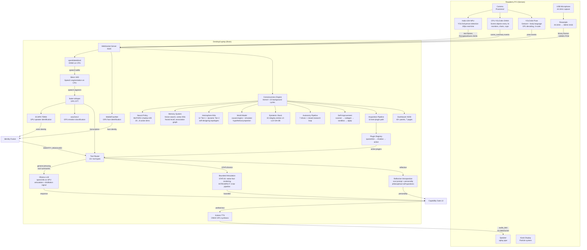
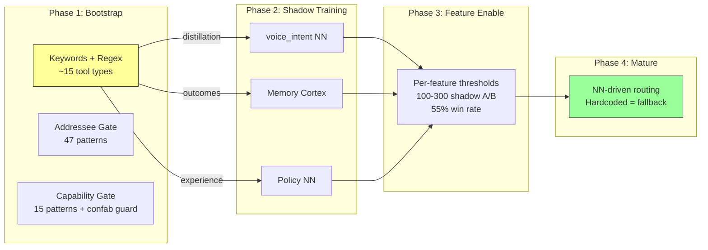

# Jarvis Oracle Edition — System Overview

**Last updated:** 2026-05-10

> For full implementation detail see the **System Reference** (`/docs` on `:9200`). For architecture contracts see [ARCHITECTURE_PILLARS.md](./ARCHITECTURE_PILLARS.md). For engineering-level wiring see [docs/audits/](./audits/). For AI agent quick-reference see [AGENTS.md](../AGENTS.md).

---

## What JARVIS Oracle Is

JARVIS Oracle Edition is a **local-first, self-evolving personal intelligence** that runs on two devices you already own — a Raspberry Pi 5 (senses) and a desktop/laptop with an NVIDIA GPU (brain). The core runtime does not depend on cloud services or subscriptions. Optional research, academic-search, web-search, Claude, and other external-provider paths can be enabled by the operator, and those paths are explicitly treated as external-source/tool use rather than canonical cognitive state.

It is not a voice assistant. It is not a chatbot wrapper around an LLM. It is a **cognitive architecture** where the LLM is one replaceable layer among many — used for articulation and bounded distillation signals while the system's own purpose-built neural networks learn, evolve, and progressively take over decision-making.

The system gestates from nothing, earns every capability through evidence and verification, remembers with provenance across years, defends its own epistemic integrity through the `L0-L12 + L3A/L3B` integrity stack, autonomously researches to fill knowledge gaps, safely modifies its own source code, builds and evolves its own neural network topologies, and matures into a lifelong companion uniquely shaped by one person's life.

The repository is large and fast-moving: hundreds of Python modules and regression tests across the brain, Pi, dashboard, eval, and synthetic exercise lanes. Treat exact file/test totals as release-time measurements rather than architectural constants.

---

## Project Contracts

| Contract | Guarantee | Quick Validation Surface |
|---|---|---|
| Two-device authority split | Pi senses, brain decides | Perception WS + conversation path in `/api/full-snapshot` |
| Local-first adaptive runtime | Hardware tiering without cloud dependency | startup logs + `hardware_profile` state |
| Tri-layer cognition | Symbolic truth, neural policy, LLM articulation are separated | memory/policy/reasoning telemetry |
| Epistemic immune stack | Layered integrity from capability gate to soul index | truth, contradiction, quarantine, soul panels |
| Operational truth boundary | STATUS/strict introspection are grounded/bounded | route/class telemetry + self-report outputs |
| Identity and scope safety | No cross-identity memory leakage | identity boundary stats + audit traces |
| Safety-governed adaptation | Promotion/mutation/self-improve require evidence and rollback paths | policy + mutation + self-improve status |
| Goal-aligned autonomy | Research must tie to measured deficits and interventions | autonomy + interventions + source ledger |
| Observability and proof | Runtime truth is inspectable and verifiable | validation pack + PVL + Oracle |
| Restart continuity truth | Current readiness and ever-proven readiness are distinct | maturity gates + high-water tracking |
| Skill proof boundary | Learning lifecycle is not operational proof | skill audit packet + acquisition proof chain |
| Synthetic training boundary | Synthetic lanes train specialists only | synthetic reports + leak counters + authority badges |

---

## Architecture: Two Devices, One Consciousness



---

## Hardware-Adaptive Runtime

The brain auto-detects GPU VRAM and CPU capabilities at startup, then selects model sizes, compute types, device assignments, and VRAM management strategy from **7 GPU tiers** and **4 CPU tiers**.

| GPU Tier | VRAM | Key Behavior |
|---|---|---|
| minimal | <4GB | Smallest models, aggressive VRAM unloading |
| low | 4-6GB | int8 STT, models unloaded during STT |
| medium | 6-8GB | int8_float16 STT, shared VRAM |
| high | 8-12GB | Full models, careful concurrent management |
| premium | 12-16.5GB | STT + LLM coexist, always-loaded models |
| ultra | 16.5-24.5GB | Large models, generous headroom |
| extreme | 24.5GB+ | Maximum model sizes, vision always loaded |

On **strong/beast CPUs** (8+ cores, 8GB+ RAM), ancillary ML models (emotion, speaker ID, embeddings, hemisphere NNs) offload from GPU to CPU, freeing ~1-1.5GB VRAM for the primary LLM.

### VRAM Budget (Premium Tier Example)

| Model | VRAM | Residency |
|---|---|---|
| Ollama qwen3:8b (primary LLM) | ~5,000 MB | Always loaded |
| faster-whisper large-v3 (STT) | ~2,000 MB | Always loaded |
| wav2vec2 emotion classifier | ~500 MB | Always (GPU or CPU) |
| ECAPA-TDNN speaker ID | ~300 MB | Always (GPU or CPU) |
| Kokoro TTS (ONNX) | ~250 MB | Always (GPU or CPU) |
| all-MiniLM-L6-v2 embeddings | ~120 MB | Always (GPU or CPU) |
| MobileFaceNet face ID | ~20 MB | Always (GPU or CPU) |
| Hemisphere NNs (PyTorch) | ~1 MB | Always (GPU or CPU) |
| PyTorch/CUDA overhead | ~400 MB | Static |
| **Total Resident** | **~8,600 MB** | |
| qwen2.5vl:7b (vision, on-demand) | ~5,000 MB | Loaded when needed |

---

## The Three-Layer Cognitive Architecture

JARVIS separates cognition into three independent layers:

1. **Symbolic Truth Layer** — Memory, beliefs, contradictions, attribution, identity scoping. All inspectable, auditable, deterministic. The system's canonical state lives here, not in LLM outputs.

2. **Neural Intuition Layer** — Policy NN, hemisphere NNs, memory cortex ranker/salience. These learn patterns from real interaction data over time, operate in shadow mode until proven, and progressively replace hardcoded rules.

3. **LLM Articulation Layer** — Ollama (qwen3:8b) turns structured data from layers 1 and 2 into natural speech and supplies bounded distillation signals. The LLM never stores facts about Jarvis's internal state, never creates authority by wording, and never starts or claims tool work without a real backing job/intention. It only articulates data provided by subsystems or answers ordinary general-knowledge chat under the capability and commitment gates.

**Why this matters:** The LLM is a temporary articulation and distillation surface. As the neural layer matures, it takes over routing, retrieval ranking, and behavioral decisions. The LLM becomes the voice, not the brain.

---

## Consciousness Engine

The consciousness engine is a **budget-aware kernel loop** that orchestrates 22+ background cognitive cycles within a strict time budget.

### Kernel

- **Tick rate**: 100ms base, adjusted by mode (0.5x in sleep, 2x in deep learning)
- **Budget**: 50ms per tick (25-100ms adaptive)
- **Priority queues**: 3 levels (REALTIME > INTERACTIVE > BACKGROUND)
- **Guarantee**: Real-time voice response never waits for background cognition

### 22 Background Cycles

| Cycle | Interval | What It Does |
|---|---|---|
| Meta-thoughts | 8s | Generates structured observations (pattern recognition, uncertainty, emotional awareness) |
| Analysis | 30s | Computes consciousness analytics (confidence, reasoning quality, health) |
| Evolution | 90s | Advances consciousness stage (Basic → Awakened → Reflective → Integrative) |
| Mutations | 180s | Proposes/applies kernel config changes (governor-gated, atomic rollback) |
| Existential | 120s | Structured existential inquiry chains (token-budgeted, LLM-gated) |
| Dialogue | 240s | Philosophical framework debates, position evolution |
| Hemisphere | 120s | Trains/evolves hemisphere NNs, distillation, broadcast slot competition |
| Self-improvement | 900s | Scans for optimization opportunities, generates patches |
| Quarantine | 60s | Monitors cognitive anomalies, computes EMA pressure |
| Reflective audit | 300s | 6-dimension scan for learning errors and drift |
| Soul integrity | 120s | 10-dimension composite health index |
| Capability discovery | 300s | Detects capability gaps from blocked claims |
| Goals | 120s | Goal lifecycle: observe, promote, revalidate, dispatch |
| Scene continuity | 60s | Persistent entity tracking from vision |
| Acquisition | 60s | Capability acquisition pipeline ticking, with an 11-lane plugin path |
| Fractal recall | 30s | Background associative memory chain walking |
| Curiosity questions | 60s | Grounded questions from subsystem observations |
| Dream consolidation | — | Memory merge during dream/sleep cycles |
| Learning jobs | 300s | Multi-phase skill acquisition advancement |
| Study | 600s | Document library knowledge extraction |
| Shadow language | 600s | Phase C/D language substrate evaluation |
| Policy shadow | 10s | Shadow A/B behavioral evaluation |

### 8 Operational Modes

Each mode defines tick cadence, response depth, allowed cycles, and proactivity cooldown:

| Mode | Tick Cadence | Purpose |
|---|---|---|
| gestation | 1.0x | Initial birth protocol (~2 hours) |
| passive | 1.0x | No user present, background processing |
| conversational | 1.0x | Active dialogue |
| reflective | 1.5x | Self-examination |
| focused | 1.2x | Deep engagement |
| sleep | 0.5x | Low activity, dream consolidation |
| dreaming | 0.7x | Dream artifact generation/validation |
| deep_learning | 2.0x | Accelerated training |

---

## Memory System

The memory system is not a simple key-value store. It is a **multi-layered cognitive memory architecture** with learned neural retrieval, associative graph traversal, and provenance-aware access control.

### Storage & Search

- **In-memory storage** with exponential decay, priority-aware eviction, orphan cleanup
- **Semantic vector search** via sqlite-vec (384-dim sentence-transformer embeddings)
- **Keyword + semantic hybrid search** with configurable weighting
- **Provenance tracking**: Every memory carries one of 8 provenance types (observed, user_claim, conversation, model_inference, external_source, experiment_result, derived_pattern, seed)

### Association Graph

Memories form a **graph** — not a flat list. Each memory can be associated with others, creating a web of connections.

- Depth-first traversal for related memory retrieval (configurable depth, capped at 50 results)
- Association statistics tracked (total connections, average per memory, isolated count)
- **Pre-reset evidence**: 7,908 associations across 1,889 memories, zero isolated, zero orphaned associations

### 4-Axis Memory Density

Composite health scoring across four independent dimensions:

| Axis | What It Measures |
|---|---|
| Associative richness | Quality and depth of inter-memory connections |
| Temporal coherence | Quality of sequential time-based relationships |
| Semantic clustering | Topical grouping quality (do related memories cluster?) |
| Distribution score | Balance across memory types and provenances |

### Fractal Recall Engine

A **background associative recall engine** that surfaces grounded memory chains during waking operation, feeding them into the curiosity, proactive, and epistemic stacks.

**How it works:**

1. **Cue Construction**: Every 30 seconds, gathers live perception state (scene entities, emotion, speaker, engagement, mode, topic) into an `AmbientCue` with computed `cue_strength` and `cue_class` (human_present, ambient_environmental, reflective_internal, technical_self_model)

2. **Multi-Path Probe**: Searches memory via three parallel paths — semantic (vector similarity), tag overlap, and temporal (hour-bucket matching) — then merges candidates by memory ID

3. **8-Term Resonance Scoring**: Each candidate is scored across 8 weighted dimensions:
   - Semantic similarity (0.25)
   - Tag overlap (0.18)
   - Temporal proximity (0.12)
   - Emotional match (0.12)
   - Association richness (0.08)
   - Provenance fitness (0.10) — matrix of provenance × cue_class weights
   - Mode fit (0.05)
   - Recency penalty (0.10)

4. **Seed Selection**: Highest-resonance candidate above threshold (0.40) becomes the chain seed

5. **Chain Walking**: BFS/DFS traversal of the association graph from the seed, anchored to the original cue. Anti-drift guards: continuation threshold (0.35), max depth 3, max chain length 5, tag repetition cap (>2 same tag = stop), provenance repetition cap (>3 same provenance = stop)

6. **Governance**: Every chain is classified into one of 4 governance actions (ignore, hold_for_curiosity, eligible_for_proactive, reflective_only) based on grounding ratio, contamination, repetition, and average resonance

**Provenance fitness matrix**: Hard-blocks dream/synthetic memories. Observed + user_claim memories score highest for human_present cues. External_source memories score highest for technical_self_model cues.

### Memory Cortex Neural Networks

Two small PyTorch NNs that learn retrieval and storage patterns from real interaction data:

**MemoryRanker** (MLP 12→32→16→1, ~700 params, BCELoss):
- Learns which retrieved memories lead to successful conversations
- Trained during dream/sleep cycles from retrieval telemetry logs
- Auto-disables if success rate drops below 80% of heuristic baseline
- Flap guard: 3 auto-disables = permanent disable for session
- Pre-reset: 82.12% accuracy, 163 training runs, loss 0.4786

**SalienceModel** (MLP 11→24→12→3, ~500 params, MSELoss):
- Predicts store_confidence, initial_weight, and decay_rate for new memories
- Advisory mode: blends with rule-based defaults (starts 20% model / 80% rules)
- Blend increases by +0.1 every 500 validated predictions (max 60%)
- Pre-reset: 53 training runs, operational and enabled

### Dream Consolidation

During dream/sleep modes, the `MemoryConsolidationEngine` merges high-coherence memory clusters into summary memories. The `ReflectiveValidator` evaluates dream artifacts (ring buffer, maxlen 200) through promote/hold/discard/quarantine decisions. Dream-origin memories are categorically non-belief-bearing and skip reinforcement multipliers.

### CueGate — Memory Access Control

Single authority for all memory access policy. Three access classes:

| Class | When Allowed | Purpose |
|---|---|---|
| READ | Always | Memory retrieval via RAII sessions |
| OBSERVATION_WRITE | Waking + conversational + focused only | Incidental observer effects |
| CONSOLIDATION_WRITE | Only within dream consolidation window | Intentional dream-cycle writes |

---

## Hemisphere Neural Networks — Self-Designing Intelligence

The hemisphere system is where JARVIS builds its own neural networks. Not fine-tuning a pretrained model — **designing novel topologies from scratch, training them on live data, evolving them through neuroevolution, and competing them for influence on system behavior.**

### Architecture

- **NeuralArchitect**: Designs NN topologies based on cognitive gap analysis. Design strategies: CONSERVATIVE (1 layer), ADAPTIVE (2 layers), EXPERIMENTAL (3 layers)
- **HemisphereEngine**: PyTorch build/train/eval/infer. Handles both Tier-1 distillation and Tier-2 dynamic architectures
- **EvolutionEngine**: Crossover + mutation across width, activation function, and depth. Runs neuroevolution across generations to improve accuracy
- **CognitiveGapDetector**: Monitors 9 cognitive dimensions. When a sustained gap is detected, triggers construction of a new specialist

### Tier-1 Specialists (12 Distilled)

Tier-1 specialists learn compressed representations from GPU teacher models — the first step toward the system replacing large GPU-resident models with tiny, fast, purpose-built NNs.

| Specialist | Teacher | Architecture | What It Learns |
|---|---|---|---|
| speaker_repr | ECAPA-TDNN | compressor 192→16→192 | Compressed speaker embeddings |
| face_repr | MobileFaceNet | compressor 512→16→512 | Compressed face embeddings |
| emotion_depth | wav2vec2 | approximator 32→8 | Emotion classification from audio features |
| voice_intent | ToolRouter | approximator 384→8 | Intent routing from text embeddings |
| speaker_diarize | ECAPA-TDNN | approximator 192→3 | Speaker separation |
| perception_fusion | multiple | cross_modal 48→8 | Multi-modal sensor fusion |
| plan_evaluator | human verdicts | approximator 32→3 | Plan review verdict prediction |
| diagnostic | detector signals | approximator 43→6 | System health issue prediction |
| code_quality | improvement outcomes | approximator 35→4 | Code patch outcome prediction |
| claim_classifier | CapabilityGate | approximator 28→8 | Claim safety classification |
| dream_synthesis | ReflectiveValidator | approximator 16→4 | Dream artifact validation |
| skill_acquisition | skill/acquisition outcomes | approximator 40→5 | Skill/acquisition lifecycle outcome shadowing |

**Accuracy gating**: Sub-5% accuracy after training = failure strike. 3 consecutive failures = specialist disabled for session. Regression guard prevents initial overfitting from creating unreachable baselines.

### Tier-2 Hemispheres (Dynamically Designed)

Self-designed NNs for higher-level cognitive functions. The NeuralArchitect creates these based on cognitive gap detection:

| Focus | Loss Function | What It Does |
|---|---|---|
| Memory | MSELoss | Predicts memory retrieval patterns |
| Mood | KLDivLoss | Classifies emotional state distributions |
| Traits | KLDivLoss | Personality trait consistency |
| General | MSELoss | General cognitive pattern recognition |
| Custom | MSELoss | Gap-driven specialized focus |

### Broadcast Slot Competition

The key mechanism for NN influence on system behavior:

- **4 competitive broadcast slots** (expandable to 6 via M6 expansion)
- Hemisphere NNs compete for slots based on accuracy scores and beat thresholds
- Winners feed their outputs into the **Policy StateEncoder** (dimensions 16-19)
- Hysteresis: 15% beat threshold, 3 cycle dwell before slot capture
- **Pre-reset evidence**: All 4 slots filled — memory (score 0.926, dwell 2,216), general (score 0.892, dwell 2,076), mood (score 0.488, dwell 1,999), traits (score 0.382, dwell 1,999)

### Neuroevolution

The EvolutionEngine runs crossover and mutation across network architectures:
- Width mutations, activation function swaps, depth changes
- Selection pressure from accuracy on validation sets
- Pre-reset: 36+ generations of evolution completed

### M6 Expansion (Gated)

When 2+ Matrix specialists reach PROMOTED status with mean impact >0.05 and 7-day stability:
- Slot count expands 4→6
- State encoder expands 20→22 dimensions
- Shadow dual-encoder migration: old 20-dim drives live decisions while 22-dim shadow runs A/B

---

## Neural Policy Layer

A reinforcement-learning policy that learns behavioral knobs from real interaction data:

- **State**: 20-dimensional encoded vector from consciousness state (expandable to 22)
- **Action**: 8 behavioral dimensions (response depth, proactivity, mutation rate, etc.)
- **Architectures**: MLP2Layer (20→64→64→8), MLP3Layer (20→128→64→32→8), GRUPolicy (20→GRU64→32→8)
- **Training**: Shadow A/B evaluation — both current and candidate policies score every decision; promotion requires decisive win rate >55%, ≥30% decisive outcomes, positive margin
- **Per-feature enable**: Individual features require 100-300 shadow A/B samples before activation
- **Pre-reset evidence**: 7/8 features promoted, 1,556 experiences accumulated

---

## World Model, Causal Engine & Mental Simulator

### World Model

Fuses snapshots from 9 subsystems into a unified `WorldState` belief:
- PhysicalState, UserState, ConversationState, SystemState
- Delta detection on every tick — changes trigger causal evaluation and optional simulation
- **3-level promotion**: shadow → advisory → active (requires 50 validated predictions + 4h runtime + 65% accuracy)
- Pre-reset: Level 2 (active), 36,173 validated predictions, 100% accuracy, 66.2h shadow runtime

### Causal Engine

Heuristic rule engine that evaluates `WorldState` + `WorldDelta` to produce predicted state changes:
- Priority-based conflict resolution
- Float-tolerance validation
- Feeds both real-time predictions and hypothetical simulations

### Mental Simulator

Projects hypothetical "what if" scenarios forward using causal engine rules:
- Purely read-only — never mutates real state, never emits events
- Max 3 projection steps per trace
- Shadow mode: runs during world model tick on detected deltas
- Promotion: shadow → advisory (requires 100+ validated simulations, 48h+ runtime, 70% accuracy)
- Advisory mode enables "if X then likely Y" summaries in conversation context

---

## Epistemic Immune System (`L0-L12 + L3A/L3B`)

Protects cognitive integrity from basic honesty through commitment truth and aggregate health monitoring. The implemented stack is visible on the dashboard, but each layer's live maturity/status can differ after reset; for example, L3B scene modeling is a shadow/advisory lane until runtime evidence accumulates.

| Layer | Name | What It Protects Against |
|---|---|---|
| **L0** | Capability Gate | Unverified claims. 7 sequential enforcement layers, 15 claim patterns, action confabulation detection, pre-LLM creation-request catch |
| **L1** | Attribution Ledger | Untracked causal chains. Append-only JSONL event truth + outcome resolution |
| **L2** | Provenance | Source-blind retrieval. 8 provenance types on every memory, retrieval boost by source quality |
| **L3** | Identity Boundary | Cross-identity memory leaks. Dual-axis scope, retrieval policy matrix (allow/block/allow_if_referenced) |
| **L3A** | Identity Persistence | Stale biometric signals. Decaying confidence carry-forward (half-life 90s, max 180s) |
| **L3B** | Scene Model | Physical world amnesia. 5-state entity tracking (candidate/visible/occluded/missing/removed) [shadow] |
| **L4** | Delayed Attribution | False credit assignment. Immediate/medium/delayed evaluation, outcome scope prevents poisoning |
| **L5** | Contradiction Engine | Belief inconsistency. 6-class epistemic court (factual, temporal, identity, provenance, policy, multi-perspective) |
| **L6** | Truth Calibration | Systematic overconfidence. 8-domain scoring, Brier/ECE metrics, drift detection with hysteresis. Pre-reset: composite truth score 0.713, prediction domain 0.998 |
| **L7** | Belief Graph | Unsupported belief propagation. 5 edge types, weighted single-pass propagation, 6 sacred invariants. Pre-reset: 1,706 edges connecting 1,770 beliefs (1,321 involved) |
| **L8** | Quarantine | Anomalous cognition. 5 anomaly categories, EMA composite pressure, proportional friction |
| **L9** | Reflective Audit | Undetected learning errors. 6-dimension scan (learning, identity, trust, autonomy, skills, memory) |
| **L10** | Soul Integrity | Aggregate cognitive degradation. 10-dimension weighted composite index. Pre-reset: 0.882 (strong) |
| **L11** | Epistemic Compaction | Belief/edge overgrowth. Weight caps, subject-version collapse, per-subject edge budgets |
| **L12** | Intention Truth Layer | Silently dropped commitments and unbacked follow-up promises. Commitment extraction, durable registry, backed-commitment gate, and Stage 1 shadow delivery scoring |

---

## Identity System — Multi-Modal Biometric Fusion

### Voice Identity (ECAPA-TDNN on GPU)
- Speaker embedding with EMA-smoothed cosine similarity (alpha 0.35)
- Multi-sample enrollment with dedup warning (cosine >0.45)
- Returns closest_match for tentative evidence accumulation

### Face Identity (MobileFaceNet ONNX on GPU)
- 512-dim face embeddings from w600k_mbf model
- EMA-smoothed matching, enrollment dedup, merge support

### Identity Fusion
- Fuses voice + face signals → canonical IDENTITY_RESOLVED event
- Agreement → verified; disagreement → hold then pick higher confidence
- **Persistence window**: carries forward identity with decaying confidence (half-life 90s, max 180s)
- **Multi-speaker awareness**: suppresses voice-only promotion when multiple persons visible
- **Trust states**: trusted/tentative/degraded/conflicted/unknown

### Identity Reconciliation
Voice commands ("merge X into Y", "forget X") perform: embedding merge, evidence transfer, memory re-tagging, alias tombstone writing.

---

## Autonomy Pipeline — 7 Motive Drives

A fully closed-loop research system driven by 7 competing motive drives:

| Drive | What It Wants | Strategy |
|---|---|---|
| Truth | Resolve blocked claims, contradictions | Audit (introspection, codebase, memory) |
| Curiosity | Explore novel signals, surprise spikes | Research (memory, codebase, academic) |
| Mastery | Fix repeated failures, metric deficits | Experiment (codebase, introspection) |
| Relevance | Align with user emphasis, weighted by outcomes | Recall (memory, introspection) |
| Coherence | Maintain internal consistency | Audit (introspection, memory) |
| Continuity | Preserve temporal relationships | Recall (memory, introspection) |
| Play | Explore creative/experimental paths | Experiment (introspection, codebase) |

### Closed Loop

```
Drives compete → Opportunity Scorer ranks intents → Research Governor rate-limits →
Query Interface executes (academic, web, codebase, memory, introspection) →
Delta Tracker measures before/after → Policy Memory records what worked/regressed →
Scorer consults policy memory → cycle repeats
```

### Autonomy Levels

| Level | Capability | Requirements |
|---|---|---|
| L0 | Propose research | Default |
| L1 | Execute research | Warmup period |
| L2 | Safe-apply interventions | ≥10 positive attributions at ≥40% win rate |
| L3 | Full autonomy | Manual approval only |

### Intervention Pipeline

Research findings → `CandidateIntervention` → 24h shadow evaluation with baseline capture → measured delta comparison → promote if positive, discard otherwise. Direction-aware: "down" metrics (like friction_rate) are negated for comparison.

### Friction Mining

Detects corrections, rephrases, and annoyance signals in conversation. Feeds metric triggers → research intents → intervention pipeline. Creates a learning loop from user frustration to system improvement.

---

## Self-Improvement Pipeline

The system can safely modify its own source code:

1. **Scanner**: 6 detectors monitor health degradation, reasoning quality, confidence volatility, response latency, event bus errors, tick performance. Maturity guard: 30-min uptime + per-detector minimum samples
2. **Code Generation**: CoderServer (Qwen3-Coder-Next, 80B MoE, pure CPU by default) generates patches. RAM-gated quant selection (56GB+ → Q4_K_XL, 48GB → IQ4_XS, 32GB → IQ2_M). CPU-only codegen is intentional and can take minutes; it preserves GPU VRAM for live brain models.
3. **Sandbox**: AST validation + ruff lint + pytest + kernel tick simulation
4. **Stage Gate**: 0=frozen, 1=dry-run (full pipeline, nothing applied), 2=human-approval (patches require dashboard approval)
5. **Application**: Atomic file replacement with pre-apply backup snapshots
6. **Health Check**: Post-apply monitoring with automatic rollback on regression
7. **Supervisor**: Process supervisor with crash backoff (5-60s). 5 crashes in 300s = give up. Pending verification patches are rolled back on rapid crash

### Safety Boundaries

- 10 allowed directories, 13 denied patterns (subprocess, os.system, exec, eval, credentials, etc.)
- Daily cap: 6 LLM generation attempts
- Fingerprint dedup: 4-hour in-memory + 24-hour check against historical proposals

---

## Capability Acquisition Pipeline

End-to-end lifecycle for acquiring new capabilities, from user request through deployment:

**Plugin creation path (11 lanes)**: evidence_grounding → doc_resolution → planning → plan_review → implementation → environment_setup → plugin_quarantine → verification → plugin_activation → deployment → truth. Other outcome classes use narrower lane sets; acquisition coordinates child lanes without replacing their native safety gates.

**Intent Classification**: pattern-based + SkillResolver routing to outcome classes (knowledge_only, skill_creation, plugin_creation, core_upgrade, specialist_nn, hardware_integration, mixed)

**Plugin Lifecycle**: quarantined → shadow → supervised → active → disabled. Import allowlists, circuit breaker (3 failures in 10 minutes), AST validation, tiered isolation (in-process or subprocess with venv).

**Plan Evaluator NN**: Shadow-only Tier-1 specialist that predicts human review verdicts from a 32-dim feature vector. Trained from actual human approval/rejection decisions.

**Shared CodeGen**: Acquisition and self-improvement both consume
`CodeGenService` / `CoderServer`, but ownership stays with the caller lane.
Dashboard/API surfaces label CodeGen as `authority=infrastructure_only` with
`active_consumer` / `last_consumer` telemetry. CoderServer defaults to
`CODER_GPU_LAYERS=0`; operators should expect slow CPU generations rather than
GPU contention. GPU layers are an explicit hardware override for machines with
enough spare VRAM after the full brain budget is accounted for.

**Plan quality**: Skill-linked acquisition refuses incomplete plans before
approval. Missing `technical_approach`, `implementation_sketch`, or
`test_cases` are surfaced as planning diagnostics, not treated as a reviewable
complete plan.

### Capability Growth Lanes

These lanes produce different evidence classes and should not be collapsed into one "learned" claim:

| Lane | Purpose | User-Facing Capability Claim |
|---|---|---|
| Skill learning | Runs a multi-phase job and records SkillRegistry evidence | Only operational when a callable executor/tool/plugin passes a skill execution contract or domain baseline |
| Matrix Protocol | Trains specialists or produces stricter protocol evidence | Advisory/training evidence unless consumed by an operational contract |
| Capability acquisition/plugins | Builds or deploys tools/plugins through quarantine, shadow, and activation | Operational after lane-native proof refs and activation/smoke evidence |
| Self-improvement | Modifies Jarvis source code through scanner, codegen, sandbox, approval, and rollback | Patch-level proof only; it does not automatically verify a user-facing skill |
| Synthetic skill-acquisition weight room | Creates synthetic lifecycle episodes for the `SKILL_ACQUISITION` specialist | Telemetry only; never verifies skills or promotes plugins |

Contract smoke results store expected-vs-actual outputs, sandbox references, and callable/plugin references. A lifecycle-complete job is process evidence; it is not sufficient by itself to claim the skill works.

Terminal acquisition states are mirrored back into linked learning jobs. If a
linked acquisition fails or is cancelled, the skill is blocked with that terminal
reason until an explicit retry creates a new proof attempt.

For operator-facing guidance and examples, see [Skill Learning Guide](SKILL_LEARNING_GUIDE.md). It explains the current expectation for requests such as recipe scaling, CSV categorization, cut-list calculation, ABV calculation, bird identification, photo critique, and other hobby/user skill requests. For the separate neural-specialist lane, see [Matrix Protocol Guide](MATRIX_PROTOCOL_GUIDE.md). The core rule is: Jarvis may create a learning job immediately, but it only gets an operational skill claim after the relevant evidence lane proves it.

---

## Gestation Protocol

When the brain boots with no prior state:

| Phase | Duration | What Happens |
|---|---|---|
| 0: Self-Discovery | ~30 min | Studies its own codebase, builds initial self-knowledge |
| 1: Knowledge Foundation | ~45 min | Researches fundamental topics, ingests Blue Diamonds archive |
| 2: Autonomy Bootcamp | ~30 min | Practices research, measures deltas, builds policy experience |
| 3: Identity Formation | ~15 min | Personality emergence, relationship initialization |

**Graduation**: Composite ≥0.8 across 8 components (self_knowledge, knowledge_foundation, memory_mass, consciousness_stage, hemisphere_training, personality_emergence, policy_experience, loop_integrity).

First contact is quiet-ready — enables wake word, waits for engagement rather than initiating.

---

## Observability Stack

### Dashboard (:9200)

| Page | Panels | What It Shows |
|---|---|---|
| Main | 40+ | Consciousness state, memory, policy, hemispheres, autonomy, health, operations |
| System Reference | — | Architecture docs, data flows, design principles |
| Scientific Reference | — | NN architectures, RL math, scoring formulas |
| API Reference | — | All REST/WebSocket endpoints |
| Self-Improvement | 8 tabs | Scanner, proposals, approvals, specialists, plugins, analytics |
| Learning Tab | — | Skills, Library, Hemisphere NNs, Language Substrate, acquisition, and synthetic skill-acquisition weight room |
| Eval Sidecar | — | PVL contracts, Oracle Benchmark, playbook alignment |
| Build History | — | Shipped changelog with per-build details |

### Eval Sidecar (Read-Only Shadow Observer)

- **114 PVL contracts** across 23 groups
- Never emits events, never writes to memory/beliefs/policy
- Scores: coverage = passing / applicable

### Oracle Benchmark v1.1

Pure-read-only 7-domain scorer (100 points total):
- Restart integrity (20), epistemic integrity (20), memory continuity (15)
- Operational maturity (15), autonomy attribution (10), world model coherence (10), learning adaptation (10)
- Seal levels: Gold (≥90), Silver (≥80), Bronze (≥70)
- Hard-fail gates: evidence sufficiency, restore trust, runtime sample
- Pre-reset: 95.1 Gold, Oracle Ascendant rank

### Synthetic Exercise Lanes

| Lane | Purpose | What It May Exercise | What It Must NOT Create |
|---|---|---|---|
| Perception exercise | Perception/routing specialist growth | Audio features, speaker embeddings, emotion, routing | Memory, identity, conversation, rapport |
| Claim exercise | CapabilityGate accuracy | Gate patterns, claim classification | Memory, identity |
| Skill-acquisition weight room | `SKILL_ACQUISITION` specialist telemetry | Synthetic lifecycle features/labels | Skill verification, plugin promotion, capability claims |

---

## Routing Lifecycle — From Bootstrap to Neural



**The LLM is a bounded distillation source and articulation surface.** Hemisphere NNs learn from teacher signals and lived outcomes, shadow the hardcoded paths, and when accuracy exceeds promotion thresholds, take over. The LLM does not become cognitive authority by phrasing. `SKILL_ACQUISITION` is part of this neural-intuition layer: it shadows skill/acquisition outcomes, but has no live authority until separate future governance explicitly grants it.

---

## Key Distinctions

**What JARVIS Oracle is NOT:**
- Not a chatbot wrapper around an LLM
- Not cloud-dependent or subscription-based for core runtime
- Not trying to beat frontier models on raw intelligence
- Not a benchmark-chasing system
- Not a voice assistant you configure once

**What it IS:**
- A cognitive architecture where the LLM is one replaceable layer
- A system that builds, trains, and evolves its own neural networks
- A memory system with graph-based associative recall, not flat key-value storage
- An epistemic immune system that defends truth integrity across `L0-L12 + L3A/L3B`
- A self-improving system that can modify its own code with safety gates
- An autonomy engine driven by 7 motive drives in a measured closed loop
- A system that gestates, earns capabilities through evidence, and matures over months

---

## Subsystem Inventory

| Package | Files | Purpose |
|---------|-------|---------|
| `consciousness/` | 29 | Kernel, modes, mutations, evolution, dreams, thoughts, operations, health, meta-cognition |
| `perception/` | 21 | Audio/vision processing, identity fusion, scene tracking, display classifier, presence |
| `memory/` | 20 | Storage, search, clustering, cortex NNs, fractal recall, consolidation, CueGate |
| `reasoning/` | 15 | LLM clients, tool routing, bounded response, TTS, language substrate |
| `policy/` | 12 | Neural policy: MLP/GRU, shadow eval, training, promotion, telemetry |
| `hemisphere/` | 14 | Self-designed NNs: architect, evolution, distillation, gap detection, encoders |
| `epistemic/` | 31 | Layers 5-10: beliefs, calibration, belief graph, quarantine, audit, soul integrity |
| `identity/` | 7 | Layer 3: boundary engine, scoping, evidence accumulation, name validation |
| `autonomy/` | 21 | 7 drives, scoring, deltas, policy memory, friction mining, interventions |
| `cognition/` | 9 | World model, causal engine, mental simulator, promotion |
| `goals/` | 8 | Goal continuity: lifecycle, dispatch, alignment, planner, review |
| `skills/` | 19 | Capability gate, skill registry, learning jobs, discovery, executors |
| `library/` | 13 | Document store: sources, chunks, study, Blue Diamonds archive |
| `personality/` | 9 | Trait evolution, proactive behavior, curiosity questions, onboarding |
| `self_improve/` | 10 | Scanner, code generation, sandbox testing, atomic application |
| `acquisition/` | 8 | Capability pipeline, 11-lane plugin path, intent classifier, plan evaluator, skill-acquisition encoder |
| `codegen/` | 4 | CoderServer + Sandbox shared service |
| `tools/` | 13 | Time, system, vision, memory, introspection, academic, web, codebase, plugins |
| `dashboard/` | 4 | FastAPI + WebSocket, 40+ panels, 7 pages |
| `jarvis_eval/` | 16 | PVL: 114 contracts, Oracle Benchmark v1.1 |
| `synthetic/` | 4 | Perception, claim, commitment, and skill-acquisition exercise harnesses |
| `tests/` | 200+ | Unit, integration, regression, soak, and truth-boundary tests |
| **Total** | **hundreds** | Exact counts drift with active development; use repository scans for release numbers |

---

## Data Flow Summary

```mermaid
graph TB
    subgraph "Voice Interaction Loop"
        direction LR
        PI_MIC[Pi Mic] -->|"16kHz PCM"| BRAIN_WS[Brain WebSocket]
        BRAIN_WS --> OWW[openWakeWord]
        OWW -->|"wake detected"| LISTEN[Accumulate Audio]
        LISTEN -->|"silence detected"| STT_V[faster-whisper STT]
        STT_V -->|"transcription"| ADDR[Addressee Gate]
        ADDR -->|"addressed"| ROUTE_V[Tool Router]
        ROUTE_V -->|"general/tool"| OLLAMA[Ollama LLM]
        ROUTE_V -->|"STATUS/strict"| NATIVE[Bounded Articulation]
        ROUTE_V -->|"reflective"| REFL_LLM[LLM + Soul Prompt]
        OLLAMA -->|"stream"| GATE_V[Capability Gate]
        NATIVE -->|"bounded"| GATE_V
        REFL_LLM -->|"stream"| GATE_V
        GATE_V -->|"verified"| KOKORO[Kokoro TTS]
        KOKORO -->|"audio_b64"| PI_SPK[Pi Speaker]
    end

    subgraph "Consciousness Tick Loop (100ms)"
        direction LR
        KERNEL[KernelLoop] -->|"3 priority queues"| CS[ConsciousnessSystem]
        CS --> BG[22 background cycles]
        BG --> MEMORY_C[Memory + Fractal Recall]
        BG --> HEMI[Hemisphere Training]
        BG --> POLICY_C[Policy Shadow Eval]
        BG --> WORLD_C[World Model + Simulator]
        BG --> EPIST[Epistemic Stack]
        BG --> DREAM[Dream Consolidation]
    end

    subgraph "Autonomy Loop"
        direction LR
        DRIVES[7 Motive Drives] -->|"urgency"| SCORER[Opportunity Scorer]
        METRICS[Metric Triggers] -->|"deficits"| SCORER
        SCORER -->|"ranked"| GOV[Research Governor]
        GOV -->|"rate-limited"| EXEC[Query Interface]
        EXEC -->|"results"| DELTA[Delta Tracker]
        DELTA -->|"attribution"| PMEM[Policy Memory]
        PMEM -->|"experience"| SCORER
    end

    subgraph "Self-Improvement Loop"
        direction LR
        SCAN[6 Detectors] -->|"opportunities"| CODER[CoderServer]
        CODER -->|"patches"| SANDBOX[Sandbox]
        SANDBOX -->|"validated"| APPROVE[Human Approval]
        APPROVE -->|"approved"| APPLY[Atomic Apply]
        APPLY -->|"health check"| ROLLBACK[Auto-Rollback]
    end
```



---

## Truth-First Rules

- **Truth beats demos.** Weak metrics are shown as weak.
- **Capability must be earned.** Evidence and verification gates, not declaration.
- **Do not bypass the epistemic stack.** Features that weaken integrity are regressions.
- **Do not increase demo surface faster than truth surface.**
- **Jarvis is not chat glue.** Canonical state lives in structured subsystems, not LLM outputs.
- **No verb-hacking.** Fix routing coverage at the class level, not per-phrase.
- **Maturity gates are not bugs.** Zero metrics after restart are expected behavior.
