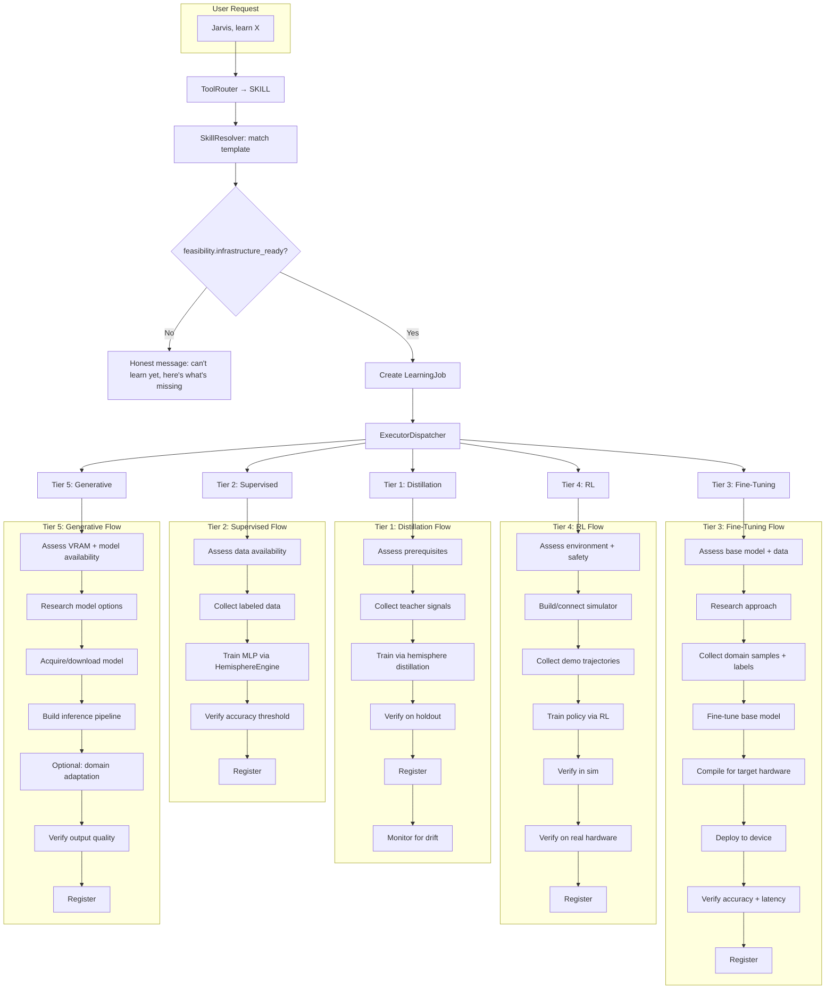

# Training Protocol Tiers (Reference Taxonomy)

Status: **REFERENCE** — not an active plan. Design taxonomy that guides how skill templates
are classified and what infrastructure each tier requires. The `SkillFeasibility` data
contract at the bottom of this document is **not implemented**; today's implicit gate is the
generic-fallback block in `skill_tool.py`. Treat this document as design reference, not a
to-do list.

History: originally written as a plan (2026-03-26) and archived as a plan; moved to
`docs/reference/` 2026-04-17 after audit confirmed only Tier 1 + Tier 2 infrastructure is
live. Higher tiers remain design-only.

---

## Problem Statement

Jarvis can learn **perceptual** skills (distillation from teacher models) today. But many skills users will ask for — singing, deer tracking, robot arm control, image generation — require training infrastructure that does not yet exist. When a user says "Jarvis, learn to track deer in the camera," the system needs to:

1. Know whether it **can** learn that skill with current infrastructure
2. If not, explain **specifically** what is missing
3. Never create a learning job that will silently stall

This document classifies all possible skill training methods into 5 tiers, maps every current and planned skill template to a tier, and defines the `SkillFeasibility` data contract that will gate learning job creation.

---

## Current State Audit

### Capability Types (3 implemented)

| Type | Executor Phases | Training Backend | Status |
|---|---|---|---|
| **procedural** | assess, research, acquire, integrate, verify, register | No model training — research + integration only | Working |
| **perceptual** | assess, collect, train, verify, register | Hemisphere distillation pipeline (Tier-1 specialists) | Working |
| **control** | assess, collect, train, verify, register | **Stub** — writes placeholder checkpoint, no real training | Skeleton only |

### What Actually Trains Today

| System | Architecture | Training Method | Status |
|---|---|---|---|
| Hemisphere Tier-1 | 12 distillation specialists | Fidelity-weighted distillation from teacher models | **Active** |
| Hemisphere Tier-2 | Dynamic (NeuralArchitect) | Supervised (MSE/KL) from consciousness state | **Active** |
| Policy NN | MLP2/MLP3/GRU (20-dim state, 8-dim action) | Advantage-weighted imitation learning | **Active, promoted** |
| Memory Ranker | MLP 12→32→16→1 | Supervised (BCE) from retrieval telemetry | **Active** |
| Memory Salience | MLP 11→24→12→3 | Supervised (MSE) from lifecycle telemetry | **Active** |
| Evolution Engine | Crossover + mutation of hemisphere topologies | Neuroevolution | **Active** |
| Control skill train | — | — | **Stub placeholder** |

### Key Gaps

- **No reinforcement learning loop** — policy NN uses imitation learning, not policy gradient
- **No vision model fine-tuning** — cannot retrain YOLOv8 or create custom detectors
- **No generative model hosting** — cannot run diffusion models, vocal synthesis, etc.
- **No simulation environment** — control skills reference "sim" but no sim exists
- **No labeling pipeline** — no way for users to annotate training data (bounding boxes, labels)
- **No Pi-side model deployment** — cannot compile and deploy custom models to Hailo-10H

---

## 5 Training Tiers

### Tier 1: Distillation (READY)

Teacher model produces soft labels; a smaller student NN learns to approximate them.

**Infrastructure**: Hemisphere distillation pipeline (`hemisphere/engine.py` `train_distillation()`), `DistillationCollector`, 12 specialist configs in `hemisphere/types.py` `DISTILLATION_CONFIGS`.

**Phase Sequence**: assess → collect (teacher signals) → train (distillation) → verify (holdout accuracy) → register → monitor

**Hardware**: CPU or CUDA (auto-detected). No special hardware needed.

**Loss Functions**: `cosine_mse`, `kl_div`, `mse` (per specialist config).

**All 12 Tier-1 Specialists** (as coded in `DISTILLATION_CONFIGS`):

| Specialist | Teacher | Type | In→Out | Loss | Min Samples | Data Source |
|---|---|---|---|---|---|---|
| `speaker_repr` | ecapa_tdnn | compressor | 192→192 | cosine_mse | 20 | Voice (mic) |
| `face_repr` | mobilefacenet | compressor | 512→512 | cosine_mse | 20 | Camera |
| `emotion_depth` | wav2vec2_emotion | approximator | 32→8 | kl_div | 30 | Voice (mic) |
| `voice_intent` | tool_router | approximator | 384→8 | kl_div | 15 | Router decisions |
| `speaker_diarize` | ecapa_tdnn | approximator | 192→3 | kl_div | 30 | Voice (mic) |
| `perception_fusion` | multi | cross_modal | 48→8 | mse | 50 | Audio features |
| `plan_evaluator` | acquisition_planner | approximator | 32→3 | kl_div | 15 | Acquisition plan reviews |
| `diagnostic` | diagnostic_detector | approximator | 43→6 | kl_div | 15 | Self-improvement scans |
| `code_quality` | upgrade_verdict | approximator | 35→4 | kl_div | 15 | Improvement attempts |
| `claim_classifier` | claim_verdict | approximator | 28→8 | kl_div | 15 | CapabilityGate evaluations |
| `dream_synthesis` | dream_validator | approximator | 16→4 | kl_div | 15 | Dream validation cycles |
| `skill_acquisition` | skill_acquisition_outcome | approximator | 40→5 | kl_div | 15 | Learning job lifecycles |

**Categories**:
- **Perception specialists** (speaker_repr, face_repr, emotion_depth, speaker_diarize, perception_fusion): fed by live audio/camera sensor data
- **Routing specialist** (voice_intent): fed by tool router classification decisions
- **Code-facing specialists** (plan_evaluator, diagnostic, code_quality): fed by self-improvement and acquisition pipelines — require those pipelines to run
- **Cognitive specialists** (claim_classifier, dream_synthesis, skill_acquisition): fed by CapabilityGate, dream validation, and learning job outcomes

All 12 are `permanent=True` (never sunset). All are shadow-only — they do not gate pipeline decisions.

**Build Complexity**: N/A — already built and running.

---

### Tier 2: Supervised Learning (READY)

Labeled dataset of (input, output) pairs trains an MLP via standard backpropagation.

**Infrastructure**: `HemisphereEngine.build_network()` and `_train_model()` can train arbitrary `NetworkTopology` specs. `NeuralArchitect` can design topologies. Adam optimizer, early stopping, gradient clipping, train/val split.

**Phase Sequence**: assess → collect (labeled data) → train (supervised) → verify (accuracy threshold) → register

**Hardware**: CPU or CUDA. No special hardware needed.

**Current Skills Using This Tier**: None directly as "skills," but the Memory Ranker and Salience models use this infrastructure during dream cycles.

**Potential Future Skills**:
- Intent classification (beyond distillation — trained from user corrections)
- Conversation quality predictor
- Context relevance scorer

**Build Complexity**: Low — infrastructure exists. Needs wiring from skill executors to `HemisphereEngine`.

---

### Tier 3: Fine-Tuning (FUTURE)

Take a pre-trained base model and adapt it to a specific domain with a smaller dataset.

**Infrastructure Needed**:
1. **Base model acquisition** — download pre-trained weights (YOLOv8, whisper variants, etc.)
2. **Data collection pipeline** — user-guided frame labeling (bounding box annotation via dashboard or voice guidance)
3. **Fine-tuning loop** — LoRA or full fine-tune with learning rate scheduling, early stopping
4. **Target hardware compilation** — ONNX export → Hailo Model Zoo compiler (HEF format) for Pi deployment, or ONNX for CPU/CUDA inference on brain
5. **Model deployment** — push compiled model to Pi, hot-swap detection model

**Phase Sequence**: assess (base model + data availability) → research (approach selection) → collect (domain samples + user labels) → train (fine-tune base model) → compile (target hardware) → deploy (push to device) → verify (accuracy + latency) → register → monitor (drift detection)

**Hardware Requirements**:
- Brain: NVIDIA GPU with 8GB+ VRAM for fine-tuning
- Pi: Hailo-10H for custom vision models (requires Hailo Dataflow Compiler for HEF conversion)
- Dashboard: annotation UI for labeling

**Example Skills**:
- **Custom vision / deer tracking** — fine-tune YOLOv8 on deer images → compile to HEF → deploy to Pi Hailo
- **Custom audio classification** — fine-tune whisper-tiny on domain audio → ONNX on brain
- **Domain-specific NER** — fine-tune small LM on entity extraction task

**Missing Components**:
| Component | What It Does | Estimated Effort |
|---|---|---|
| `DashboardAnnotationUI` | Bounding box / label annotation in browser | Medium (2-3 days) |
| `FrameCollector` | Pi sends raw frames on demand, brain stores + indexes | Low (1 day) |
| `FineTuneExecutor` | Skill executor that wraps PyTorch fine-tuning loop | Medium (2 days) |
| `HailoCompiler` | ONNX → HEF conversion (wraps Hailo Dataflow Compiler CLI) | Medium (depends on Hailo SDK availability) |
| `PiModelDeploy` | WebSocket command to hot-swap model on Pi | Low (1 day) |

**Build Complexity**: Medium-High. The fine-tuning loop itself is straightforward (PyTorch). The hard parts are the annotation UI and Hailo compilation pipeline.

---

### Tier 4: Reinforcement Learning (FUTURE)

Agent interacts with an environment, receives rewards, optimizes a policy to maximize cumulative reward.

**Infrastructure Needed**:
1. **Environment abstraction** — `SkillEnvironment` interface with `reset()`, `step(action)`, `observe()`, `reward()`
2. **Simulation bridge** — connect to sim (PyBullet, MuJoCo, or custom) for safe exploration
3. **Policy training loop** — PPO, SAC, or DQN implementation (or wrap stable-baselines3)
4. **Reward shaping** — domain-specific reward functions
5. **Sim-to-real transfer** — domain randomization, progressive transfer
6. **Safety envelope** — action space bounds, emergency stop, user-present gate

**Phase Sequence**: assess (environment + safety gates) → research (reward function design) → sim_build (build/connect simulator) → collect (demonstration trajectories from human or heuristic) → train (RL policy optimization) → sim_verify (verify in simulation) → real_verify (verify on hardware with user present) → register → monitor

**Hardware Requirements**:
- Brain: NVIDIA GPU for policy training
- Pi: GPIO / I2C / SPI for actuator control
- Physical: robot arm SDK, servo controllers, kill switch hardware
- Simulation: PyBullet or MuJoCo running on brain

**Example Skills**:
- **Robot arm control** — pick-and-place via learned policy, sim-first with real transfer
- **Camera PTZ tracking** — learn to track a target by controlling pan/tilt/zoom servos
- **Navigation** — learn to navigate robot chassis through environment

**Missing Components**:
| Component | What It Does | Estimated Effort |
|---|---|---|
| `SkillEnvironment` | Abstract environment interface | Low (1 day) |
| `SimBridge` | Connects to PyBullet/MuJoCo for sim episodes | Medium (2-3 days) |
| `RLTrainer` | PPO/SAC wrapper (or stable-baselines3 integration) | Medium (2-3 days) |
| `SafetyEnvelope` | Action space bounds, E-stop, user-present enforcement | Medium (2 days) |
| `HardwareDriver` | Pi-side actuator control via GPIO/I2C/SPI | Variable (depends on hardware) |
| `RewardDesigner` | Domain-specific reward function library | Ongoing |
| `DemonstrationCollector` | Record human demonstrations for imitation pre-training | Low (1 day) |

**Build Complexity**: High. RL training is notoriously sample-inefficient and reward-sensitive. Sim-to-real transfer adds another layer of complexity. Safety is non-negotiable for physical actuators.

**Existing Foundation**: The policy NN infrastructure (`policy/trainer.py`, `policy/evaluator.py`, `policy/governor.py`) provides the shadow evaluation and promotion patterns. The control skill executor (`skills/executors/control.py`) has the safety gate structure. These can be extended rather than rebuilt.

---

### Tier 5: Generative Model Acquisition (FUTURE)

Acquire, host, and potentially fine-tune a generative model that produces new content (audio, images, text).

**Infrastructure Needed**:
1. **Model acquisition** — download large pre-trained generative models (diffusion, TTS, etc.)
2. **VRAM management** — generative models are large; need dynamic load/unload alongside LLM
3. **Inference pipeline** — model-specific preprocessing, generation, postprocessing
4. **Quality evaluation** — automated metrics (FID, PESQ, etc.) or user feedback loop
5. **Optional fine-tuning** — LoRA/DreamBooth for domain adaptation

**Phase Sequence**: assess (VRAM budget + model availability) → research (model selection + benchmarks) → acquire (download model) → integrate (inference pipeline) → adapt (optional domain fine-tuning) → verify (quality metrics) → register → monitor

**Hardware Requirements**:
- Brain: NVIDIA GPU with 12GB+ VRAM (must coexist with LLM)
- Storage: 5-20GB per generative model

**Example Skills**:
- **Singing / vocal synthesis** — acquire dedicated vocal model (e.g., Bark, VALL-E, or fine-tuned TTS with pitch control). Current Kokoro TTS cannot modulate pitch/melody/rhythm for singing.
- **Image generation** — acquire Stable Diffusion or FLUX model, expose via tool
- **Music composition** — acquire MusicGen or similar audio generation model
- **Voice cloning** — acquire XTTS or similar speaker-adaptive TTS

**Why Singing Was Removed**: The `singing_v1` template classified singing as `procedural` with TTS prosody shaping. This was architecturally dishonest — Kokoro ONNX is a text-to-speech engine that maps phonemes to speech waveforms with fixed prosody. It cannot:
- Control fundamental frequency (pitch) melodically
- Sustain notes at specific frequencies
- Modulate vibrato, dynamics, or timbre independently
- Follow musical timing (tempo, rhythm, meter)

Singing requires a **generative audio model** purpose-built for vocal synthesis, making it a Tier 5 skill.

**Missing Components**:
| Component | What It Does | Estimated Effort |
|---|---|---|
| `ModelAcquisitionPipeline` | Download, verify, and register large models | Medium (2 days) |
| `VRAMBudgetManager` | Dynamic model load/unload to fit VRAM constraints | High (3-5 days) |
| `GenerativeInferencePipeline` | Model-specific generation wrappers | Per-model (1-2 days each) |
| `QualityEvaluator` | Automated output quality metrics | Medium (2 days) |
| `DomainAdapter` | LoRA/DreamBooth fine-tuning wrapper | Medium (2-3 days) |

**Build Complexity**: High. VRAM management alongside the existing LLM is the hardest constraint. Each generative model type has its own inference quirks.

---

## Feasibility Gate Design

When the code changes ship, every `SkillResolution` will carry a `SkillFeasibility` that gates learning job creation.

### Proposed Data Contract

```python
from enum import Enum
from dataclasses import dataclass

class TrainingRequirement(Enum):
    DISTILLATION = "distillation"
    SUPERVISED = "supervised"
    FINE_TUNING = "fine_tuning"
    REINFORCEMENT = "reinforcement"
    GENERATIVE_MODEL = "generative_model"

@dataclass(frozen=True)
class SkillFeasibility:
    training_tier: TrainingRequirement
    infrastructure_ready: bool
    missing_components: tuple[str, ...] = ()
    hardware_required: tuple[str, ...] = ()
    estimated_complexity: str = "unknown"  # low, medium, high, research_needed
    future_notes: str = ""
```

### Gating Logic (in `LearningJobOrchestrator.create_job()`)

```python
if resolution.feasibility and not resolution.feasibility.infrastructure_ready:
    return {
        "outcome": "infeasible",
        "status": "blocked",
        "skill_id": resolution.skill_id,
        "training_tier": resolution.feasibility.training_tier.value,
        "missing": resolution.feasibility.missing_components,
        "hardware": resolution.feasibility.hardware_required,
        "message": (
            f"I can't learn '{resolution.name}' yet. "
            f"This requires {resolution.feasibility.training_tier.value} training "
            f"(Tier {1 + list(TrainingRequirement).index(resolution.feasibility.training_tier)}). "
            f"Missing: {', '.join(resolution.feasibility.missing_components)}."
        ),
    }
```

---

## Template Audit Table

### Currently Implemented Templates

| Template | Skill ID | Cap. Type | Training Tier | Ready? | Missing Components |
|---|---|---|---|---|---|
| Speaker Diarization | `speaker_diarization_v1` | perceptual | Tier 1: Distillation | Yes* | Audio feed pipeline wiring |
| Emotion Detection | `emotion_detection_v1` | perceptual | Tier 1: Distillation | Yes | — |
| Speaker Identification | `speaker_identification_v1` | perceptual | Tier 1: Distillation | Yes | — |
| Audio Analysis | `audio_analysis_v1` | perceptual | Tier 1: Distillation | Yes | — |
| Generic Perception | `generic_perception_v1` | perceptual | Tier 1: Distillation | Yes | — |
| Robot Arm Control | `robot_arm_control_v1` | control | Tier 4: RL | **No** | sim_bridge, rl_trainer, safety_envelope, hardware_driver |
| Image Generation | `image_generation_v1` | procedural | Tier 5: Generative | **No** | model_acquisition, vram_budget_manager, inference_pipeline |
| Code Generation | `code_generation_v1` | procedural | Tier 5: Generative | **No** | code_model_integration, sandbox_execution |

*Speaker Diarization has infrastructure but the audio feed (`diarization_collector.feed_audio()`) is not wired, so the assess phase blocks.

### Removed Templates

| Template | Skill ID | Why Removed | Training Tier | What Would Be Needed |
|---|---|---|---|---|
| Singing | `singing_v1` | Current TTS cannot modulate pitch/melody | Tier 5: Generative | Vocal synthesis model (Bark/VALL-E), pitch control API, VRAM budget |

### Planned Future Templates

| Template | Skill ID | Cap. Type | Training Tier | Key Requirements |
|---|---|---|---|---|
| Custom Vision (e.g., deer tracking) | `custom_vision_v1` | perceptual | Tier 3: Fine-Tuning | Frame labeling UI, YOLOv8 fine-tuning, Hailo HEF compiler, Pi model deploy |
| Camera PTZ Tracking | `camera_tracking_v1` | control | Tier 4: RL | PTZ servo driver, tracking reward function, sim environment |
| Voice Cloning | `voice_cloning_v1` | procedural | Tier 5: Generative | XTTS model, speaker embedding extraction, VRAM budget |
| Music Composition | `music_composition_v1` | procedural | Tier 5: Generative | MusicGen model, audio output pipeline, VRAM budget |
| Domain NER | `domain_ner_v1` | procedural | Tier 3: Fine-Tuning | Small LM base model, entity annotation UI, fine-tune loop |

---

## Implementation Roadmap

### Immediate (next code ship)

1. Add `TrainingRequirement` enum and `SkillFeasibility` dataclass to `brain/skills/resolver.py`
2. Annotate all existing templates with `feasibility` field
3. Gate `LearningJobOrchestrator.create_job()` on `feasibility.infrastructure_ready`
4. Update `skill_tool.py` honest fallback to include feasibility info

### Near-Term (when Pi camera upgrades happen)

1. Build frame collection pipeline (Pi sends frames on demand → brain stores)
2. Build dashboard annotation UI (bounding box tool, label selector)
3. Wire `FineTuneExecutor` for YOLOv8 transfer learning
4. Investigate Hailo Dataflow Compiler for HEF model compilation
5. Build Pi model hot-swap via WebSocket command

### Medium-Term (when physical hardware connects)

1. Define `SkillEnvironment` abstract interface
2. Integrate PyBullet or MuJoCo for simulation
3. Build `RLTrainer` (wrap stable-baselines3 or implement PPO)
4. Wire control skill executor to real training loop (replace stub)
5. Build safety envelope with E-stop and action bounds

### Long-Term (when VRAM budget allows)

1. Build model acquisition pipeline (download + verify + register)
2. Build VRAM budget manager (dynamic load/unload alongside LLM)
3. Build per-model inference pipelines (diffusion, vocal synthesis, etc.)
4. Wire Tier 5 skills to acquisition + inference infrastructure

---

## Architecture: Per-Tier Training Flow



---

## Relationship to Other Plans

- **[Skill Routing Fix + Voice Intent NN Takeover](skill_routing_and_nn_takeover.md)** — Ship A (regex + confabulation guard + honest fallback) is prerequisite. The honest fallback in `skill_tool.py` will be extended to show feasibility info.
- **MASTER_ROADMAP.md Phase 6.4** — Explainability. Feasibility gating produces structured reasons that feed into "why can't I learn this" explanations.
- **AGENTS.md NN Maturity Flywheel** — Tier 1 and 2 skills feed the flywheel directly. Tier 3-5 skills create new data streams that can eventually feed new hemisphere specialists.
